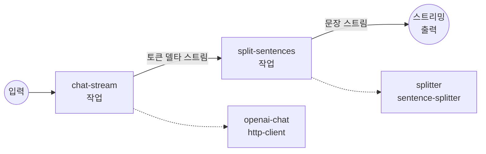

# OpenAI 스트림 → Sentence Splitter 예제

이 예제는 OpenAI 스트리밍 챗 컴플리션을 `sentence-splitter` 컴포넌트를
통해 파이프하여, 다운스트림 출력이 원시 토큰 델타가 아닌 완전한 문장
단위로 도착하도록 합니다.

## 개요

이 워크플로우는 두 개의 컴포넌트를 연결합니다:

1. **`openai-chat`** — `stream: true`로 `POST /v1/chat/completions`를
   호출하고, `${response[].choices[0].delta.content}`를 통해 각 SSE
   프레임에서 토큰 델타를 추출합니다. 출력은 (대개 몇 글자짜리) 부분
   조각들의 텍스트 스트림입니다.
2. **`splitter`** — 그 스트림을 `streaming: true` 모드로 소비하며,
   문장 경계마다 병합된 하나의 청크를 방출합니다. 선택적인
   `min_chunk_length` / `max_chunk_length` 입력을 사용하면 매우 짧은
   문장을 병합하거나, 종결자 없이 이어지는 문장을 강제로 분할할 수
   있습니다.

두 작업 모두 스트리밍 모드로 실행되므로, 최종 워크플로우 출력은
`stream/text`입니다 — 클라이언트는 모델이 각 문장을 완성하는 즉시
문장이 나타나는 것을 볼 수 있으며, 전체 응답을 기다릴 필요가 없습니다.

## 준비사항

### 필수 요구사항

- `model-compose`가 설치되어 `PATH`에서 사용 가능
- OpenAI API 키

### 환경 구성

1. 이 예제 디렉토리로 이동:
   ```bash
   cd examples/data-streaming/sentence-splitter
   ```

2. 샘플 환경 파일 복사:
   ```bash
   cp .env.sample .env
   ```

3. `.env`를 편집해 OpenAI API 키 추가:
   ```env
   OPENAI_API_KEY=your-actual-openai-api-key
   ```

## 실행 방법

1. **서비스 시작:**
   ```bash
   model-compose up
   ```

2. **워크플로우 실행:**

   **API 사용:**
   ```bash
   curl -N -X POST http://localhost:8080/api/workflows/runs \
     -H "Content-Type: application/json" \
     -d '{
       "input": {
         "prompt": "Give me three interesting facts about the Voyager 1 probe.",
         "temperature": 0.7,
         "min_chunk_length": 0
       }
     }'
   ```
   `-N` 플래그는 curl의 출력 버퍼링을 비활성화하여 문장이 도착하는
   과정을 실시간으로 확인할 수 있게 합니다.

   **웹 UI 사용:**
   - Web UI 열기: http://localhost:8081
   - 프롬프트와 설정 입력
   - "Run Workflow" 버튼 클릭

   **CLI 사용:**
   ```bash
   model-compose run --input '{
     "prompt": "Give me three interesting facts about the Voyager 1 probe.",
     "temperature": 0.7
   }'
   ```

## 워크플로우 세부사항



### 입력 매개변수

| 매개변수 | 유형 | 필수 | 기본값 | 설명 |
|---------|------|------|--------|------|
| `prompt` | text | 예 | - | 모델에게 전송되는 사용자 메시지 |
| `temperature` | number | 아니오 | `0.7` | 샘플링 온도 (0.0–1.0) |
| `min_chunk_length` | integer | 아니오 | `0` | 방출되는 청크당 최소 문자 수. 짧은 문장은 임계값을 충족할 때까지 다음 문장과 병합됩니다 (`0`이면 모든 문장을 개별적으로 방출) |
| `max_chunk_length` | integer | 아니오 | — | 청크 길이의 선택적 상한. 종결자 없이 이어지는 실행은 제한 내 가장 가까운 공백에서 강제 분할됩니다. 비활성화하려면 생략 |

### 출력 형식

| 필드 | 유형 | 설명 |
|-----|------|------|
| — | text (stream/text) | Server-Sent Events로 전달되는 문장 정렬된 텍스트 스트림 |

## 왜 스트림을 Splitter로 라우팅하는가?

OpenAI 스트리밍 원시 델타는 아주 작은 조각으로 도착할 수 있습니다 —
때로는 `"Voy"`, `"ager"`, `" 1"` 같은 단일 토큰입니다. 모델의 출력을
다른 시스템(TTS, 번역, 문장별 로깅, 문장별 임베딩)에 공급하려면
이러한 조각들을 먼저 완전한 문장으로 재집계해야 합니다.
`sentence-splitter` 컴포넌트는 내부 대기 버퍼를 유지하며 종결자(`.`,
`!`, `?`, `。`, `！`, `？`, `…`, 개행)를 감시하고, 입력이 어떻게
청크되었든 상관없이 문장이 완성되는 순간에 정확히 방출합니다.

## 사용자 정의

- **짧은 문장 병합**: `"min_chunk_length": 120`을 전달해 여러 짧은
  문장을 다운스트림 단일 청크로 결합.
- **긴 실행 제한**: `"max_chunk_length": 500`을 전달해 종결자 없는
  실행(예: 코드 블록)을 가장 가까운 공백에서 강제 분할.
- **다른 모델**: `model-compose.yml`의 `gpt-4o`를 다른
  chat-completions 호환 모델로 변경.
- **구조화된 출력**: `output: ${output as stream/text}`를
  `stream/json`으로 교체하고 각 청크를 객체로 감싸기 (예:
  `output: '{"sentence": ${jobs.split-sentences.output}}'`).
