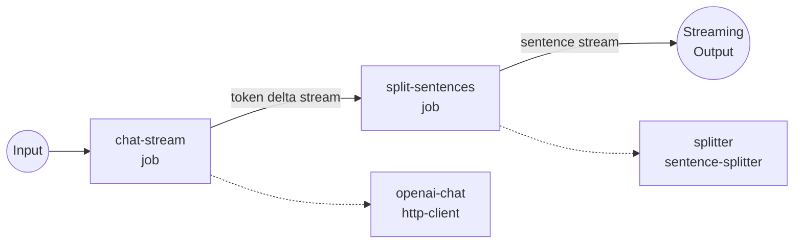

# OpenAI Stream → Sentence Splitter Example

This example pipes an OpenAI streaming chat completion through the
`sentence-splitter` component so the downstream output arrives one full
sentence at a time instead of raw token deltas.

## Overview

The workflow chains two components:

1. **`openai-chat`** — Calls `POST /v1/chat/completions` with `stream: true`
   and extracts the token deltas from each SSE frame via
   `${response[].choices[0].delta.content}`. The output is a text stream of
   partial fragments (often just a few characters each).
2. **`splitter`** — Consumes that stream in `streaming: true` mode and emits
   one merged chunk per sentence boundary. Optional `min_chunk_length` /
   `max_chunk_length` inputs let callers coalesce very short sentences or
   force-split runaway ones.

Because both jobs run in streaming mode, the final workflow output is a
`stream/text` — the client sees sentences appear as soon as the model has
finished each one, without waiting for the whole reply.

## Preparation

### Prerequisites

- `model-compose` installed and available in your `PATH`
- An OpenAI API key

### Environment Configuration

1. Navigate to this example directory:
   ```bash
   cd examples/data-streaming/sentence-splitter
   ```

2. Copy the sample environment file:
   ```bash
   cp .env.sample .env
   ```

3. Edit `.env` and add your OpenAI API key:
   ```env
   OPENAI_API_KEY=your-actual-openai-api-key
   ```

## How to Run

1. **Start the service:**
   ```bash
   model-compose up
   ```

2. **Run the workflow:**

   **Using API:**
   ```bash
   curl -N -X POST http://localhost:8080/api/workflows/runs \
     -H "Content-Type: application/json" \
     -d '{
       "input": {
         "prompt": "Give me three interesting facts about the Voyager 1 probe.",
         "temperature": 0.7,
         "min_chunk_length": 0
       }
     }'
   ```
   The `-N` flag disables curl's output buffering so you can watch sentences
   arrive live.

   **Using Web UI:**
   - Open the Web UI: http://localhost:8081
   - Enter your prompt and settings
   - Click the "Run Workflow" button

   **Using CLI:**
   ```bash
   model-compose run --input '{
     "prompt": "Give me three interesting facts about the Voyager 1 probe.",
     "temperature": 0.7
   }'
   ```

## Workflow Details



### Input Parameters

| Parameter | Type | Required | Default | Description |
|-----------|------|----------|---------|-------------|
| `prompt` | text | Yes | - | The user message sent to the model |
| `temperature` | number | No | `0.7` | Sampling temperature (0.0–1.0) |
| `min_chunk_length` | integer | No | `0` | Minimum characters per emitted chunk. Short sentences are merged with the next until the threshold is met (`0` emits every sentence individually) |
| `max_chunk_length` | integer | No | — | Optional hard cap on chunk length. Terminator-less runs are force-split at the nearest whitespace within the limit. Omit to disable |

### Output Format

| Field | Type | Description |
|-------|------|-------------|
| — | text (stream/text) | Sentence-aligned text stream delivered as Server-Sent Events |

## Why Route the Stream Through a Splitter?

Raw OpenAI streaming deltas can arrive as tiny fragments — sometimes a
single token like `"Voy"`, `"ager"`, `" 1"`. If you want to feed the model's
output into another system (TTS, translation, per-sentence logging,
per-sentence embedding), those fragments need to be re-aggregated into
complete sentences first. The `sentence-splitter` component holds an
internal pending buffer, watches for terminators (`.`, `!`, `?`, `。`,
`！`, `？`, `…`, newline), and yields exactly when a sentence has been
completed — no matter how the input was chunked.

## Customization

- **Merge short sentences**: pass `"min_chunk_length": 120` to combine
  several short sentences into a single downstream chunk.
- **Cap long runs**: pass `"max_chunk_length": 500` to force-split any
  terminator-less run (e.g. a code block) at the nearest whitespace.
- **Different model**: change `gpt-4o` in `model-compose.yml` to another
  chat-completions-compatible model.
- **Structured output**: replace `output: ${output as stream/text}` with
  `stream/json` and wrap each chunk into an object (e.g.
  `output: '{"sentence": ${jobs.split-sentences.output}}'`).
