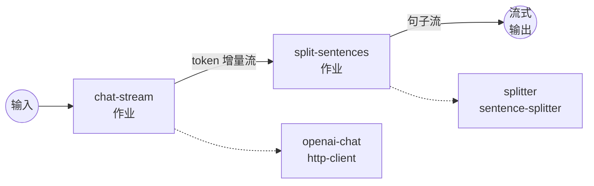

# OpenAI 流 → Sentence Splitter 示例

此示例将 OpenAI 流式聊天补全通过 `sentence-splitter` 组件传递，使下游
输出以完整句子为单位到达，而不是原始的 token 增量。

## 概述

该工作流串联两个组件：

1. **`openai-chat`** — 使用 `stream: true` 调用
   `POST /v1/chat/completions`，并通过
   `${response[].choices[0].delta.content}` 从每个 SSE 帧中提取 token
   增量。输出是一个由（通常只有几个字符的）片段组成的文本流。
2. **`splitter`** — 以 `streaming: true` 模式消费该流，并在每个句子
   边界处发出一个合并后的块。可选的 `min_chunk_length` /
   `max_chunk_length` 输入允许调用方合并非常短的句子，或强制分割过长
   而没有终止符的运行。

由于两个作业都以流式模式运行，最终工作流输出为 `stream/text` —
客户端会在模型完成每个句子后立即看到句子出现，无需等待整个回复。

## 准备工作

### 前置条件

- 已安装 `model-compose` 并在您的 `PATH` 中可用
- OpenAI API 密钥

### 环境配置

1. 进入此示例目录：
   ```bash
   cd examples/data-streaming/sentence-splitter
   ```

2. 复制示例环境文件：
   ```bash
   cp .env.sample .env
   ```

3. 编辑 `.env` 并添加您的 OpenAI API 密钥：
   ```env
   OPENAI_API_KEY=your-actual-openai-api-key
   ```

## 运行方式

1. **启动服务：**
   ```bash
   model-compose up
   ```

2. **运行工作流：**

   **使用 API：**
   ```bash
   curl -N -X POST http://localhost:8080/api/workflows/runs \
     -H "Content-Type: application/json" \
     -d '{
       "input": {
         "prompt": "Give me three interesting facts about the Voyager 1 probe.",
         "temperature": 0.7,
         "min_chunk_length": 0
       }
     }'
   ```
   `-N` 标志禁用 curl 的输出缓冲，以便您实时看到句子到达。

   **使用 Web UI：**
   - 打开 Web UI：http://localhost:8081
   - 输入您的提示词和设置
   - 点击"运行工作流"按钮

   **使用 CLI：**
   ```bash
   model-compose run --input '{
     "prompt": "Give me three interesting facts about the Voyager 1 probe.",
     "temperature": 0.7
   }'
   ```

## 工作流详情



### 输入参数

| 参数 | 类型 | 必需 | 默认值 | 描述 |
|-----------|------|----------|---------|-------------|
| `prompt` | text | 是 | - | 发送给模型的用户消息 |
| `temperature` | number | 否 | `0.7` | 采样温度 (0.0–1.0) |
| `min_chunk_length` | integer | 否 | `0` | 发出的每个块的最小字符数。短句子会与后续句子合并，直到达到阈值（`0` 会逐句单独发出） |
| `max_chunk_length` | integer | 否 | — | 可选的块长度硬上限。无终止符的运行会在限制范围内最近的空白处强制分割。省略以禁用 |

### 输出格式

| 字段 | 类型 | 描述 |
|-------|------|-------------|
| — | text (stream/text) | 以 Server-Sent Events 形式交付的按句子对齐的文本流 |

## 为什么要通过 Splitter 路由流？

原始的 OpenAI 流式增量可能以很小的片段到达 — 有时只是像 `"Voy"`、
`"ager"`、`" 1"` 这样的单个 token。如果您希望将模型的输出输入到另一个
系统（TTS、翻译、按句子日志记录、按句子嵌入），这些片段需要先被重新
聚合为完整的句子。`sentence-splitter` 组件维护一个内部待处理缓冲区，
监视终止符（`.`、`!`、`?`、`。`、`！`、`？`、`…`、换行），并在句子
完成时精确产出 — 无论输入是如何分块的。

## 自定义

- **合并短句子**：传入 `"min_chunk_length": 120` 将多个短句子合并
  为下游的单个块。
- **限制长运行**：传入 `"max_chunk_length": 500`，强制在最近的空白处
  分割任何无终止符的运行（例如代码块）。
- **不同的模型**：将 `model-compose.yml` 中的 `gpt-4o` 更改为其他
  chat-completions 兼容模型。
- **结构化输出**：将 `output: ${output as stream/text}` 替换为
  `stream/json`，并将每个块包装成对象（例如
  `output: '{"sentence": ${jobs.split-sentences.output}}'`）。
