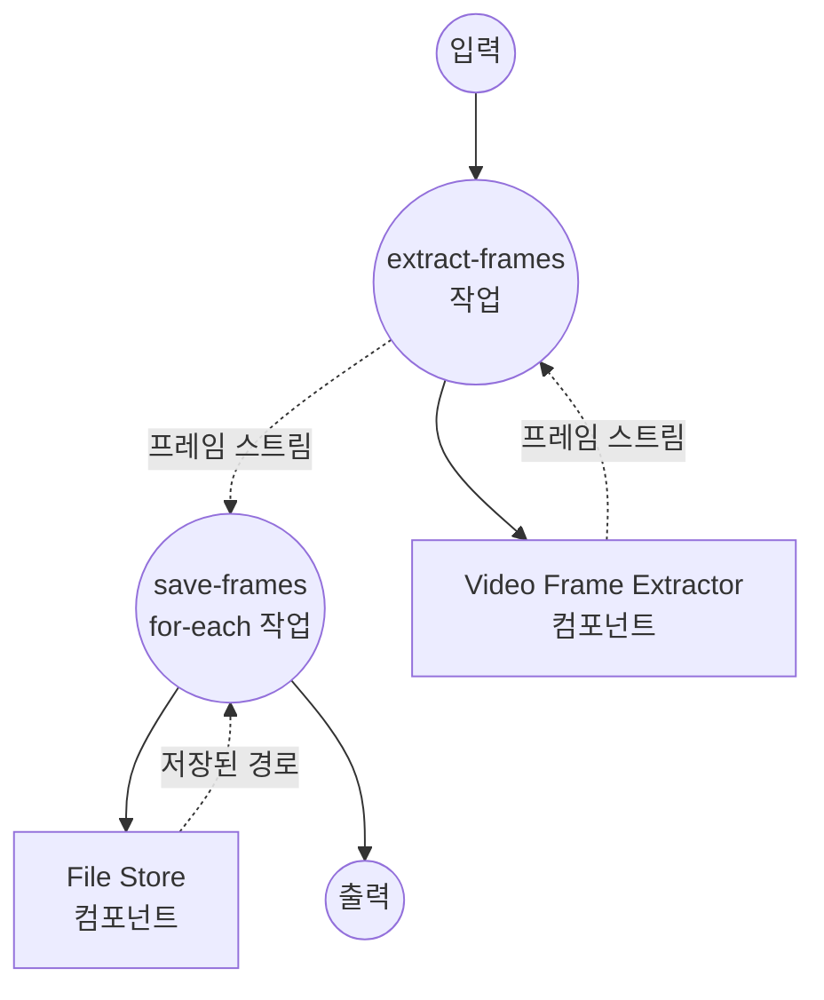

# 비디오 프레임 추출 예제

이 예제는 단일 입력 비디오에서 프레임을 추출하고, 각 프레임이 생성되는 즉시 로컬 파일 스토어에 저장하는 스트리밍 워크플로우를 보여줍니다.

## 개요

이 워크플로우는 다음 프로세스를 통해 작동합니다:

1. **프레임 추출**: `video-frame-extractor`(ffmpeg 드라이버)가 설정된 간격으로 입력 비디오에서 프레임을 스트리밍합니다
2. **프레임 저장**: `for-each` 작업이 프레임 스트림을 소비하며 각 프레임을 PNG로 로컬 파일 스토어에 기록합니다

이 예제는 `streaming: true`를 통한 "단일 입력 → 다수 출력" 스펙과, 그 스트림을 다음 작업에서 소비하는 흐름을 확인합니다.

## 준비사항

### 필수 요구사항

- model-compose가 설치되어 PATH에서 사용 가능
- 로컬에 `ffmpeg` 사용 가능 (또는 번들된 `setup.sh`로 docker 런타임 안에 설치)
- 워크플로우를 실행하는 머신에서 접근 가능한 소스 비디오 파일

### 환경 구성

환경 변수는 필요하지 않습니다. docker 런타임에서 프레임 추출기를 실행하려면 `model-compose.yml`의 `runtime:` 블록의 주석을 해제하세요. 이 디렉토리의 `setup.sh`가 첫 `up` 시 ffmpeg를 파생 이미지에 설치합니다.

## 실행 방법

1. **서비스 시작:**
   ```bash
   model-compose up
   ```

2. **워크플로우 실행:**

   **API 사용:**
   ```bash
   curl -X POST http://localhost:8080/api/workflows/runs \
     -H "Content-Type: application/json" \
     -d '{"input": {"video": "/absolute/path/to/video.mp4", "frame_interval": 30}}'
   ```

   **웹 UI 사용:**
   - Web UI 열기: http://localhost:8081
   - 비디오와 (선택적으로) 프레임 간격을 제공한 뒤 "Run Workflow" 클릭

   **CLI 사용:**
   ```bash
   model-compose run --input '{"video": "/absolute/path/to/video.mp4", "frame_interval": 30}'
   ```

추출된 프레임은 `./output/frames/frame-<timestamp>.png` 경로에 기록됩니다.

## 컴포넌트 세부사항

### Video Frame Extractor 컴포넌트 (frame-extractor)
- **유형**: `video-frame-extractor` 컴포넌트
- **드라이버**: `ffmpeg`
- **목적**: 입력 비디오로부터 프레임을 한 번에 하나씩 스트리밍
- **주요 옵션**:
  - `video`: 소스 비디오 미디어
  - `frame_interval`: N 프레임마다 한 장씩 방출
  - `streaming: true`: 리스트가 아닌 비동기 이터레이터로 프레임을 제공

### File Store 컴포넌트 (storage)
- **유형**: `file-store` 컴포넌트
- **드라이버**: `local`
- **기본 경로**: `./output/frames`
- **목적**: 스트리밍된 각 프레임을 PNG 파일로 영속화
- **액션**: 프레임별 `path`와 PNG `source`를 갖는 `put`

## 워크플로우 세부사항

### "Video to Frames to Local Files" 워크플로우 (기본)

**설명**: 비디오에서 프레임을 스트리밍하고, 생성되는 대로 각 프레임을 로컬 파일 스토어에 저장합니다.

#### 작업 흐름

1. **extract-frames**: 입력 비디오로부터 프레임 스트림을 생성
2. **save-frames**: 스트리밍된 각 프레임을 로컬 파일 스토어에 기록



#### 입력 매개변수

| 매개변수 | 유형 | 필수 | 기본값 | 설명 |
|---------|------|------|--------|------|
| `video` | video | 예 | - | 프레임을 추출할 소스 비디오 |
| `frame_interval` | integer | 아니오 | `30` | N 프레임마다 한 장씩 방출 |

#### 출력 형식

`save-frames` for-each의 각 반복은 `storage` 컴포넌트가 반환한 저장 경로(`${result.path}`)를 산출합니다.

| 필드 | 유형 | 설명 |
|-----|------|------|
| `path` | text | 저장된 각 프레임 PNG의 로컬 경로 |

## 예제 출력

`frame_interval: 30`으로 짧은 클립을 처리하면 다음과 같은 파일이 생성됩니다:

```
output/frames/frame-0.033.png
output/frames/frame-1.033.png
output/frames/frame-2.033.png
...
```

각 파일은 ffmpeg가 해당 프레임을 방출하는 즉시 기록되므로, 비디오가 끝나기 전에도 다운스트림 소비자가 처리를 시작할 수 있습니다.

## 사용자 정의

- `frame_interval`을 변경해 더 많거나 더 적은 프레임을 샘플링
- `storage.base_path`를 다른 디렉토리로 지정하거나 원격 스토어 드라이버로 교체
- `for-each` 본문에 이미지 모델과 같은 프레임별 처리를 추가
- `runtime: docker` 블록을 활성화해 `setup.sh`로 빌드된 컨테이너 안에서 ffmpeg 실행
