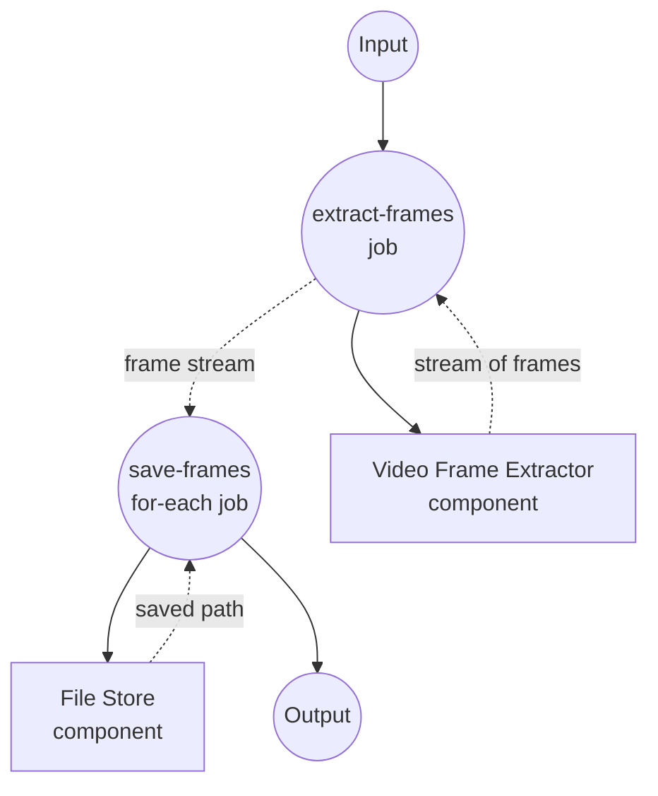

# Video to Frames Example

This example demonstrates a streaming workflow that extracts frames from a single input video and writes each frame to the local file store as soon as it is produced.

## Overview

This workflow operates through the following process:

1. **Extract Frames**: A `video-frame-extractor` (ffmpeg driver) streams frames from the input video at a configurable interval
2. **Save Frames**: A `for-each` job consumes the frame stream and writes each frame to the local file store as a PNG

The example exercises the streaming spec of "single input to many outputs" via `streaming: true`, and the ability to consume that stream in a downstream job.

## Preparation

### Prerequisites

- model-compose installed and available in your PATH
- `ffmpeg` available locally (or use the bundled `setup.sh` to install it inside the docker runtime)
- A source video file accessible from the machine running the workflow

### Environment Configuration

No environment variables are required. If you plan to run the frame extractor inside a docker runtime, uncomment the `runtime:` block in `model-compose.yml`; `setup.sh` in this directory will install ffmpeg into the derived image on the first `up`.

## How to Run

1. **Start the service:**
   ```bash
   model-compose up
   ```

2. **Run the workflow:**

   **Using API:**
   ```bash
   curl -X POST http://localhost:8080/api/workflows/runs \
     -H "Content-Type: application/json" \
     -d '{"input": {"video": "/absolute/path/to/video.mp4", "frame_interval": 30}}'
   ```

   **Using Web UI:**
   - Open the Web UI: http://localhost:8081
   - Provide a video and (optionally) a frame interval, then click "Run Workflow"

   **Using CLI:**
   ```bash
   model-compose run --input '{"video": "/absolute/path/to/video.mp4", "frame_interval": 30}'
   ```

Extracted frames are written to `./output/frames/frame-<timestamp>.png`.

## Component Details

### Video Frame Extractor Component (frame-extractor)
- **Type**: `video-frame-extractor` component
- **Driver**: `ffmpeg`
- **Purpose**: Streams frames out of the input video one at a time
- **Key options**:
  - `video`: source video media
  - `frame_interval`: emit every Nth frame
  - `streaming: true`: yields frames as an async iterator instead of returning a list

### File Store Component (storage)
- **Type**: `file-store` component
- **Driver**: `local`
- **Base path**: `./output/frames`
- **Purpose**: Persists each streamed frame as a PNG file
- **Action**: `put` with a per-frame `path` and PNG `source`

## Workflow Details

### "Video to Frames to Local Files" Workflow (Default)

**Description**: Stream frames from a video and save each one to the local file store as it is produced.

#### Job Flow

1. **extract-frames**: Produce a stream of frames from the input video
2. **save-frames**: For each streamed frame, write it to the local file store



#### Input Parameters

| Parameter | Type | Required | Default | Description |
|-----------|------|----------|---------|-------------|
| `video` | video | Yes | - | Source video to extract frames from |
| `frame_interval` | integer | No | `30` | Emit one frame every N frames |

#### Output Format

Each iteration of the `save-frames` for-each yields the saved file path returned by the `storage` component (`${result.path}`).

| Field | Type | Description |
|-------|------|-------------|
| `path` | text | Local path of each saved frame PNG |

## Example Output

When executed against a short clip with `frame_interval: 30`, the workflow produces files such as:

```
output/frames/frame-0.033.png
output/frames/frame-1.033.png
output/frames/frame-2.033.png
...
```

Each file is written as soon as ffmpeg emits the corresponding frame, so downstream consumers can start processing before the video finishes.

## Customization

- Change `frame_interval` to sample more or fewer frames
- Point `storage.base_path` at a different directory or swap the driver for a remote store
- Wrap `save-frames` with additional per-frame processing (e.g., an image model) inside the `for-each` body
- Enable the `runtime: docker` block to run ffmpeg inside a container built via `setup.sh`
