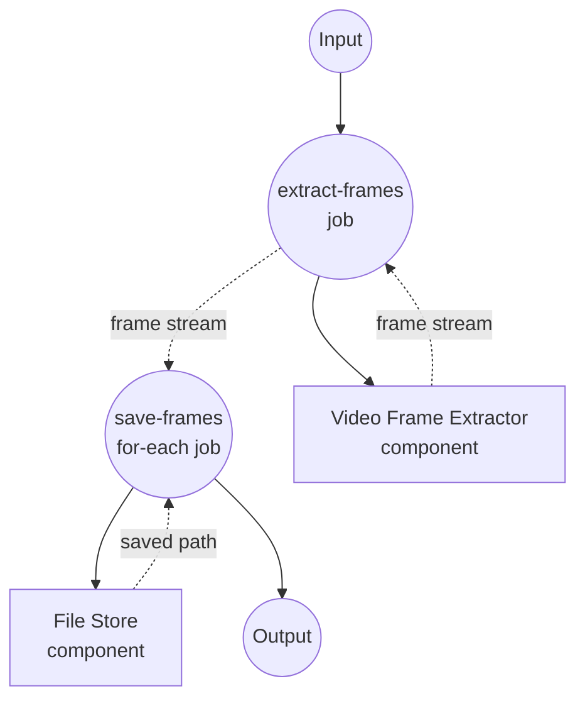

# 视频抽帧示例

此示例演示了一个流式工作流：从单个输入视频中提取帧，并在每一帧生成时立即写入本地文件存储。

## 概述

此工作流通过以下流程运行：

1. **提取帧**：`video-frame-extractor`（ffmpeg 驱动）按可配置的间隔从输入视频中流式输出帧
2. **保存帧**：`for-each` 作业消费帧流，将每一帧以 PNG 形式写入本地文件存储

该示例验证了 `streaming: true` 所支持的"单输入到多输出"规范，以及在下游作业中消费该流的能力。

## 准备工作

### 前置条件

- 已安装 model-compose 并在您的 PATH 中可用
- 本地可用 `ffmpeg`（或使用附带的 `setup.sh` 将其安装到 docker 运行时内）
- 运行工作流的机器可访问的源视频文件

### 环境配置

不需要环境变量。若要在 docker 运行时中运行帧提取器，请取消 `model-compose.yml` 中 `runtime:` 块的注释；本目录下的 `setup.sh` 会在首次 `up` 时将 ffmpeg 安装到派生镜像中。

## 运行方式

1. **启动服务：**
   ```bash
   model-compose up
   ```

2. **运行工作流：**

   **使用 API：**
   ```bash
   curl -X POST http://localhost:8080/api/workflows/runs \
     -H "Content-Type: application/json" \
     -d '{"input": {"video": "/absolute/path/to/video.mp4", "frame_interval": 30}}'
   ```

   **使用 Web UI：**
   - 打开 Web UI：http://localhost:8081
   - 提供视频和（可选的）帧间隔，然后点击"运行工作流"

   **使用 CLI：**
   ```bash
   model-compose run --input '{"video": "/absolute/path/to/video.mp4", "frame_interval": 30}'
   ```

提取的帧将写入 `./output/frames/frame-<timestamp>.png`。

## 组件详情

### Video Frame Extractor 组件 (frame-extractor)
- **类型**：`video-frame-extractor` 组件
- **驱动**：`ffmpeg`
- **用途**：从输入视频中逐帧流式输出
- **关键选项**：
  - `video`：源视频媒体
  - `frame_interval`：每 N 帧发出一帧
  - `streaming: true`：以异步迭代器（而非列表）方式产出帧

### File Store 组件 (storage)
- **类型**：`file-store` 组件
- **驱动**：`local`
- **基路径**：`./output/frames`
- **用途**：将每个流式帧持久化为 PNG 文件
- **动作**：使用每帧的 `path` 和 PNG `source` 的 `put`

## 工作流详情

### "Video to Frames to Local Files" 工作流（默认）

**描述**：从视频中流式输出帧，并在每一帧生成时保存到本地文件存储。

#### 作业流程

1. **extract-frames**：从输入视频生成帧流
2. **save-frames**：将每个流式帧写入本地文件存储



#### 输入参数

| 参数 | 类型 | 必需 | 默认值 | 描述 |
|-----------|------|----------|---------|-------------|
| `video` | video | 是 | - | 用于抽帧的源视频 |
| `frame_interval` | integer | 否 | `30` | 每 N 帧发出一帧 |

#### 输出格式

`save-frames` for-each 的每次迭代都会产出 `storage` 组件返回的保存路径（`${result.path}`）。

| 字段 | 类型 | 描述 |
|-------|------|-------------|
| `path` | text | 每个已保存帧 PNG 的本地路径 |

## 示例输出

在 `frame_interval: 30` 下对短片处理时，工作流会生成类似以下文件：

```
output/frames/frame-0.033.png
output/frames/frame-1.033.png
output/frames/frame-2.033.png
...
```

每个文件会在 ffmpeg 发出对应帧后立即写入，因此下游消费者可以在视频结束前就开始处理。

## 自定义

- 修改 `frame_interval` 以采样更多或更少的帧
- 将 `storage.base_path` 指向其他目录，或切换到远程存储驱动
- 在 `for-each` 主体中添加逐帧处理（如图像模型）
- 启用 `runtime: docker` 块，在通过 `setup.sh` 构建的容器中运行 ffmpeg
