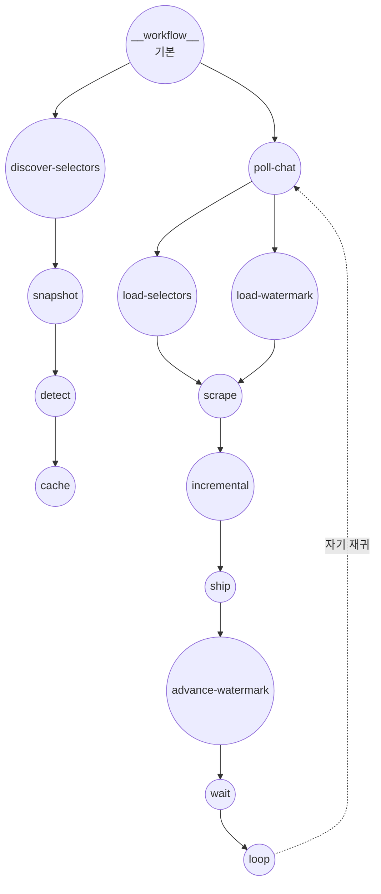

# YouTube 라이브 채팅 — AI가 발견한 선택자

이 예제는 세 단계 워크플로우를 보여줍니다:

1. **Snapshot** — `web-scraper`가 JS 렌더링과 함께 YouTube 라이브 채팅 팝아웃을 열어 채팅 컨테이너의 HTML 조각만 반환합니다
2. **Detect** — `http-client`가 그 HTML을 GPT-4o에 보내면, 각 메시지의 CSS 선택자와 id, 작성자, 메시지 본문 선택자를 담은 JSON 객체를 반환합니다
3. **Scrape** — 두 번째 `web-scraper` 호출이 그 선택자들을 선택자 사전에 꽂아 폴링 루프에서 구조화된 메시지를 가져오며, Redis 기반 워터마크로 중복을 제거합니다

발견 단계는 스트림당 한 번 실행되고 Redis에 6시간 캐시되므로, 반복되는 GPT 비용은 제한됩니다.

## 개요

이 워크플로우는 다음 프로세스를 통해 작동합니다:

1. **HTML 스냅샷**: 팝아웃 채팅 페이지를 렌더링하고 채팅 컨테이너 HTML을 추출
2. **선택자 감지**: GPT-4o에 HTML을 보내 엄격한 JSON 스키마로 CSS 선택자 세트를 요청
3. **선택자 캐시**: Redis에 6시간 TTL로 저장
4. **폴링**: 캐시된 선택자로 페이지를 다시 스크랩하고, 워터마크 기반 중복 제거 후 sink로 새 메시지 전송
5. **자기 재귀**: 지연 이후 폴링 워크플로우를 반복 호출하여 무기한 유지

## 이 패턴을 언제 사용하는가

핵심은 사실 YouTube가 아닙니다 — YouTube 자체는 `yt-live-chat-text-message-renderer` + `#author-name` + `#message`를 하드코딩하고 AI를 건너뛸 수 있습니다. 흥미로운 경우는 **사전에 마크업을 알 수 없거나 클래스 이름이 순환하는 사이트**입니다. 동일한 3단계 형태가 적용됩니다: 렌더 → 모델에 선택자 요청 → 그것으로 스크랩.

## 주의사항

- 라이브 채팅 HTML은 웹 컴포넌트 기반이 강해 GPT가 클래스 대신 태그명 선택자(예: `yt-live-chat-text-message-renderer`)를 반환할 수 있습니다. 정상적이고 예상된 결과입니다.
- 스냅샷 컴포넌트의 초기 `wait_for`는 최소 하나의 메시지가 렌더링되었다고 가정합니다. 시작 직후 메시지가 0인 스트림에서는 더 오래 기다리거나 빈 컨테이너 스크래핑으로 대체해야 할 수 있습니다.
- 폴링 워크플로우는 매 틱마다 페이지를 다시 탐색합니다 (`web-scraper`는 호출마다 새 Chromium 컨텍스트를 만드므로). 장기 관찰에는 지속적 `session_id`가 있는 `web-browser` 컴포넌트나 `web-scraper`의 향후 `watch` 모드가 필요합니다.

## 준비사항

### 필수 요구사항

- model-compose가 설치되어 PATH에서 사용 가능
- `localhost:6379`에서 수신 대기 중인 Redis
- OpenAI API 키
- 각 신규 메시지 배치를 수신할 sink 엔드포인트 (선택 사항이지만 실제로 스트림을 소비하려면 필요)

### 환경 구성

1. 이 예제 디렉토리로 이동:
   ```bash
   cd examples/data-streaming/youtube-live-chat
   ```

2. 환경 변수 내보내기:
   ```bash
   export OPENAI_API_KEY=sk-...
   export SINK_URL=http://localhost:9000   # 사용자의 ingest 엔드포인트
   ```

   `SINK_URL`이 설정되지 않으면 `chat-sink`는 설정 구문 분석을 위해 `http://localhost:9999`로 폴백합니다.

## 실행 방법

1. **서비스 시작:**
   ```bash
   model-compose up
   ```

2. **특정 라이브 비디오에 대해 워크플로우 실행:**

   **API 사용:**
   ```bash
   curl -X POST http://localhost:8080/api/workflows/runs \
     -H "Content-Type: application/json" \
     -d '{"workflow": "__workflow__", "input": {"video_id": "jfKfPfyJRdk", "poll_interval": "3s"}}'
   ```

   **웹 UI 사용:**
   - Web UI 열기: http://localhost:8081
   - `video_id`와 `poll_interval` 입력 후 "Run Workflow" 클릭

   **CLI 사용:**
   ```bash
   model-compose run __workflow__ \
     --input '{"video_id":"jfKfPfyJRdk","poll_interval":"3s"}'
   ```

## 컴포넌트 세부사항

### Chat HTML Snapshot 컴포넌트 (chat-html-snapshot)
- **유형**: `web-scraper` 컴포넌트
- **목적**: 팝아웃 채팅 페이지의 렌더링된 HTML 캡처
- **참고**: 실제 데스크톱 UA로 위장하고 EU 동의 쿠키를 사전 설정하며, `wait_until: domcontentloaded`를 사용해 무한한 networkidle을 피함

### Selector Detector 컴포넌트 (selector-detector)
- **유형**: `http-client` 컴포넌트 (OpenAI Chat Completions)
- **모델**: `gpt-4o`, `response_format: json_object`
- **출력**: `item_selector`, `id_selector`, `author_selector`, `message_selector`

### Dynamic Chat Scraper 컴포넌트 (dynamic-chat-scraper)
- **유형**: `web-scraper` 컴포넌트
- **목적**: GPT가 발견한 선택자로 채팅을 다시 스크랩하고 항목당 파싱된 객체 목록 반환

### Key-Value Store 컴포넌트 (kv)
- **유형**: `key-value-store` 컴포넌트
- **드라이버**: `redis` (`localhost:6379`)
- **액션**: `get`, `set` (TTL 지원). 선택자 캐시와 워터마크에 사용

### Chat Sink 컴포넌트 (chat-sink)
- **유형**: `http-client` 컴포넌트
- **엔드포인트**: `${env.SINK_URL | http://localhost:9999}/ingest`
- **목적**: 각 폴 틱의 새 메시지 배치를 수신

### 워크플로우 자기 참조
- `self-discover` → `discover-selectors` 워크플로우
- `self-poll` → `poll-chat` 워크플로우

## 워크플로우 세부사항

이 예제는 세 개의 워크플로우를 정의합니다:

- `discover-selectors` — HTML 스냅샷, GPT 감지, 선택자 캐시
- `poll-chat` — 선택자 로드, 워터마크 로드, 스크랩, 증분 필터, sink 전송, 워터마크 갱신, 지연, 자기 재귀
- `__workflow__` (기본) — `discover-selectors`를 실행한 뒤 `poll-chat`을 시작



#### 입력 매개변수

| 매개변수 | 유형 | 필수 | 기본값 | 설명 |
|---------|------|------|--------|------|
| `video_id` | text | 예 | - | YouTube 라이브 비디오 ID |
| `poll_interval` | duration | 아니오 | `3s` | 각 폴 사이의 지연 |

#### 출력 형식

`discover-selectors`는 감지된 선택자 사전을 반환합니다:

| 필드 | 유형 | 설명 |
|-----|------|------|
| `selectors.item_selector` | text | 각 메시지 요소를 선택 |
| `selectors.id_selector` | text | 안정적인 메시지 ID |
| `selectors.author_selector` | text | 작성자 이름 (항목 기준 상대 경로) |
| `selectors.message_selector` | text | 메시지 본문 (항목 기준 상대 경로) |

`poll-chat`은 각 틱에서 새 메시지를 sink로 스트리밍합니다; 워크플로우 자체는 무기한 자기 재귀합니다.

## 예제 출력

`chat-sink`에 게시된 각 배치는 다음 형태입니다:

```json
{
  "video_id": "jfKfPfyJRdk",
  "messages": [
    { "id": "abc123", "author": "SomeUser", "message": "Hello!" },
    { "id": "abc124", "author": "AnotherUser", "message": "Nice stream" }
  ]
}
```

## 사용자 정의

- `selector-detector` 시스템 프롬프트를 조정해 다른 사이트에 맞게 변경
- 선택자 캐시 `ttl`(기본 21600초)을 조정
- 다른 KV 스토어(Redis 이외)나 sink URL로 교체
- 지속적 브라우저 세션이 필요하면 `web-scraper`를 `web-browser` 컴포넌트로 교체
