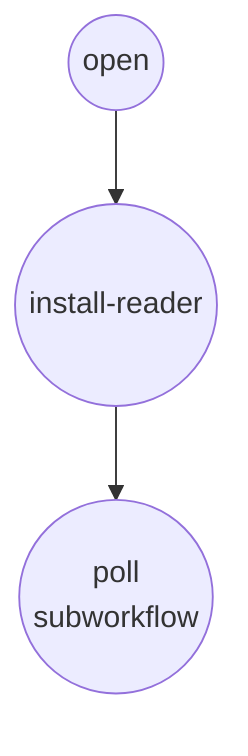
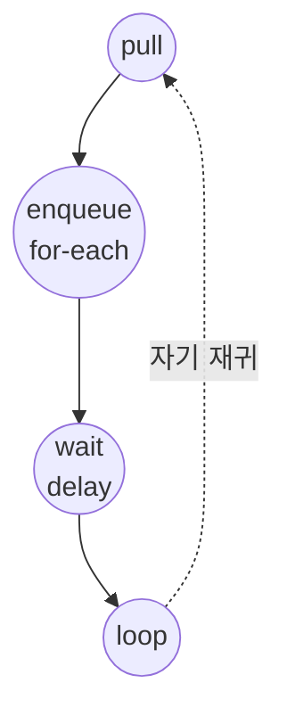
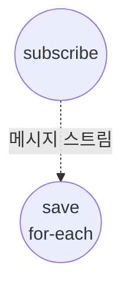

# YouTube 라이브 채팅 수집기

이 예제는 YouTube 라이브 스트림의 채팅 메시지를 지속적으로 수집하여, 새 메시지가 도착할 때마다 공유 큐를 통해 소비자 워크플로우로 넘겨줍니다. model-compose의 세 가지 기본 요소를 결합하는 방법을 보여줍니다:

- 폴링 틱 사이에도 유지되는 지속적 `web-browser` 세션
- 이미 보고한 메시지를 추적하는 작은 페이지 내 리더 스크립트
- 수집기와 후속 처리 로직을 분리해주는 `data-queue` 컴포넌트

## 개요

두 워크플로우가 하나의 `data-queue` 인스턴스와 하나의 장수(long-lived) `web-browser` 컴포넌트를 공유합니다:

1. **collect-chat** (기본) — 팝아웃 채팅 페이지를 한 번만 열고, `window`에 리더 스크립트를 설치한 뒤, `poll-chat`으로 tail-recurse하며 몇 초마다 새 메시지를 뽑아 큐에 push합니다.
2. **save-chat** — 큐를 지속적으로 드레인하며 각 메시지를 JSON 파일로 디스크에 저장하는 장기 실행 소비자.

`web-browser` 컴포넌트는 id로 캐시되므로, 페이지와 `window.__seenIds` 집합이 폴링 반복을 넘어 그대로 유지됩니다. 이것이 바로 리더 스크립트가 외부 워터마크 없이도 매 틱마다 **새** 메시지만 방출할 수 있는 이유입니다.

## 준비사항

### 필수 요구사항

- model-compose가 설치되어 PATH에서 사용 가능
- Playwright의 Chromium (브라우저 최초 사용 시 자동 설치됨)

### 환경 구성

환경 변수가 필요하지 않습니다.

## 실행 방법

1. **서비스 시작:**
   ```bash
   model-compose up
   ```

2. **소비자 시작 (계속 실행되도록 두기):**

   한 터미널에서 소비자 워크플로우를 시작합니다. 첫 메시지를 기다리며 블록됩니다:

   ```bash
   model-compose run save-chat
   ```

   또는 Web UI(http://localhost:8081)를 열어 `save-chat`을 실행하세요.

3. **라이브 스트림에서 수집 시작:**

   다른 터미널(또는 Web UI)에서 활성 라이브 방송의 video id로 수집기를 시작합니다:

   ```bash
   model-compose run collect-chat \
     --input '{"video_id": "jfKfPfyJRdk", "poll_interval": "2s"}'
   ```

   **API 사용:**
   ```bash
   curl -X POST http://localhost:8080/api/workflows/collect-chat/runs \
     -H "Content-Type: application/json" \
     -d '{"input": {"video_id": "jfKfPfyJRdk", "poll_interval": "2s"}}'
   ```

4. **중지:**

   `collect-chat` 실행을 취소하면 폴링이 멈춥니다. `save-chat`을 취소하면 저장이 멈춥니다. 브라우저 컴포넌트가 캐시되므로 `collect-chat`을 다시 시작해도 동일한 페이지가 재사용됩니다.

## 컴포넌트 세부사항

### Web Browser 컴포넌트 (browser)
- **유형**: `web-browser` 컴포넌트
- **드라이버**: `playwright` (헤드리스 Chromium)
- **목적**: 팝아웃 채팅 페이지를 계속 열어두며 세 가지 액션을 노출:
  - `open-chat` (method `navigate`): `https://www.youtube.com/live_chat?v=<id>&is_popout=1`로 이동, `wait_until: domcontentloaded`. 팝아웃은 `/watch`보다 가벼워서(비디오 플레이어 없음) 탭이 `networkidle`을 무한히 붙잡지 않음.
  - `install-reader` (method `evaluate`): `window.__chatReader`와 `window.__seenIds`를 정의. 리더는 `yt-live-chat-text-message-renderer` 노드를 스캔하고, 이미 보고한 id를 기억하며, 새로운 것만 반환.
  - `pull-new-messages` (method `evaluate`): `window.__chatReader()`를 호출하여 새 배치를 반환.

### Data Queue 컴포넌트 (chat-messages)
- **유형**: `data-queue` 컴포넌트
- **드라이버**: `memory`
- **목적**: 수집기와 저장기 사이의 FIFO 버퍼
- **액션**: `enqueue` (메시지 한 건 추가), `dequeue` (취소될 때까지 메시지 스트림)

### File Store 컴포넌트 (storage)
- **유형**: `file-store` 컴포넌트
- **드라이버**: `local`
- **베이스 경로**: `./output`
- **목적**: 각 메시지를 `./output/<video_id>/<message_id>.json`으로 저장

### Poller 컴포넌트 (poller)
- **유형**: `workflow` 컴포넌트
- **대상**: `poll-chat` 워크플로우
- **목적**: `collect-chat`이 폴링 루프를 서브워크플로우로 호출하고, `poll-chat`이 자기 자신으로 tail-recurse할 수 있도록 함

## 워크플로우 세부사항

### "Collect YouTube live chat" 워크플로우 (collect-chat, 기본)

**설명**: 일회성 셋업(채팅 페이지 열기 + 리더 설치) 후 폴링 루프로 넘겨줌.

#### 잡 흐름

1. **open**: 팝아웃 채팅 페이지로 이동
2. **install-reader**: `window.__chatReader`와 seen-ids 집합을 주입
3. **poll**: `poll-chat` 서브워크플로우로 진입


```mermaid
graph TD
    J1((open))
    J2((install-reader))
    J3((poll<br/>subworkflow))

    J1 --> J2 --> J3
```

#### 입력 매개변수

| 매개변수 | 유형 | 필수 | 기본값 | 설명 |
|---------|------|------|--------|------|
| `video_id` | text | 예 | - | YouTube 라이브 비디오 ID |
| `poll_interval` | duration | 아니오 | `2s` | 폴링 틱 사이의 지연 |

### "poll-chat" 워크플로우

**설명**: 새 메시지를 pull하고, 큐에 enqueue하고, 대기 후 자기 자신을 재호출. 직접 호출하도록 의도된 것은 아님 — `collect-chat`이 셋업 후 시작.

#### 잡 흐름

1. **pull**: `window.__chatReader()`를 호출하여 새 메시지 반환
2. **enqueue**: 각 메시지를 `chat-messages`에 append
3. **wait**: `poll_interval`만큼 지연
4. **loop**: `poller` 컴포넌트를 통해 `poll-chat` 재진입


```mermaid
graph TD
    J1((pull))
    J2((enqueue<br/>for-each))
    J3((wait<br/>delay))
    J4((loop))

    J1 --> J2 --> J3 --> J4
    J4 -.-> |자기 재귀| J1
```

### "Save chat messages to disk" 워크플로우 (save-chat)

**설명**: 큐를 지속적으로 드레인하여 각 메시지를 JSON으로 저장하는 장기 실행 소비자.

#### 잡 흐름

1. **subscribe**: `chat-messages`에 소비 스트림 오픈
2. **save**: 스트리밍된 각 메시지를 `./output/<video_id>/<id>.json`으로 저장


```mermaid
graph TD
    J1((subscribe))
    J2((save<br/>for-each))

    J1 -.-> |메시지 스트림| J2
```

## 예제 출력

두 워크플로우가 모두 실행 중이면 `./output/<video_id>/` 아래에 파일이 나타납니다:

```
output/jfKfPfyJRdk/ChwKGkNMbjMwc21VbTQ4REZjekF3Z1FkVFo0S0lB.json
output/jfKfPfyJRdk/ChwKGkNKM3JzOUM3bjQ4REZlOEF3Z1FkbG5jS3RB.json
```

각 파일에는 한 건의 메시지가 담깁니다:

```json
{
  "id": "ChwKGkNMbjMwc21VbTQ4REZjekF3Z1FkVFo0S0lB",
  "video_id": "jfKfPfyJRdk",
  "author": "SomeUser",
  "message": "안녕하세요!",
  "timestamp": "2:15 PM"
}
```

## 사용자 정의

- `save-chat`의 `storage` 컴포넌트를 다른 것으로 교체하세요 (ingest 엔드포인트로 POST하는 `http-client`, 검색용 `vector-store`, 소셜 분석용 `graph-store` 등) — 큐는 누가 드레인하든 상관하지 않습니다.
- 동일한 큐에 여러 소비자를 추가하여 작업 큐 스타일로 팬아웃하세요 (각 메시지는 정확히 하나의 소비자에게 전달됨).
- `poll_interval`을 조절하여 신선도와 브라우저 CPU 사용량을 트레이드오프하세요.
- 다른 메시지 유형을 원하면 리더 스크립트의 CSS 선택자를 교체하세요 — 예를 들어 Super Chat은 `yt-live-chat-paid-message-renderer`.
