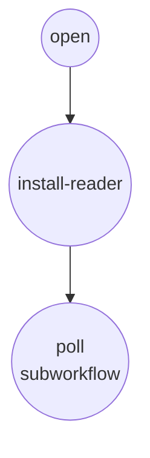
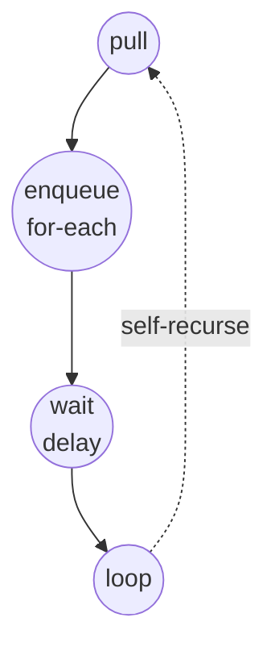
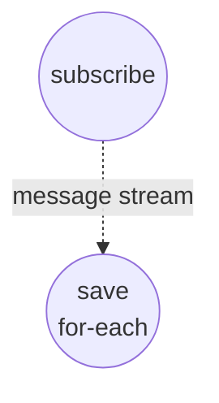

# YouTube Live Chat Collector

This example continuously collects messages from a YouTube live stream's chat and hands each new message off to a consumer workflow via a shared queue. It shows how to combine three model-compose primitives:

- a persistent `web-browser` session — attached to a real Chrome over CDP — that stays open across polling ticks
- a small in-page reader that tracks which messages have already been reported
- a `data-queue` component that decouples the collector from whatever you want to do with the messages

YouTube's popout chat refuses to render its chat app inside Playwright's bundled Chromium (it falls back to a "your browser is out of date" page), so this example drives a user-launched Chrome over the Chrome DevTools Protocol instead.

## Overview

Two workflows share one `data-queue` instance and one long-lived `web-browser` component:

1. **collect-chat** (default) — opens the popout chat page once, installs an in-page reader on `window`, then tail-recurses through `poll-chat` to pull new messages every few seconds and push each one onto the queue.
2. **save-chat** — long-running consumer that drains the queue and writes each message to disk as a JSON file.

The `web-browser` component is cached by id, so the page and the `window.__seenIds` set survive across polling iterations. That is what lets the in-page reader emit only *new* messages on each tick without any external watermark.

## Preparation

### Prerequisites

- model-compose installed and available in your PATH
- Google Chrome installed locally

### Environment Configuration

No environment variables are required.

## How to Run

1. **Launch Chrome with remote debugging enabled** (leave it running):

   The `web-browser` component attaches to this Chrome over CDP on port 9222. A dedicated `--user-data-dir` keeps the profile isolated from your everyday browsing.

   macOS:
   ```bash
   /Applications/Google\ Chrome.app/Contents/MacOS/Google\ Chrome \
     --remote-debugging-port=9222 \
     --user-data-dir=/tmp/chrome-yt-live-chat
   ```

   Linux:
   ```bash
   google-chrome \
     --remote-debugging-port=9222 \
     --user-data-dir=/tmp/chrome-yt-live-chat
   ```

2. **Start the service:**
   ```bash
   model-compose up
   ```

3. **Start the consumer (leave it running):**

   In one terminal, start the consumer workflow. It blocks waiting for the first message:

   ```bash
   model-compose run save-chat
   ```

   Or open the Web UI at http://localhost:8081 and run `save-chat`.

4. **Start collecting from a live stream:**

   In another terminal (or the Web UI), start the collector with the video id of an active live broadcast:

   ```bash
   model-compose run collect-chat \
     --input '{"video_id": "jfKfPfyJRdk", "poll_interval": "2s"}'
   ```

   **Using API:**
   ```bash
   curl -X POST http://localhost:8080/api/workflows/collect-chat/runs \
     -H "Content-Type: application/json" \
     -d '{"input": {"video_id": "jfKfPfyJRdk", "poll_interval": "2s"}}'
   ```

5. **Stop:**

   Cancel the `collect-chat` run to stop polling. Cancel `save-chat` to stop persisting. Because the browser component is cached and attached to your Chrome, restarting `collect-chat` reuses the same tab.

## Component Details

### Web Browser Component (browser)
- **Type**: `web-browser` component
- **Driver**: `chrome` (CDP attach to a user-launched Chrome at `localhost:9222`)
- **Purpose**: Keeps one page open on the popout chat and exposes three actions:
  - `open-chat` (method `navigate`): navigates to `https://www.youtube.com/live_chat?v=<id>&is_popout=1` with `wait_until: domcontentloaded`. The popout is lighter than `/watch` — no video player, so the tab does not hold `networkidle` open forever.
  - `install-reader` (method `evaluate`): defines `window.__chatReader` and `window.__seenIds`. The reader scans `yt-live-chat-text-message-renderer` nodes, remembers ids it has already reported, and returns only new ones.
  - `pull-new-messages` (method `evaluate`): calls `window.__chatReader()` and returns the fresh batch.

### Data Queue Component (chat-messages)
- **Type**: `data-queue` component
- **Driver**: `memory`
- **Purpose**: FIFO buffer between the collector and the saver
- **Actions**: `enqueue` (appends one message) and `dequeue` (streams messages until cancelled)

### File Store Component (storage)
- **Type**: `file-store` component
- **Driver**: `local`
- **Base path**: `./output`
- **Purpose**: Persists each message as `./output/<video_id>/<message_id>.json`

### Poller Component (poller)
- **Type**: `workflow` component
- **Target**: the `poll-chat` workflow
- **Purpose**: Lets `collect-chat` invoke the polling loop as a subworkflow and lets `poll-chat` tail-recurse into itself

## Workflow Details

### "Collect YouTube live chat" Workflow (collect-chat, default)

**Description**: One-time setup (open the chat page + install the reader), then hand off to the polling loop.

#### Job Flow

1. **open**: Navigates to the popout chat page
2. **install-reader**: Injects `window.__chatReader` and the seen-ids set
3. **poll**: Enters the `poll-chat` subworkflow



#### Input Parameters

| Parameter | Type | Required | Default | Description |
|-----------|------|----------|---------|-------------|
| `video_id` | text | Yes | - | YouTube live video id |
| `poll_interval` | duration | No | `2s` | Delay between polling ticks |

### "poll-chat" Workflow

**Description**: Pull new messages, enqueue them, sleep, then re-enter self. Not intended to be called directly — `collect-chat` starts it after setup.

#### Job Flow

1. **pull**: Calls `window.__chatReader()` and returns new messages
2. **enqueue**: For each message, appends it to `chat-messages`
3. **wait**: Delays for `poll_interval`
4. **loop**: Re-enters `poll-chat` via the `poller` component



### "Save chat messages to disk" Workflow (save-chat)

**Description**: Long-running consumer that drains the queue and writes each message as JSON.

#### Job Flow

1. **subscribe**: Opens a consume stream on `chat-messages`
2. **save**: For each streamed message, writes `./output/<video_id>/<id>.json`



## Example Output

With both workflows running, files appear under `./output/<video_id>/`:

```
output/jfKfPfyJRdk/ChwKGkNMbjMwc21VbTQ4REZjekF3Z1FkVFo0S0lB.json
output/jfKfPfyJRdk/ChwKGkNKM3JzOUM3bjQ4REZlOEF3Z1FkbG5jS3RB.json
```

Each file contains one message:

```json
{
  "id": "ChwKGkNMbjMwc21VbTQ4REZjekF3Z1FkVFo0S0lB",
  "video_id": "jfKfPfyJRdk",
  "author": "SomeUser",
  "message": "Hello!",
  "timestamp": "2:15 PM"
}
```

## Customization

- Swap `save-chat`'s `storage` component for anything else (an `http-client` posting to your ingest endpoint, a `vector-store` for retrieval, a `graph-store` for social analysis) — the queue does not care who drains it.
- Add multiple consumers on the same queue to fan out work-queue style (each message goes to exactly one consumer).
- Adjust `poll_interval` to trade freshness against browser CPU.
- Replace the CSS selectors in the reader if you want other message types — for example `yt-live-chat-paid-message-renderer` for Super Chats.
