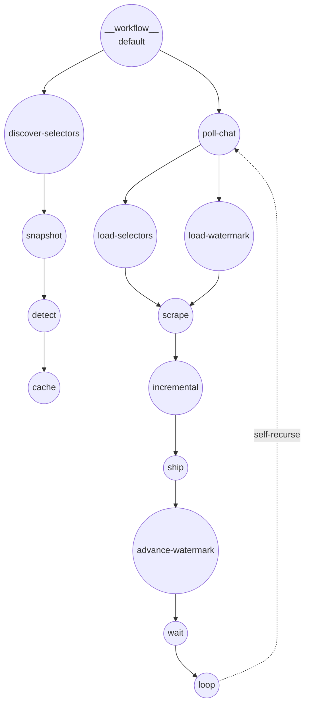

# YouTube 直播聊天 — AI 发现的选择器

此示例演示了一个三阶段工作流：

1. **Snapshot** — `web-scraper` 使用 JS 渲染打开 YouTube 直播聊天弹出页，并只返回聊天容器的 HTML 片段
2. **Detect** — `http-client` 将该 HTML 发送给 GPT-4o，返回命名了每条消息、id、作者和消息正文的 CSS 选择器的 JSON 对象
3. **Scrape** — 第二次 `web-scraper` 调用将这些选择器插入选择器字典，在轮询循环中拉取结构化消息，并通过基于 Redis 的水位线去重

发现步骤在每个直播开始时运行一次，并在 Redis 中缓存 6 小时，因此重复的 GPT 成本是有界的。

## 概述

此工作流通过以下流程运行：

1. **HTML 快照**：渲染弹出聊天页并提取聊天容器 HTML
2. **选择器检测**：将 HTML 发送给 GPT-4o，以严格的 JSON 模式请求 CSS 选择器集合
3. **缓存选择器**：以 6 小时 TTL 存入 Redis
4. **轮询**：使用缓存的选择器重新抓取页面，基于水位线去重后将新消息发送到 sink
5. **自递归**：在延迟后再次调用轮询工作流以无限期维持

## 何时使用此模式

关键其实不在 YouTube —— 对 YouTube 本身你可以硬编码 `yt-live-chat-text-message-renderer` + `#author-name` + `#message` 并跳过 AI。有意思的情形是**事先不知道标记结构、或类名会轮换的站点**。相同的三阶段形态同样适用：渲染 → 请模型给出选择器 → 用它们去抓取。

## 注意事项

- 直播聊天 HTML 严重依赖 web components，GPT 可能返回标签名选择器（例如 `yt-live-chat-text-message-renderer`）而非基于类的选择器。这是正确且预期的。
- 快照组件的初始 `wait_for` 假设至少一条消息已渲染。对于刚开始且零消息的直播，你可能需要等待更长时间或改抓空容器。
- 轮询工作流每一 tick 都会重新导航页面（`web-scraper` 每次调用会生成新的 Chromium 上下文）。长时间观察需要使用带持久 `session_id` 的 `web-browser` 组件，或 `web-scraper` 未来的 `watch` 模式。

## 准备工作

### 前置条件

- 已安装 model-compose 并在您的 PATH 中可用
- 在 `localhost:6379` 监听的 Redis
- OpenAI API 密钥
- 接收每批新消息的 sink 端点（可选，但要真正消费流则需要）

### 环境配置

1. 导航到此示例目录：
   ```bash
   cd examples/data-streaming/youtube-live-chat
   ```

2. 导出环境变量：
   ```bash
   export OPENAI_API_KEY=sk-...
   export SINK_URL=http://localhost:9000   # 您的 ingest 端点
   ```

   若未设置 `SINK_URL`，`chat-sink` 会回退到 `http://localhost:9999` 以便配置能解析。

## 运行方式

1. **启动服务：**
   ```bash
   model-compose up
   ```

2. **针对特定直播视频运行工作流：**

   **使用 API：**
   ```bash
   curl -X POST http://localhost:8080/api/workflows/runs \
     -H "Content-Type: application/json" \
     -d '{"workflow": "__workflow__", "input": {"video_id": "jfKfPfyJRdk", "poll_interval": "3s"}}'
   ```

   **使用 Web UI：**
   - 打开 Web UI：http://localhost:8081
   - 输入 `video_id` 和 `poll_interval` 后点击"运行工作流"

   **使用 CLI：**
   ```bash
   model-compose run __workflow__ \
     --input '{"video_id":"jfKfPfyJRdk","poll_interval":"3s"}'
   ```

## 组件详情

### Chat HTML Snapshot 组件 (chat-html-snapshot)
- **类型**：`web-scraper` 组件
- **用途**：捕获弹出聊天页的渲染后 HTML
- **备注**：伪装成真实桌面浏览器 UA、预置欧盟同意 cookie，使用 `wait_until: domcontentloaded` 以避免无限的 networkidle

### Selector Detector 组件 (selector-detector)
- **类型**：`http-client` 组件（OpenAI Chat Completions）
- **模型**：`gpt-4o`，`response_format: json_object`
- **输出**：`item_selector`、`id_selector`、`author_selector`、`message_selector`

### Dynamic Chat Scraper 组件 (dynamic-chat-scraper)
- **类型**：`web-scraper` 组件
- **用途**：使用 GPT 发现的选择器重新抓取聊天，返回每项一个已解析对象的列表

### Key-Value Store 组件 (kv)
- **类型**：`key-value-store` 组件
- **驱动**：`redis`（`localhost:6379`）
- **动作**：`get`、`set`（支持 TTL）。用于选择器缓存和水位线

### Chat Sink 组件 (chat-sink)
- **类型**：`http-client` 组件
- **端点**：`${env.SINK_URL | http://localhost:9999}/ingest`
- **用途**：接收每次轮询中的新消息批次

### 工作流自引用
- `self-discover` → `discover-selectors` 工作流
- `self-poll` → `poll-chat` 工作流

## 工作流详情

此示例定义了三个工作流：

- `discover-selectors` — HTML 快照、GPT 检测、选择器缓存
- `poll-chat` — 加载选择器、加载水位线、抓取、增量过滤、发送 sink、推进水位线、延迟、自递归
- `__workflow__`（默认）— 先运行 `discover-selectors`，再启动 `poll-chat`



#### 输入参数

| 参数 | 类型 | 必需 | 默认值 | 描述 |
|-----------|------|----------|---------|-------------|
| `video_id` | text | 是 | - | YouTube 直播视频 ID |
| `poll_interval` | duration | 否 | `3s` | 每次轮询之间的延迟 |

#### 输出格式

`discover-selectors` 返回检测到的选择器字典：

| 字段 | 类型 | 描述 |
|-------|------|-------------|
| `selectors.item_selector` | text | 选中每个消息元素 |
| `selectors.id_selector` | text | 稳定的消息 ID |
| `selectors.author_selector` | text | 作者名称（相对于项） |
| `selectors.message_selector` | text | 消息正文（相对于项） |

`poll-chat` 在每一 tick 将新消息流式送入 sink；工作流本身无限期自递归。

## 示例输出

发送到 `chat-sink` 的每个批次形如：

```json
{
  "video_id": "jfKfPfyJRdk",
  "messages": [
    { "id": "abc123", "author": "SomeUser", "message": "Hello!" },
    { "id": "abc124", "author": "AnotherUser", "message": "Nice stream" }
  ]
}
```

## 自定义

- 调整 `selector-detector` 的 system prompt 以适配其他站点
- 调整选择器缓存 `ttl`（默认 21600 秒）
- 替换为其他 KV 存储（非 Redis）或不同的 sink URL
- 需要持久浏览器会话时，将 `web-scraper` 替换为 `web-browser` 组件
