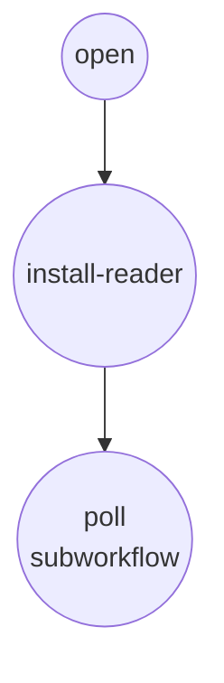
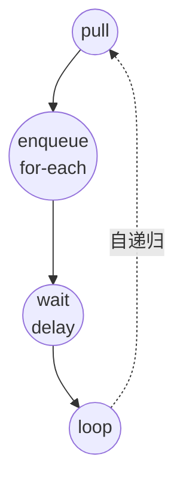
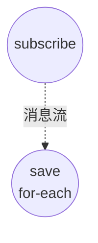

# YouTube 直播聊天收集器

此示例持续从 YouTube 直播的聊天中收集消息，并通过共享队列将每条新消息交给消费者工作流。它演示了如何组合 model-compose 的三个基本要素：

- 跨轮询 tick 保持打开的持久 `web-browser` 会话
- 追踪已上报消息的小型页面内读取脚本
- 将收集器与后续处理逻辑解耦的 `data-queue` 组件

## 概述

两个工作流共享一个 `data-queue` 实例和一个长生命周期的 `web-browser` 组件：

1. **collect-chat**（默认）— 只打开一次弹出聊天页面，在 `window` 上安装读取脚本，然后 tail-recurse 进入 `poll-chat`，每隔几秒拉取新消息并推入队列。
2. **save-chat** — 持续从队列中取出消息并将每条消息作为 JSON 文件保存到磁盘的长期运行消费者。

`web-browser` 组件按 id 缓存，因此页面和 `window.__seenIds` 集合在多次轮询之间得以保留。这正是读取脚本无需外部水位线即可在每 tick 只发出**新**消息的原因。

## 准备工作

### 前置条件

- 已安装 model-compose 并在您的 PATH 中可用
- Playwright 的 Chromium（首次使用浏览器时会自动安装）

### 环境配置

无需环境变量。

## 运行方式

1. **启动服务：**
   ```bash
   model-compose up
   ```

2. **启动消费者（保持运行）：**

   在一个终端中启动消费者工作流。它会阻塞等待第一条消息：

   ```bash
   model-compose run save-chat
   ```

   或打开 Web UI（http://localhost:8081）运行 `save-chat`。

3. **开始从直播流收集：**

   在另一个终端（或 Web UI）中，使用活跃直播的视频 id 启动收集器：

   ```bash
   model-compose run collect-chat \
     --input '{"video_id": "jfKfPfyJRdk", "poll_interval": "2s"}'
   ```

   **使用 API：**
   ```bash
   curl -X POST http://localhost:8080/api/workflows/collect-chat/runs \
     -H "Content-Type: application/json" \
     -d '{"input": {"video_id": "jfKfPfyJRdk", "poll_interval": "2s"}}'
   ```

4. **停止：**

   取消 `collect-chat` 运行以停止轮询。取消 `save-chat` 以停止保存。由于浏览器组件已缓存，重新启动 `collect-chat` 会复用同一页面。

## 组件详情

### Web Browser 组件 (browser)
- **类型**：`web-browser` 组件
- **驱动**：`playwright`（无头 Chromium）
- **用途**：保持弹出聊天页面打开并暴露三个动作：
  - `open-chat`（method `navigate`）：导航到 `https://www.youtube.com/live_chat?v=<id>&is_popout=1`，使用 `wait_until: domcontentloaded`。弹出页比 `/watch` 更轻量（无视频播放器），所以标签页不会永远处于 `networkidle`。
  - `install-reader`（method `evaluate`）：定义 `window.__chatReader` 和 `window.__seenIds`。读取脚本扫描 `yt-live-chat-text-message-renderer` 节点，记住已上报的 id，只返回新消息。
  - `pull-new-messages`（method `evaluate`）：调用 `window.__chatReader()` 并返回新批次。

### Data Queue 组件 (chat-messages)
- **类型**：`data-queue` 组件
- **驱动**：`memory`
- **用途**：收集器和保存器之间的 FIFO 缓冲区
- **动作**：`enqueue`（追加一条消息）和 `dequeue`（流式发送消息直到取消）

### File Store 组件 (storage)
- **类型**：`file-store` 组件
- **驱动**：`local`
- **基础路径**：`./output`
- **用途**：将每条消息保存为 `./output/<video_id>/<message_id>.json`

### Poller 组件 (poller)
- **类型**：`workflow` 组件
- **目标**：`poll-chat` 工作流
- **用途**：让 `collect-chat` 将轮询循环作为子工作流调用，并让 `poll-chat` tail-recurse 到自身

## 工作流详情

### "Collect YouTube live chat" 工作流（collect-chat，默认）

**描述**：一次性设置（打开聊天页 + 安装读取脚本），然后交给轮询循环。

#### 作业流程

1. **open**：导航到弹出聊天页
2. **install-reader**：注入 `window.__chatReader` 和 seen-ids 集合
3. **poll**：进入 `poll-chat` 子工作流


```mermaid
graph TD
    J1((open))
    J2((install-reader))
    J3((poll<br/>subworkflow))

    J1 --> J2 --> J3
```

#### 输入参数

| 参数 | 类型 | 必需 | 默认值 | 描述 |
|-----|------|------|--------|------|
| `video_id` | text | 是 | - | YouTube 直播视频 id |
| `poll_interval` | duration | 否 | `2s` | 轮询 tick 之间的延迟 |

### "poll-chat" 工作流

**描述**：拉取新消息、入队、休眠，然后重新进入自身。不建议直接调用 — `collect-chat` 在设置之后会启动它。

#### 作业流程

1. **pull**：调用 `window.__chatReader()` 并返回新消息
2. **enqueue**：将每条消息追加到 `chat-messages`
3. **wait**：延迟 `poll_interval`
4. **loop**：通过 `poller` 组件重新进入 `poll-chat`


```mermaid
graph TD
    J1((pull))
    J2((enqueue<br/>for-each))
    J3((wait<br/>delay))
    J4((loop))

    J1 --> J2 --> J3 --> J4
    J4 -.-> |自递归| J1
```

### "Save chat messages to disk" 工作流（save-chat）

**描述**：持续从队列取出消息并将每条保存为 JSON 的长期运行消费者。

#### 作业流程

1. **subscribe**：在 `chat-messages` 上打开消费流
2. **save**：将每条流入的消息写入 `./output/<video_id>/<id>.json`


```mermaid
graph TD
    J1((subscribe))
    J2((save<br/>for-each))

    J1 -.-> |消息流| J2
```

## 示例输出

两个工作流都运行时，文件会出现在 `./output/<video_id>/` 下：

```
output/jfKfPfyJRdk/ChwKGkNMbjMwc21VbTQ4REZjekF3Z1FkVFo0S0lB.json
output/jfKfPfyJRdk/ChwKGkNKM3JzOUM3bjQ4REZlOEF3Z1FkbG5jS3RB.json
```

每个文件包含一条消息：

```json
{
  "id": "ChwKGkNMbjMwc21VbTQ4REZjekF3Z1FkVFo0S0lB",
  "video_id": "jfKfPfyJRdk",
  "author": "SomeUser",
  "message": "你好！",
  "timestamp": "2:15 PM"
}
```

## 自定义

- 将 `save-chat` 的 `storage` 组件替换为其他任何东西（向您的 ingest 端点 POST 的 `http-client`、用于检索的 `vector-store`、用于社交分析的 `graph-store`）— 队列不关心谁来消费它。
- 在同一队列上添加多个消费者以工作队列的方式扇出（每条消息恰好交给一个消费者）。
- 调整 `poll_interval` 以在新鲜度和浏览器 CPU 消耗之间权衡。
- 想抓其他消息类型时替换读取脚本中的 CSS 选择器 — 例如 Super Chat 使用 `yt-live-chat-paid-message-renderer`。
