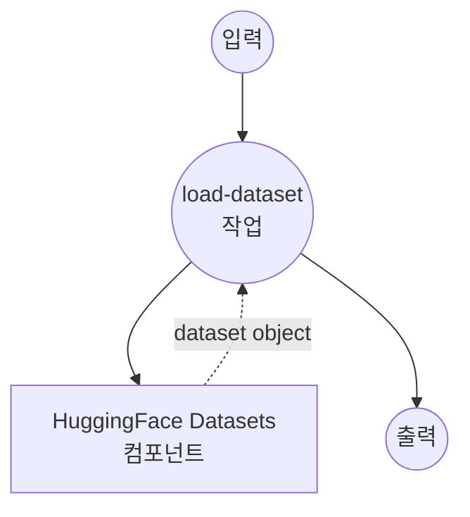
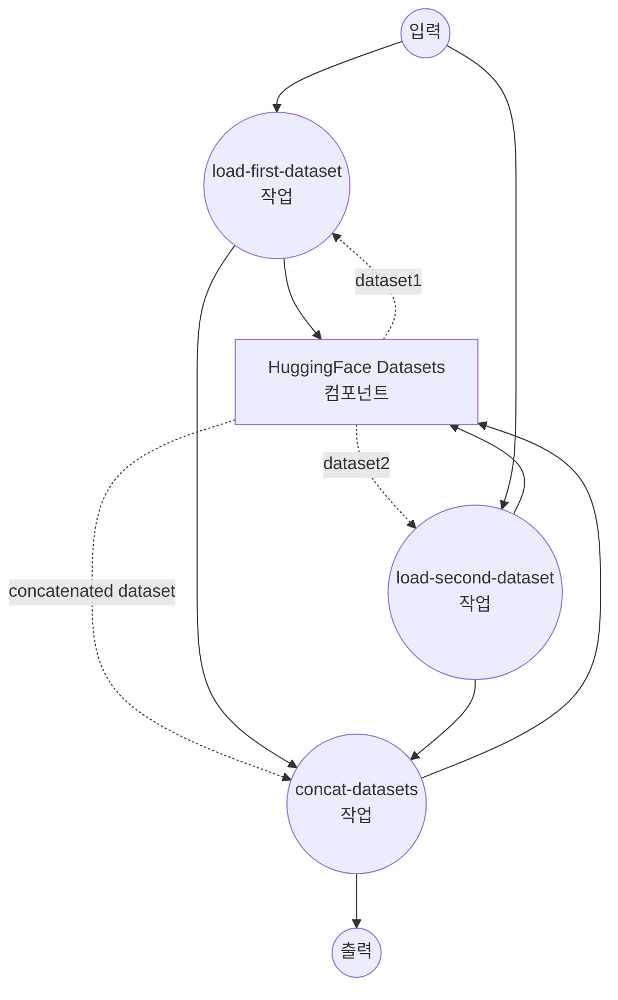

# HuggingFace Datasets 예제

이 예제는 HuggingFace Hub에서 데이터셋을 로드, 처리 및 연결하기 위해 model-compose를 HuggingFace Datasets와 함께 사용하는 방법을 보여줍니다.

## 개요

이 워크플로우는 다음과 같은 포괄적인 데이터셋 작업을 제공합니다:

1. **데이터셋 로드**: 구성 가능한 매개변수로 HuggingFace Hub에서 데이터셋 로드
2. **분할 샘플링**: 효율적인 처리를 위해 대규모 데이터셋의 일부만 로드
3. **데이터셋 연결**: 학습 또는 분석을 위해 여러 데이터셋을 수직으로 결합
4. **행/열 선택**: 인덱스별로 특정 행 또는 이름별로 열 선택
5. **유연한 구성**: 다양한 분할, 경로 및 샘플링 옵션 지원

## 준비사항

- model-compose가 설치되어 PATH에서 사용 가능
- HuggingFace Hub에서 데이터셋 다운로드를 위한 인터넷 연결
- datasets 라이브러리 지원이 있는 Python

## 실행 방법

1. **서비스 시작:**
   ```bash
   model-compose up
   ```

2. **워크플로우 실행:**

   **단일 데이터셋 로드:**
   ```bash
   curl -X POST http://localhost:8080/api/workflows/runs \
     -H "Content-Type: application/json" \
     -d '{"workflow_id": "load-dataset", "input": {"path": "tatsu-lab/alpaca", "split": "train", "fraction": 0.1}}'
   ```

   **여러 데이터셋 연결:**
   ```bash
   curl -X POST http://localhost:8080/api/workflows/runs \
     -H "Content-Type: application/json" \
     -d '{"workflow_id": "concat-datasets", "input": {"path-1": "tatsu-lab/alpaca", "split-1": "train", "fraction-1": 0.05, "path-2": "yahma/alpaca-cleaned", "split-2": "train", "fraction-2": 0.05}}'
   ```

   **데이터셋에서 열 선택:**
   ```bash
   curl -X POST http://localhost:8080/api/workflows/runs \
     -H "Content-Type: application/json" \
     -d '{"workflow_id": "select-columns", "input": {"path": "tatsu-lab/alpaca", "split": "train", "fraction": 0.1, "columns": ["instruction", "output"]}}'
   ```

   **데이터셋에서 행 선택:**
   ```bash
   curl -X POST http://localhost:8080/api/workflows/runs \
     -H "Content-Type: application/json" \
     -d '{"workflow_id": "select-rows", "input": {"path": "tatsu-lab/alpaca", "split": "train", "indices": [0, 5, 10, 15, 20]}}'
   ```

   **웹 UI 사용:**
   - 웹 UI 열기: http://localhost:8081
   - 원하는 워크플로우 선택 (load-dataset 또는 concat-datasets)
   - 입력 매개변수 구성:
     - `path`: HuggingFace 데이터셋 이름 (예: "tatsu-lab/alpaca")
     - `split`: 데이터셋 분할 (예: "train", "test", "validation")
     - `fraction`: 로드할 데이터셋 비율 (0.0-1.0, 기본값: 1.0)
   - "Run Workflow" 클릭

   **CLI 사용:**
   ```bash
   # 10% 샘플링으로 단일 데이터셋 로드
   model-compose run load-dataset --input '{
     "path": "squad",
     "split": "train",
     "fraction": 0.1
   }'

   # 다양한 비율로 두 데이터셋 연결
   model-compose run concat-datasets --input '{
     "path-1": "tatsu-lab/alpaca",
     "fraction-1": 0.1,
     "path-2": "yahma/alpaca-cleaned",
     "fraction-2": 0.2
   }'

   # 데이터셋에서 특정 열 선택
   model-compose run select-columns --input '{
     "path": "tatsu-lab/alpaca",
     "split": "train",
     "fraction": 0.1,
     "columns": ["instruction", "output"]
   }'

   # 데이터셋에서 특정 행 선택
   model-compose run select-rows --input '{
     "path": "tatsu-lab/alpaca",
     "split": "train",
     "indices": [0, 5, 10, 15, 20]
   }'
   ```

## 컴포넌트 세부사항

### HuggingFace Datasets 컴포넌트 (huggingface-datasets)

**유형**: HuggingFace 프로바이더가 있는 Datasets 컴포넌트

**지원되는 작업**:

#### 1. Load 작업
- **목적**: HuggingFace Hub에서 데이터셋 로드
- **기능**:
  - HuggingFace Hub의 모든 공개 데이터셋 지원
  - 구성 가능한 분할 선택
  - 대규모 데이터셋을 위한 분할 샘플링
  - 스트리밍 및 캐싱 옵션

#### 2. Concat 작업
- **목적**: 로드된 여러 데이터셋 연결
- **기능**:
  - 수직 연결 (행)
  - 수평 연결 (열)
  - 자동 분할 처리

#### 3. Select 작업
- **목적**: 데이터셋에서 특정 행 또는 열 선택
- **기능**:
  - 인덱스별 행 선택 (axis='rows')
  - 이름별 열 선택 (axis='columns')
  - 데이터 전처리를 위한 유연한 필터링

## 워크플로우 세부사항

### "Load HuggingFace Dataset" 워크플로우

**설명**: 구성 가능한 경로, 분할 및 비율 샘플링으로 HuggingFace Hub에서 단일 데이터셋을 로드합니다.

#### 작업 흐름



#### 입력 매개변수

| 매개변수 | 유형 | 필수 | 기본값 | 설명 |
|---------|------|------|--------|------|
| `path` | string | 아니오 | `tatsu-lab/alpaca` | HuggingFace 데이터셋 이름 또는 경로 |
| `split` | string | 아니오 | `train` | 로드할 데이터셋 분할 |
| `fraction` | number | 아니오 | 1.0 | 로드할 데이터셋 비율 (0.0-1.0) |

#### 출력 형식

로드된 데이터가 포함된 HuggingFace Dataset 객체를 반환합니다.

#### 사용 예시

```yaml
# 전체 데이터셋 로드
input: {"path": "squad", "split": "train"}

# 검증 세트의 10% 샘플 로드
input: {"path": "imdb", "split": "test", "fraction": 0.1}

# 커스텀 데이터셋 로드
input: {"path": "my-username/my-dataset", "split": "train", "fraction": 0.5}
```

### "Concatenate Multiple Datasets" 워크플로우

**설명**: HuggingFace Hub에서 두 개의 다른 데이터셋을 로드하고 수직으로 연결합니다.

#### 작업 흐름



#### 입력 매개변수

| 매개변수 | 유형 | 필수 | 기본값 | 설명 |
|---------|------|------|--------|------|
| `path-1` | string | 아니오 | `tatsu-lab/alpaca` | 첫 번째 데이터셋 경로 |
| `split-1` | string | 아니오 | `train` | 첫 번째 데이터셋 분할 |
| `fraction-1` | number | 아니오 | 1.0 | 첫 번째 데이터셋 비율 |
| `path-2` | string | 아니오 | `yahma/alpaca-cleaned` | 두 번째 데이터셋 경로 |
| `split-2` | string | 아니오 | `train` | 두 번째 데이터셋 분할 |
| `fraction-2` | number | 아니오 | 1.0 | 두 번째 데이터셋 비율 |

#### 출력 형식

두 입력 데이터셋을 결합한 연결된 HuggingFace Dataset 객체를 반환합니다.

#### 사용 예시

```yaml
# 전체 데이터셋 연결
input: {
  "path-1": "tatsu-lab/alpaca",
  "path-2": "yahma/alpaca-cleaned"
}

# 샘플링과 함께 연결
input: {
  "path-1": "squad", "fraction-1": 0.1,
  "path-2": "squad_v2", "fraction-2": 0.2
}
```

## 고급 구성

### 분할 샘플링

`fraction` 매개변수를 사용하면 대규모 데이터셋의 일부만 로드할 수 있습니다:

- `fraction: 1.0` - 전체 데이터셋 로드 (기본값)
- `fraction: 0.1` - 데이터셋의 10% 로드
- `fraction: 0.01` - 데이터셋의 1% 로드

특히 다음과 같은 경우에 유용합니다:
- **프로토타이핑**: 적은 데이터로 빠른 테스트
- **메모리 관리**: 대규모 데이터셋으로 인한 OOM 오류 방지
- **개발**: 개발 중 빠른 반복

### 인기 있는 데이터셋

시도해 볼 수 있는 인기 있는 데이터셋:

```yaml
# 텍스트 분류
path: "imdb"              # 영화 리뷰 감성
path: "ag_news"           # 뉴스 분류

# 질의응답
path: "squad"             # 독해
path: "squad_v2"          # 답변 불가능 질문이 포함된 SQuAD 2.0

# 지시 따르기
path: "tatsu-lab/alpaca"  # Alpaca 지시 데이터셋
path: "yahma/alpaca-cleaned"  # 정제된 버전

# 언어 모델링
path: "wikitext"          # Wikipedia 텍스트
path: "bookcorpus"        # 도서 데이터셋
```

## 사용자 정의

### 비공개 데이터셋 사용

비공개 데이터셋의 경우 인증을 추가할 수 있습니다:

```yaml
# 컴포넌트 구성에서
- id: load
  method: load
  provider: huggingface
  path: ${input.path}
  split: ${input.split}
  token: ${env.HUGGINGFACE_TOKEN}  # 환경에 토큰 설정
```

### 커스텀 데이터셋 처리

추가 처리 단계를 추가하여 이 예제를 확장할 수 있습니다:

```yaml
workflows:
  - id: load-and-process
    jobs:
      - id: load-dataset
        component: huggingface-datasets
        action: load

      - id: select-columns
        component: huggingface-datasets
        action: select-columns
        input:
          dataset: ${jobs.load-dataset.output}
          columns: ["text", "label"]

      - id: process-data
        # 커스텀 처리 컴포넌트 추가
        component: text-processor
        input: ${jobs.select-columns.output}
```

### Select 예제

**학습을 위한 특정 열 선택:**
```yaml
- id: prepare-training-data
  component: huggingface-datasets
  action: select-columns
  input:
    dataset: ${jobs.load-dataset.output}
    columns: ["instruction", "output"]  # 필요한 필드만 유지
```

**빠른 테스트를 위한 샘플 행 선택:**
```yaml
- id: get-samples
  component: huggingface-datasets
  action: select-rows
  input:
    dataset: ${jobs.load-dataset.output}
    indices: [0, 100, 200, 300, 400]  # 특정 예제 가져오기
```
