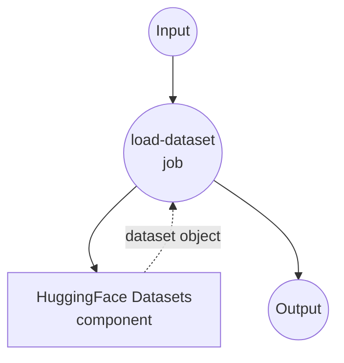
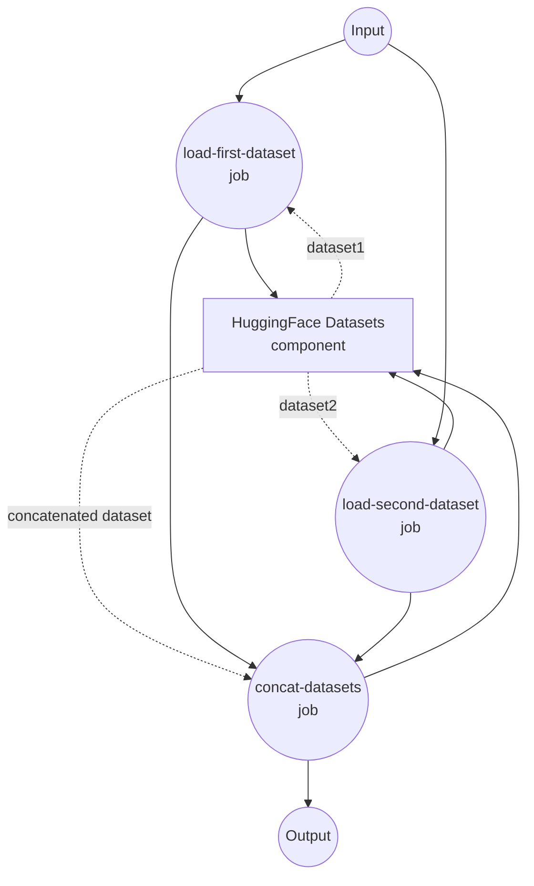

# HuggingFace Datasets Example

This example demonstrates how to use model-compose with HuggingFace Datasets for loading, processing, and concatenating datasets from the HuggingFace Hub.

## Overview

This workflow provides comprehensive dataset operations including:

1. **Dataset Loading**: Load datasets from HuggingFace Hub with configurable parameters
2. **Fraction Sampling**: Load only a portion of large datasets for efficient processing
3. **Dataset Concatenation**: Combine multiple datasets vertically for training or analysis
4. **Row/Column Selection**: Select specific rows by indices or columns by names
5. **Flexible Configuration**: Support for different splits, paths, and sampling options

## Prerequisites

- model-compose installed and available in your PATH
- Internet connection for downloading datasets from HuggingFace Hub
- Python with datasets library support

## How to Run

1. **Start the service:**
   ```bash
   model-compose up
   ```

2. **Run the workflows:**

   **Load Single Dataset:**
   ```bash
   curl -X POST http://localhost:8080/api/workflows/runs \
     -H "Content-Type: application/json" \
     -d '{"workflow_id": "load-dataset", "input": {"path": "tatsu-lab/alpaca", "split": "train", "fraction": 0.1}}'
   ```

   **Concatenate Multiple Datasets:**
   ```bash
   curl -X POST http://localhost:8080/api/workflows/runs \
     -H "Content-Type: application/json" \
     -d '{"workflow_id": "concat-datasets", "input": {"path-1": "tatsu-lab/alpaca", "split-1": "train", "fraction-1": 0.05, "path-2": "yahma/alpaca-cleaned", "split-2": "train", "fraction-2": 0.05}}'
   ```

   **Select Columns from Dataset:**
   ```bash
   curl -X POST http://localhost:8080/api/workflows/runs \
     -H "Content-Type: application/json" \
     -d '{"workflow_id": "select-columns", "input": {"path": "tatsu-lab/alpaca", "split": "train", "fraction": 0.1, "columns": ["instruction", "output"]}}'
   ```

   **Select Rows from Dataset:**
   ```bash
   curl -X POST http://localhost:8080/api/workflows/runs \
     -H "Content-Type: application/json" \
     -d '{"workflow_id": "select-rows", "input": {"path": "tatsu-lab/alpaca", "split": "train", "indices": [0, 5, 10, 15, 20]}}'
   ```

   **Using Web UI:**
   - Open the Web UI: http://localhost:8081
   - Select the desired workflow (load-dataset or concat-datasets)
   - Configure input parameters:
     - `path`: HuggingFace dataset name (e.g., "tatsu-lab/alpaca")
     - `split`: Dataset split (e.g., "train", "test", "validation")
     - `fraction`: Portion of dataset to load (0.0-1.0, default: 1.0)
   - Click "Run Workflow"

   **Using CLI:**
   ```bash
   # Load single dataset with 10% sampling
   model-compose run load-dataset --input '{
     "path": "squad",
     "split": "train",
     "fraction": 0.1
   }'

   # Concatenate two datasets with different fractions
   model-compose run concat-datasets --input '{
     "path-1": "tatsu-lab/alpaca",
     "fraction-1": 0.1,
     "path-2": "yahma/alpaca-cleaned",
     "fraction-2": 0.2
   }'

   # Select specific columns from a dataset
   model-compose run select-columns --input '{
     "path": "tatsu-lab/alpaca",
     "split": "train",
     "fraction": 0.1,
     "columns": ["instruction", "output"]
   }'

   # Select specific rows from a dataset
   model-compose run select-rows --input '{
     "path": "tatsu-lab/alpaca",
     "split": "train",
     "indices": [0, 5, 10, 15, 20]
   }'
   ```

## Component Details

### HuggingFace Datasets Component (huggingface-datasets)

**Type**: Datasets component with HuggingFace provider

**Supported Actions**:

#### 1. Load Action
- **Purpose**: Load datasets from HuggingFace Hub
- **Features**:
  - Support for any public dataset on HuggingFace Hub
  - Configurable split selection
  - Fraction sampling for large datasets
  - Streaming and caching options

#### 2. Concat Action
- **Purpose**: Concatenate multiple loaded datasets
- **Features**:
  - Vertical concatenation (rows)
  - Horizontal concatenation (columns)
  - Automatic split handling

#### 3. Select Action
- **Purpose**: Select specific rows or columns from a dataset
- **Features**:
  - Row selection by indices (axis='rows')
  - Column selection by names (axis='columns')
  - Flexible filtering for data preprocessing

## Workflow Details

### "Load HuggingFace Dataset" Workflow

**Description**: Load a single dataset from HuggingFace Hub with configurable path, split, and fraction sampling.

#### Job Flow



#### Input Parameters

| Parameter | Type | Required | Default | Description |
|-----------|------|----------|---------|-------------|
| `path` | string | No | `tatsu-lab/alpaca` | HuggingFace dataset name or path |
| `split` | string | No | `train` | Dataset split to load |
| `fraction` | number | No | 1.0 | Fraction of dataset to load (0.0-1.0) |

#### Output Format

Returns a HuggingFace Dataset object with the loaded data.

#### Example Usage

```yaml
# Load full dataset
input: {"path": "squad", "split": "train"}

# Load 10% sample of validation set
input: {"path": "imdb", "split": "test", "fraction": 0.1}

# Load custom dataset
input: {"path": "my-username/my-dataset", "split": "train", "fraction": 0.5}
```

### "Concatenate Multiple Datasets" Workflow

**Description**: Load two different datasets from HuggingFace Hub and concatenate them vertically.

#### Job Flow



#### Input Parameters

| Parameter | Type | Required | Default | Description |
|-----------|------|----------|---------|-------------|
| `path-1` | string | No | `tatsu-lab/alpaca` | First dataset path |
| `split-1` | string | No | `train` | First dataset split |
| `fraction-1` | number | No | 1.0 | Fraction of first dataset |
| `path-2` | string | No | `yahma/alpaca-cleaned` | Second dataset path |
| `split-2` | string | No | `train` | Second dataset split |
| `fraction-2` | number | No | 1.0 | Fraction of second dataset |

#### Output Format

Returns a concatenated HuggingFace Dataset object combining both input datasets.

#### Example Usage

```yaml
# Concatenate full datasets
input: {
  "path-1": "tatsu-lab/alpaca",
  "path-2": "yahma/alpaca-cleaned"
}

# Concatenate with sampling
input: {
  "path-1": "squad", "fraction-1": 0.1,
  "path-2": "squad_v2", "fraction-2": 0.2
}
```

## Advanced Configuration

### Fraction Sampling

The `fraction` parameter allows you to load only a portion of large datasets:

- `fraction: 1.0` - Load entire dataset (default)
- `fraction: 0.1` - Load 10% of the dataset
- `fraction: 0.01` - Load 1% of the dataset

This is particularly useful for:
- **Prototyping**: Quick testing with smaller data
- **Memory Management**: Avoiding OOM errors with large datasets
- **Development**: Faster iteration during development

### Popular Datasets

Some popular datasets you can try:

```yaml
# Text Classification
path: "imdb"              # Movie reviews sentiment
path: "ag_news"           # News categorization

# Question Answering
path: "squad"             # Reading comprehension
path: "squad_v2"          # SQuAD 2.0 with unanswerable questions

# Instruction Following
path: "tatsu-lab/alpaca"  # Alpaca instruction dataset
path: "yahma/alpaca-cleaned"  # Cleaned version

# Language Modeling
path: "wikitext"          # Wikipedia text
path: "bookcorpus"        # Books dataset
```

## Customization

### Using Private Datasets

For private datasets, you can add authentication:

```yaml
# In the component configuration
- id: load
  method: load
  provider: huggingface
  path: ${input.path}
  split: ${input.split}
  token: ${env.HUGGINGFACE_TOKEN}  # Set your token in environment
```

### Custom Dataset Processing

You can extend this example by adding additional processing steps:

```yaml
workflows:
  - id: load-and-process
    jobs:
      - id: load-dataset
        component: huggingface-datasets
        action: load

      - id: select-columns
        component: huggingface-datasets
        action: select-columns
        input:
          dataset: ${jobs.load-dataset.output}
          columns: ["text", "label"]

      - id: process-data
        # Add custom processing components
        component: text-processor
        input: ${jobs.select-columns.output}
```

### Select Examples

**Select specific columns for training:**
```yaml
- id: prepare-training-data
  component: huggingface-datasets
  action: select-columns
  input:
    dataset: ${jobs.load-dataset.output}
    columns: ["instruction", "output"]  # Only keep required fields
```

**Select sample rows for quick testing:**
```yaml
- id: get-samples
  component: huggingface-datasets
  action: select-rows
  input:
    dataset: ${jobs.load-dataset.output}
    indices: [0, 100, 200, 300, 400]  # Get specific examples
```
