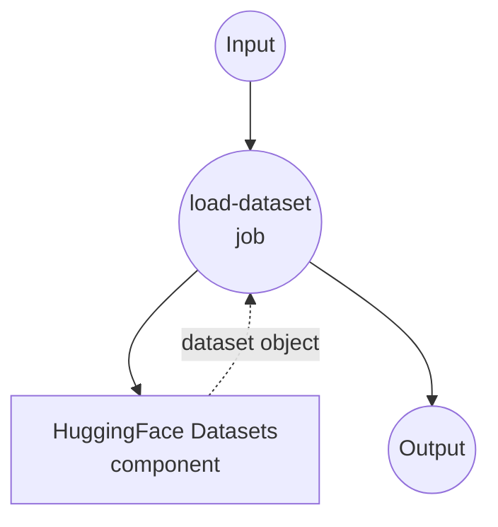
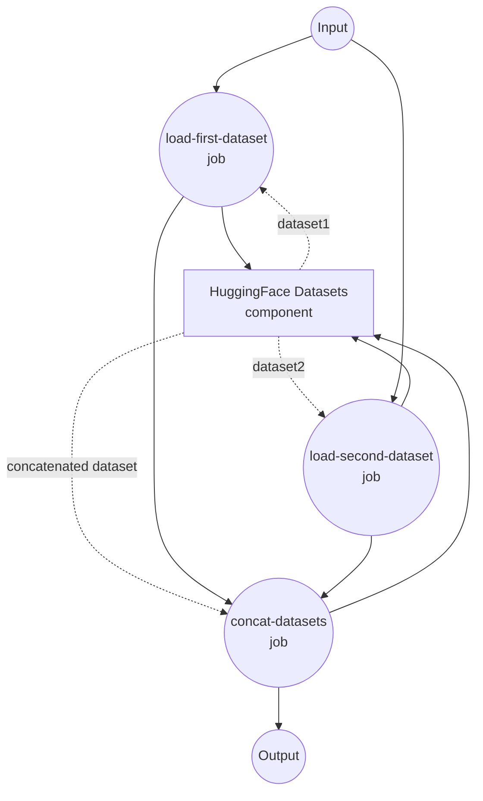

# HuggingFace 数据集示例

此示例演示如何使用 model-compose 配合 HuggingFace Datasets 来加载、处理和连接来自 HuggingFace Hub 的数据集。

## 概述

此工作流提供全面的数据集操作，包括：

1. **数据集加载**：使用可配置参数从 HuggingFace Hub 加载数据集
2. **分数采样**：仅加载大型数据集的一部分以实现高效处理
3. **数据集连接**：垂直组合多个数据集用于训练或分析
4. **行/列选择**：通过索引选择特定行或通过名称选择列
5. **灵活配置**：支持不同的分割、路径和采样选项

## 前置条件

- 已安装 model-compose 并在 PATH 中可用
- 用于从 HuggingFace Hub 下载数据集的互联网连接
- 支持 datasets 库的 Python 环境

## 运行方法

1. **启动服务：**
   ```bash
   model-compose up
   ```

2. **运行工作流：**

   **加载单个数据集：**
   ```bash
   curl -X POST http://localhost:8080/api/workflows/runs \
     -H "Content-Type: application/json" \
     -d '{"workflow_id": "load-dataset", "input": {"path": "tatsu-lab/alpaca", "split": "train", "fraction": 0.1}}'
   ```

   **连接多个数据集：**
   ```bash
   curl -X POST http://localhost:8080/api/workflows/runs \
     -H "Content-Type: application/json" \
     -d '{"workflow_id": "concat-datasets", "input": {"path-1": "tatsu-lab/alpaca", "split-1": "train", "fraction-1": 0.05, "path-2": "yahma/alpaca-cleaned", "split-2": "train", "fraction-2": 0.05}}'
   ```

   **从数据集中选择列：**
   ```bash
   curl -X POST http://localhost:8080/api/workflows/runs \
     -H "Content-Type: application/json" \
     -d '{"workflow_id": "select-columns", "input": {"path": "tatsu-lab/alpaca", "split": "train", "fraction": 0.1, "columns": ["instruction", "output"]}}'
   ```

   **从数据集中选择行：**
   ```bash
   curl -X POST http://localhost:8080/api/workflows/runs \
     -H "Content-Type: application/json" \
     -d '{"workflow_id": "select-rows", "input": {"path": "tatsu-lab/alpaca", "split": "train", "indices": [0, 5, 10, 15, 20]}}'
   ```

   **使用 Web UI：**
   - 打开 Web UI：http://localhost:8081
   - 选择所需的工作流（load-dataset 或 concat-datasets）
   - 配置输入参数：
     - `path`：HuggingFace 数据集名称（例如 "tatsu-lab/alpaca"）
     - `split`：数据集分割（例如 "train"、"test"、"validation"）
     - `fraction`：要加载的数据集部分（0.0-1.0，默认值：1.0）
   - 点击 "Run Workflow"

   **使用 CLI：**
   ```bash
   # 加载单个数据集，10% 采样
   model-compose run load-dataset --input '{
     "path": "squad",
     "split": "train",
     "fraction": 0.1
   }'

   # 连接两个具有不同分数的数据集
   model-compose run concat-datasets --input '{
     "path-1": "tatsu-lab/alpaca",
     "fraction-1": 0.1,
     "path-2": "yahma/alpaca-cleaned",
     "fraction-2": 0.2
   }'

   # 从数据集中选择特定列
   model-compose run select-columns --input '{
     "path": "tatsu-lab/alpaca",
     "split": "train",
     "fraction": 0.1,
     "columns": ["instruction", "output"]
   }'

   # 从数据集中选择特定行
   model-compose run select-rows --input '{
     "path": "tatsu-lab/alpaca",
     "split": "train",
     "indices": [0, 5, 10, 15, 20]
   }'
   ```

## 组件详情

### HuggingFace Datasets 组件（huggingface-datasets）

**类型**：带有 HuggingFace 提供者的 Datasets 组件

**支持的操作**：

#### 1. Load 操作
- **目的**：从 HuggingFace Hub 加载数据集
- **功能**：
  - 支持 HuggingFace Hub 上的任何公共数据集
  - 可配置的分割选择
  - 大型数据集的分数采样
  - 流式传输和缓存选项

#### 2. Concat 操作
- **目的**：连接多个已加载的数据集
- **功能**：
  - 垂直连接（行）
  - 水平连接（列）
  - 自动分割处理

#### 3. Select 操作
- **目的**：从数据集中选择特定行或列
- **功能**：
  - 通过索引选择行（axis='rows'）
  - 通过名称选择列（axis='columns'）
  - 灵活的数据预处理过滤

## 工作流详情

### "加载 HuggingFace 数据集" 工作流

**描述**：从 HuggingFace Hub 加载单个数据集，可配置路径、分割和分数采样。

#### 作业流程



#### 输入参数

| 参数 | 类型 | 必需 | 默认值 | 描述 |
|-----------|------|----------|---------|-------------|
| `path` | string | 否 | `tatsu-lab/alpaca` | HuggingFace 数据集名称或路径 |
| `split` | string | 否 | `train` | 要加载的数据集分割 |
| `fraction` | number | 否 | 1.0 | 要加载的数据集分数（0.0-1.0）|

#### 输出格式

返回包含已加载数据的 HuggingFace Dataset 对象。

#### 使用示例

```yaml
# 加载完整数据集
input: {"path": "squad", "split": "train"}

# 加载验证集的 10% 样本
input: {"path": "imdb", "split": "test", "fraction": 0.1}

# 加载自定义数据集
input: {"path": "my-username/my-dataset", "split": "train", "fraction": 0.5}
```

### "连接多个数据集" 工作流

**描述**：从 HuggingFace Hub 加载两个不同的数据集并垂直连接它们。

#### 作业流程



#### 输入参数

| 参数 | 类型 | 必需 | 默认值 | 描述 |
|-----------|------|----------|---------|-------------|
| `path-1` | string | 否 | `tatsu-lab/alpaca` | 第一个数据集路径 |
| `split-1` | string | 否 | `train` | 第一个数据集分割 |
| `fraction-1` | number | 否 | 1.0 | 第一个数据集的分数 |
| `path-2` | string | 否 | `yahma/alpaca-cleaned` | 第二个数据集路径 |
| `split-2` | string | 否 | `train` | 第二个数据集分割 |
| `fraction-2` | number | 否 | 1.0 | 第二个数据集的分数 |

#### 输出格式

返回一个连接的 HuggingFace Dataset 对象，组合了两个输入数据集。

#### 使用示例

```yaml
# 连接完整数据集
input: {
  "path-1": "tatsu-lab/alpaca",
  "path-2": "yahma/alpaca-cleaned"
}

# 使用采样连接
input: {
  "path-1": "squad", "fraction-1": 0.1,
  "path-2": "squad_v2", "fraction-2": 0.2
}
```

## 高级配置

### 分数采样

`fraction` 参数允许您仅加载大型数据集的一部分：

- `fraction: 1.0` - 加载整个数据集（默认）
- `fraction: 0.1` - 加载数据集的 10%
- `fraction: 0.01` - 加载数据集的 1%

这特别适用于：
- **原型设计**：使用较小数据进行快速测试
- **内存管理**：避免大型数据集的 OOM 错误
- **开发**：开发期间更快的迭代

### 热门数据集

您可以尝试的一些热门数据集：

```yaml
# 文本分类
path: "imdb"              # 电影评论情感
path: "ag_news"           # 新闻分类

# 问答
path: "squad"             # 阅读理解
path: "squad_v2"          # SQuAD 2.0，包含无法回答的问题

# 指令跟随
path: "tatsu-lab/alpaca"  # Alpaca 指令数据集
path: "yahma/alpaca-cleaned"  # 清理版本

# 语言建模
path: "wikitext"          # 维基百科文本
path: "bookcorpus"        # 图书数据集
```

## 自定义

### 使用私有数据集

对于私有数据集，您可以添加身份验证：

```yaml
# 在组件配置中
- id: load
  method: load
  provider: huggingface
  path: ${input.path}
  split: ${input.split}
  token: ${env.HUGGINGFACE_TOKEN}  # 在环境中设置您的令牌
```

### 自定义数据集处理

您可以通过添加额外的处理步骤来扩展此示例：

```yaml
workflows:
  - id: load-and-process
    jobs:
      - id: load-dataset
        component: huggingface-datasets
        action: load

      - id: select-columns
        component: huggingface-datasets
        action: select-columns
        input:
          dataset: ${jobs.load-dataset.output}
          columns: ["text", "label"]

      - id: process-data
        # 添加自定义处理组件
        component: text-processor
        input: ${jobs.select-columns.output}
```

### Select 示例

**选择用于训练的特定列：**
```yaml
- id: prepare-training-data
  component: huggingface-datasets
  action: select-columns
  input:
    dataset: ${jobs.load-dataset.output}
    columns: ["instruction", "output"]  # 仅保留必需字段
```

**选择样本行进行快速测试：**
```yaml
- id: get-samples
  component: huggingface-datasets
  action: select-rows
  input:
    dataset: ${jobs.load-dataset.output}
    indices: [0, 100, 200, 300, 400]  # 获取特定示例
```
