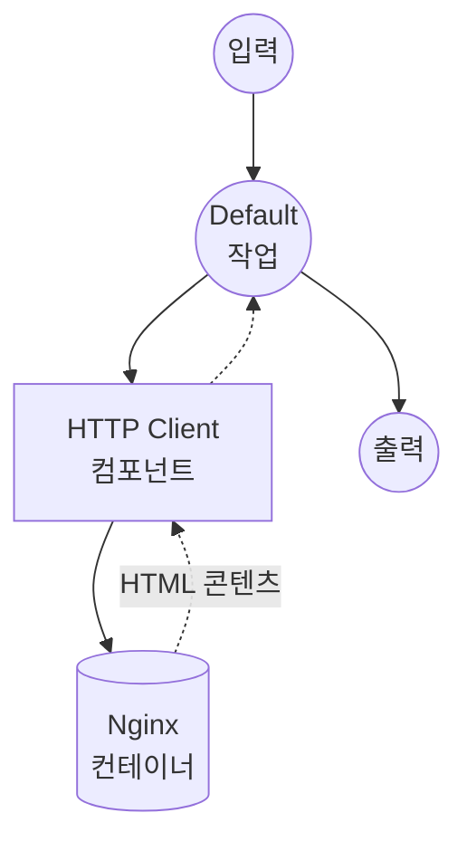

# Docker Nginx 예제

이 예제는 컴포넌트의 Docker 런타임을 사용하여, 로컬 디렉토리의 정적 파일을 볼륨 마운트로 제공하는 Nginx 컨테이너를 실행하는 방법을 보여줍니다.

## 개요

이 워크플로우는 다음과 같은 간단한 정적 파일 서버를 제공합니다:

1. **Docker 런타임**: 컴포넌트의 Docker 런타임을 통해 Nginx 컨테이너 자동 시작 및 관리
2. **볼륨 마운트**: 로컬 `html` 디렉토리를 컨테이너에 마운트하여 정적 파일 제공
3. **HTTP 통신**: Docker화된 서비스와의 HTTP 클라이언트 통신 시연
4. **경량 이미지**: `nginx:alpine` 사용으로 최소 용량 (~40MB)

## 준비사항

### 필수 요구사항

- model-compose가 설치되어 PATH에서 사용 가능
- Docker 설치 및 실행 중

### 환경 구성

1. 이 예제 디렉토리로 이동:
   ```bash
   cd examples/docker
   ```

2. 추가 환경 구성 불필요 - Docker 이미지는 자동으로 pull됩니다.

## 실행 방법

1. **서비스 시작:**
   ```bash
   model-compose up
   ```

2. **워크플로우 실행:**

   **API 사용:**
   ```bash
   curl -X POST http://localhost:8080/api/workflows/runs \
     -H "Content-Type: application/json" \
     -d '{"input": {"path": "index.html"}}'
   ```

   **웹 UI 사용:**
   - Web UI 열기: http://localhost:8081
   - 파일 경로 입력 (예: `index.html`)
   - "Run Workflow" 버튼 클릭

   **CLI 사용:**
   ```bash
   model-compose run --input '{"path": "index.html"}'
   ```

3. **Nginx 직접 접근 (대안):**
   ```bash
   curl http://localhost:8090/index.html
   ```

4. **서비스 중지:**
   ```bash
   model-compose down
   ```

## 컴포넌트 세부사항

### HTTP Client 컴포넌트 (기본)
- **유형**: Docker 런타임을 가진 HTTP 클라이언트
- **Docker 이미지**: `nginx:alpine`
- **컨테이너 이름**: `model-compose-nginx`
- **포트 매핑**: `8090:80` (호스트:컨테이너)
- **볼륨**: `./html:/usr/share/nginx/html:ro` (읽기 전용)
- **재시작 정책**: `unless-stopped`

## 워크플로우 세부사항

### "Docker Nginx Example" 워크플로우 (기본)

**설명**: Nginx 컨테이너를 사용하여 로컬 디렉토리의 정적 파일을 제공합니다.

#### 작업 흐름



#### 입력 매개변수

| 매개변수 | 유형 | 필수 | 기본값 | 설명 |
|---------|------|------|--------|------|
| `path` | text | 아니오 | `index.html` | Nginx에서 가져올 파일 경로 |

#### 출력 형식

| 필드 | 유형 | 설명 |
|-----|------|------|
| `content` | text | Nginx에서 가져온 HTML 콘텐츠 |

## 설정

### model-compose.yml

```yaml
component:
  type: http-client
  runtime:
    type: docker
    image: nginx:alpine
    container_name: model-compose-nginx
    ports:
      - "8090:80"
    volumes:
      - ./html:/usr/share/nginx/html:ro
    restart: unless-stopped
  action:
    method: GET
    endpoint: http://localhost:8090/${input.path | index.html}
    output:
      content: ${response as text}
```

**핵심 포인트:**
- `runtime` 섹션에서 Docker 컨테이너 설정을 정의
- `action` 섹션에서 컴포넌트가 컨테이너와 통신하는 방식을 정의
- 볼륨 마운트에 `:ro` (읽기 전용) 사용으로 보안 강화

## 사용자 정의

### 정적 파일 추가
`html` 디렉토리에 파일을 추가:
```bash
echo "<h1>About</h1>" > html/about.html
```

### 포트 변경
`model-compose.yml`에서 포트 매핑 수정:
```yaml
ports:
  - "9090:80"
```

### 다른 이미지 사용
`nginx:alpine`을 다른 HTTP 서버 이미지로 교체:
```yaml
runtime:
  type: docker
  image: httpd:alpine
  ports:
    - "8090:80"
  volumes:
    - ./html:/usr/local/apache2/htdocs:ro
```

## 문제 해결

### 일반적인 문제

1. **Docker 미실행**: Docker 데몬이 실행 중인지 확인 (`docker info`)
2. **포트가 이미 사용 중**: 8090 포트가 사용 중이면 `model-compose.yml`에서 호스트 포트 변경
3. **권한 거부**: `html` 디렉토리에 읽기 권한이 있는지 확인
4. **컨테이너 미제거**: `docker rm -f model-compose-nginx`로 수동 정리
