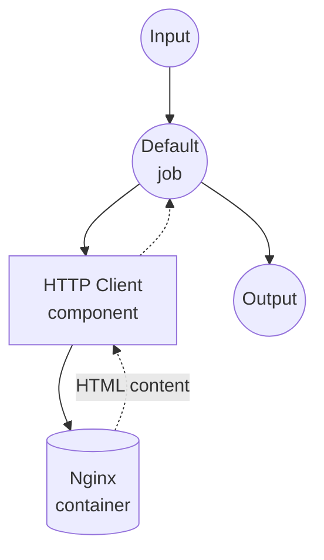

# Docker Nginx Example

This example demonstrates how to use Docker runtime for components, running an Nginx container that serves static files from a local directory with volume mounting.

## Overview

This workflow provides a simple static file server that:

1. **Docker Runtime**: Automatically starts and manages an Nginx container via component's Docker runtime
2. **Volume Mounting**: Mounts a local `html` directory into the container for serving static files
3. **HTTP Communication**: Demonstrates HTTP client communication with a Dockerized service
4. **Lightweight Image**: Uses `nginx:alpine` for minimal footprint (~40MB)

## Preparation

### Prerequisites

- model-compose installed and available in your PATH
- Docker installed and running

### Environment Configuration

1. Navigate to this example directory:
   ```bash
   cd examples/docker
   ```

2. No additional environment configuration required - Docker image is pulled automatically.

## How to Run

1. **Start the service:**
   ```bash
   model-compose up
   ```

2. **Run the workflow:**

   **Using API:**
   ```bash
   curl -X POST http://localhost:8080/api/workflows/runs \
     -H "Content-Type: application/json" \
     -d '{"input": {"path": "index.html"}}'
   ```

   **Using Web UI:**
   - Open the Web UI: http://localhost:8081
   - Enter a file path (e.g., `index.html`)
   - Click the "Run Workflow" button

   **Using CLI:**
   ```bash
   model-compose run --input '{"path": "index.html"}'
   ```

3. **Direct Nginx access (alternative):**
   ```bash
   curl http://localhost:8090/index.html
   ```

4. **Stop the service:**
   ```bash
   model-compose down
   ```

## Component Details

### HTTP Client Component (Default)
- **Type**: HTTP client with Docker runtime
- **Docker Image**: `nginx:alpine`
- **Container Name**: `model-compose-nginx`
- **Port Mapping**: `8090:80` (host:container)
- **Volume**: `./html:/usr/share/nginx/html:ro` (read-only)
- **Restart Policy**: `unless-stopped`

## Workflow Details

### "Docker Nginx Example" Workflow (Default)

**Description**: Serves static files from a local directory using an Nginx container.

#### Job Flow



#### Input Parameters

| Parameter | Type | Required | Default | Description |
|-----------|------|----------|---------|-------------|
| `path` | text | No | `index.html` | File path to fetch from Nginx |

#### Output Format

| Field | Type | Description |
|-------|------|-------------|
| `content` | text | The HTML content fetched from Nginx |

## Configuration

### model-compose.yml

```yaml
component:
  type: http-client
  runtime:
    type: docker
    image: nginx:alpine
    container_name: model-compose-nginx
    ports:
      - "8090:80"
    volumes:
      - ./html:/usr/share/nginx/html:ro
    restart: unless-stopped
  action:
    method: GET
    endpoint: http://localhost:8090/${input.path | index.html}
    output:
      content: ${response as text}
```

**Key points:**
- The `runtime` section defines the Docker container configuration
- The `action` section defines how the component communicates with the container
- Volume mount uses `:ro` (read-only) for security

## Customization

### Add More Static Files
Place additional files in the `html` directory:
```bash
echo "<h1>About</h1>" > html/about.html
```

### Change Port
Modify the port mapping in `model-compose.yml`:
```yaml
ports:
  - "9090:80"
```

### Use a Different Image
Replace `nginx:alpine` with any HTTP server image:
```yaml
runtime:
  type: docker
  image: httpd:alpine
  ports:
    - "8090:80"
  volumes:
    - ./html:/usr/local/apache2/htdocs:ro
```

## Troubleshooting

### Common Issues

1. **Docker not running**: Ensure Docker daemon is running (`docker info`)
2. **Port already in use**: Change the host port in `model-compose.yml` if 8090 is occupied
3. **Permission denied**: Ensure the `html` directory is readable
4. **Container not removed**: Run `docker rm -f model-compose-nginx` to clean up manually
