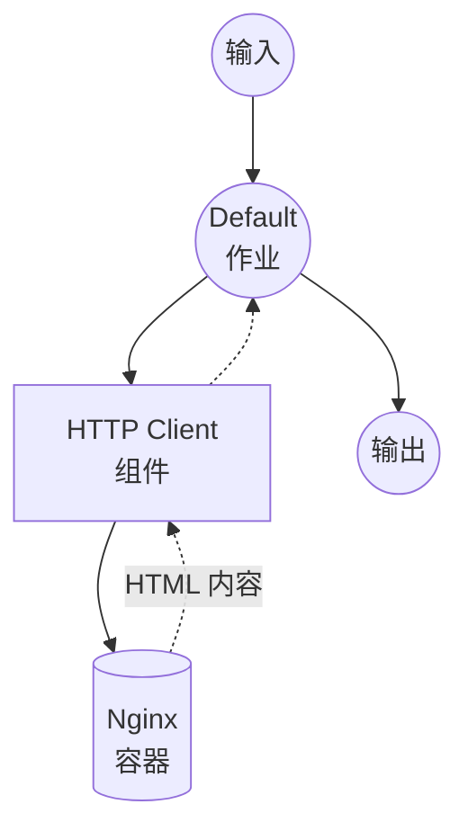

# Docker Nginx 示例

此示例演示如何使用组件的 Docker 运行时，通过卷挂载运行一个 Nginx 容器来提供本地目录中的静态文件。

## 概述

此工作流提供了一个简单的静态文件服务器：

1. **Docker 运行时**：通过组件的 Docker 运行时自动启动和管理 Nginx 容器
2. **卷挂载**：将本地 `html` 目录挂载到容器中以提供静态文件
3. **HTTP 通信**：演示与 Docker 化服务的 HTTP 客户端通信
4. **轻量级镜像**：使用 `nginx:alpine` 实现最小占用空间（~40MB）

## 准备工作

### 前置条件

- 已安装 model-compose 并在您的 PATH 中可用
- Docker 已安装并正在运行

### 环境配置

1. 导航到此示例目录：
   ```bash
   cd examples/docker
   ```

2. 不需要额外的环境配置 - Docker 镜像会自动拉取。

## 运行方式

1. **启动服务：**
   ```bash
   model-compose up
   ```

2. **运行工作流：**

   **使用 API：**
   ```bash
   curl -X POST http://localhost:8080/api/workflows/runs \
     -H "Content-Type: application/json" \
     -d '{"input": {"path": "index.html"}}'
   ```

   **使用 Web UI：**
   - 打开 Web UI：http://localhost:8081
   - 输入文件路径（例如：`index.html`）
   - 点击"运行工作流"按钮

   **使用 CLI：**
   ```bash
   model-compose run --input '{"path": "index.html"}'
   ```

3. **直接访问 Nginx（替代方式）：**
   ```bash
   curl http://localhost:8090/index.html
   ```

4. **停止服务：**
   ```bash
   model-compose down
   ```

## 组件详情

### HTTP Client 组件（默认）
- **类型**：具有 Docker 运行时的 HTTP 客户端
- **Docker 镜像**：`nginx:alpine`
- **容器名称**：`model-compose-nginx`
- **端口映射**：`8090:80`（主机:容器）
- **卷**：`./html:/usr/share/nginx/html:ro`（只读）
- **重启策略**：`unless-stopped`

## 工作流详情

### "Docker Nginx Example" 工作流（默认）

**描述**：使用 Nginx 容器提供本地目录中的静态文件。

#### 作业流程



#### 输入参数

| 参数 | 类型 | 必需 | 默认值 | 描述 |
|------|------|------|--------|------|
| `path` | text | 否 | `index.html` | 从 Nginx 获取的文件路径 |

#### 输出格式

| 字段 | 类型 | 描述 |
|------|------|------|
| `content` | text | 从 Nginx 获取的 HTML 内容 |

## 配置

### model-compose.yml

```yaml
component:
  type: http-client
  runtime:
    type: docker
    image: nginx:alpine
    container_name: model-compose-nginx
    ports:
      - "8090:80"
    volumes:
      - ./html:/usr/share/nginx/html:ro
    restart: unless-stopped
  action:
    method: GET
    endpoint: http://localhost:8090/${input.path | index.html}
    output:
      content: ${response as text}
```

**关键要点：**
- `runtime` 部分定义 Docker 容器配置
- `action` 部分定义组件如何与容器通信
- 卷挂载使用 `:ro`（只读）以增强安全性

## 自定义

### 添加更多静态文件
将文件放入 `html` 目录：
```bash
echo "<h1>About</h1>" > html/about.html
```

### 更改端口
在 `model-compose.yml` 中修改端口映射：
```yaml
ports:
  - "9090:80"
```

### 使用不同的镜像
将 `nginx:alpine` 替换为其他 HTTP 服务器镜像：
```yaml
runtime:
  type: docker
  image: httpd:alpine
  ports:
    - "8090:80"
  volumes:
    - ./html:/usr/local/apache2/htdocs:ro
```

## 故障排除

### 常见问题

1. **Docker 未运行**：确保 Docker 守护进程正在运行（`docker info`）
2. **端口已被占用**：如果 8090 端口被占用，在 `model-compose.yml` 中更改主机端口
3. **权限被拒绝**：确保 `html` 目录具有读取权限
4. **容器未移除**：运行 `docker rm -f model-compose-nginx` 手动清理
