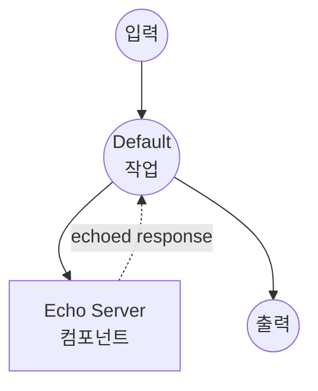

# Echo Server 예제

이 예제는 사용자 입력을 받아 그대로 반환하는 간단한 HTTP echo server를 보여주며, model-compose가 로컬 HTTP 서비스를 관리하고 통신하는 방법을 시연합니다.

## 개요

이 워크플로우는 다음과 같은 기본 echo 서비스를 제공합니다:

1. **로컬 서버 관리**: 로컬 FastAPI echo server 자동 시작 및 관리
2. **HTTP 통신**: model-compose 내에서 HTTP client-server 통신 시연
3. **입출력 처리**: 컴포넌트와 워크플로우 간 데이터 흐름 방식 표시
4. **개발 테스트**: model-compose HTTP 기능 테스트를 위한 간단한 서비스 제공

## 준비사항

### 필수 요구사항

- model-compose가 설치되어 PATH에서 사용 가능
- FastAPI 및 Uvicorn이 포함된 Python (컴포넌트에 의해 자동 관리)

### 환경 구성

1. 이 예제 디렉토리로 이동:
   ```bash
   cd examples/echo-server
   ```

2. 추가 환경 구성 불필요 - 모든 의존성 자동 관리

## 실행 방법

1. **서비스 시작:**
   ```bash
   model-compose up
   ```

2. **워크플로우 실행:**

   **API 사용:**
   ```bash
   curl -X POST http://localhost:8080/api/workflows/runs \
     -H "Content-Type: application/json" \
     -d '{"input": {"text": "Hello, world!"}}'
   ```

   **웹 UI 사용:**
   - Web UI 열기: http://localhost:8081
   - 텍스트 입력
   - "Run Workflow" 버튼 클릭

   **CLI 사용:**
   ```bash
   model-compose run --input '{"text": "Hello, world!"}'
   ```

3. **직접 서버 액세스 (대안):**
   ```bash
   # 내부 echo server로 직접 액세스
   curl -X POST http://localhost:8000/echo \
        -H "Content-Type: application/json" \
        -d '{"text": "Hello, world!"}'
   ```

## 컴포넌트 세부사항

### Echo Server 컴포넌트 (기본)
- **유형**: 관리되는 수명 주기를 가진 HTTP server 컴포넌트
- **목적**: 테스트 및 시연을 위한 간단한 echo 서비스
- **프레임워크**: Uvicorn server가 있는 FastAPI
- **포트**: 8000 (내부)
- **엔드포인트**: `/echo`
- **관리 명령**:
  - **시작**: 자동 리로드로 FastAPI server 시작
    ```bash
    uvicorn main:app --reload
    ```
- **기능**:
  - 자동 server 시작 및 관리
  - JSON 요청/응답 처리
  - 개발 중 자동 리로드
  - 입력을 "echo" 객체로 래핑하는 간단한 echo 기능

## 워크플로우 세부사항

### "Echo Server" 워크플로우 (기본)

**설명**: HTTP server에 사용자 입력을 전송하고 echo된 응답 반환

#### 작업 흐름

이 예제는 명시적인 작업 없이 단순화된 단일 컴포넌트 구성을 사용합니다.



#### 입력 매개변수

| 매개변수 | 유형 | 필수 | 기본값 | 설명 |
|---------|------|------|--------|------|
| `text` | text | 예 | - | server가 echo할 텍스트 메시지 |

#### 출력 형식

| 필드 | 유형 | 설명 |
|-----|------|------|
| `text` | text | server 응답에서 추출된 echo된 텍스트 |

## Server 구현

echo server는 FastAPI를 사용하여 `main.py`에 구현됩니다:

```python
from fastapi import FastAPI, Request
from fastapi.responses import JSONResponse

app = FastAPI()

@app.post("/echo")
async def echo(request: Request):
    body = await request.json()
    return JSONResponse(content={ "echo": body })
```

**작동 방식:**
1. `/echo` 엔드포인트에서 POST 요청 수신
2. 요청에서 JSON body 추출
3. 받은 데이터를 "echo" 객체로 래핑
4. 래핑된 데이터를 JSON 응답으로 반환

## 데이터 흐름

완전한 데이터 변환 프로세스:

1. **입력**: `{"text": "Hello"}`
2. **HTTP 요청**: `http://localhost:8000/echo`로 전송
3. **Server 처리**: echo 객체로 입력 래핑: `{"echo": {"text": "Hello"}}`
4. **출력 추출**: `response.echo.text` 추출 → `"Hello"`
5. **최종 출력**: `{"text": "Hello"}`

## 개발 기능

- **자동 리로드**: `main.py`가 수정되면 server 자동 리로드
- **FastAPI 문서**: `http://localhost:8000/docs`에서 대화형 API 문서 사용 가능
- **간단한 디버깅**: 다양한 응답 형식을 쉽게 수정하고 테스트
- **최소 의존성**: FastAPI 및 Uvicorn만 필요

## 사용자 정의

### Server 응답 수정
`main.py`를 편집하여 응답 형식 변경:
```python
@app.post("/echo")
async def echo(request: Request):
    body = await request.json()
    return JSONResponse(content={
        "echo": body,
        "timestamp": "2024-01-01T00:00:00Z",
        "status": "processed"
    })
```

### 여러 엔드포인트 추가
```python
@app.post("/reverse")
async def reverse_text(request: Request):
    body = await request.json()
    reversed_text = body.get("text", "")[::-1]
    return JSONResponse(content={"reversed": reversed_text})
```

### Server 구성 변경
`model-compose.yml`에서 `start` 명령 수정:
```yaml
start: [ uvicorn, main:app, --host, 0.0.0.0, --port, 8000, --reload ]
```

## 문제 해결

### 일반적인 문제

1. **포트가 이미 사용 중**: 8000 포트가 사용 중이면 `model-compose.yml`에서 포트 변경
2. **Import 오류**: Python 환경에 FastAPI 및 Uvicorn이 설치되어 있는지 확인
3. **자동 리로드 작동 안 함**: 파일 권한 확인 및 `main.py`가 쓰기 가능한지 확인

### 성능 참고사항

- 자동 리로드가 활성화된 개발 server입니다
- 프로덕션 사용을 위해 프로덕션 ASGI server 사용 고려
- Server는 컴포넌트 수명 주기 내에서 동기적으로 실행됨
