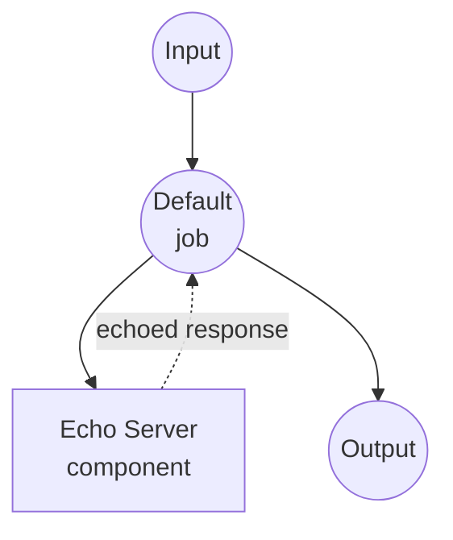

# Echo Server Example

This example demonstrates a simple HTTP echo server that receives user input and returns it back, showcasing how model-compose can manage and communicate with local HTTP services.

## Overview

This workflow provides a basic echo service that:

1. **Local Server Management**: Automatically starts and manages a local FastAPI echo server
2. **HTTP Communication**: Demonstrates HTTP client-server communication within model-compose
3. **Input/Output Processing**: Shows how data flows between components and workflows
4. **Development Testing**: Provides a simple service for testing model-compose HTTP capabilities

## Preparation

### Prerequisites

- model-compose installed and available in your PATH
- Python with FastAPI and Uvicorn (automatically managed by the component)

### Environment Configuration

1. Navigate to this example directory:
   ```bash
   cd examples/echo-server
   ```

2. No additional environment configuration required - all dependencies are managed automatically.

## How to Run

1. **Start the service:**
   ```bash
   model-compose up
   ```

2. **Run the workflow:**

   **Using API:**
   ```bash
   curl -X POST http://localhost:8080/api/workflows/runs \
     -H "Content-Type: application/json" \
     -d '{"input": {"text": "Hello, world!"}}'
   ```

   **Using Web UI:**
   - Open the Web UI: http://localhost:8081
   - Enter your text
   - Click the "Run Workflow" button

   **Using CLI:**
   ```bash
   model-compose run --input '{"text": "Hello, world!"}'
   ```

3. **Direct server access (alternative):**
   ```bash
   # Direct access to the internal echo server
   curl -X POST http://localhost:8000/echo \
        -H "Content-Type: application/json" \
        -d '{"text": "Hello, world!"}'
   ```

## Component Details

### Echo Server Component (Default)
- **Type**: HTTP server component with managed lifecycle
- **Purpose**: Simple echo service for testing and demonstration
- **Framework**: FastAPI with Uvicorn server
- **Port**: 8000 (internal)
- **Endpoint**: `/echo`
- **Management Commands**:
  - **Start**: Launches FastAPI server with auto-reload
    ```bash
    uvicorn main:app --reload
    ```
- **Features**:
  - Automatic server startup and management
  - JSON request/response handling
  - Auto-reload during development
  - Simple echo functionality that wraps input in an "echo" object

## Workflow Details

### "Echo Server" Workflow (Default)

**Description**: Sends user input to an HTTP server and returns the echoed response.

#### Job Flow

This example uses a simplified single-component configuration without explicit jobs.



#### Input Parameters

| Parameter | Type | Required | Default | Description |
|-----------|------|----------|---------|-------------|
| `text` | text | Yes | - | The text message to be echoed by the server |

#### Output Format

| Field | Type | Description |
|-------|------|-------------|
| `text` | text | The echoed text extracted from the server response |

## Server Implementation

The echo server is implemented in `main.py` using FastAPI:

```python
from fastapi import FastAPI, Request
from fastapi.responses import JSONResponse

app = FastAPI()

@app.post("/echo")
async def echo(request: Request):
    body = await request.json()
    return JSONResponse(content={ "echo": body })
```

**How it works:**
1. Receives POST request at `/echo` endpoint
2. Extracts JSON body from request
3. Wraps the received data in an "echo" object
4. Returns the wrapped data as JSON response

## Data Flow

The complete data transformation process:

1. **Input**: `{"text": "Hello"}`
2. **HTTP Request**: Sent to `http://localhost:8000/echo`
3. **Server Processing**: Wraps input in echo object: `{"echo": {"text": "Hello"}}`
4. **Output Extraction**: Extracts `response.echo.text` → `"Hello"`
5. **Final Output**: `{"text": "Hello"}`

## Development Features

- **FastAPI Docs**: Interactive API documentation available at `http://localhost:8000/docs`
- **Simple Debugging**: Easy to modify and test different response formats
- **Minimal Dependencies**: Only requires FastAPI and Uvicorn

## Customization

### Modify Server Response
Edit `main.py` to change the response format:
```python
@app.post("/echo")
async def echo(request: Request):
    body = await request.json()
    return JSONResponse(content={
        "echo": body,
        "timestamp": "2024-01-01T00:00:00Z",
        "status": "processed"
    })
```

### Add Multiple Endpoints
```python
@app.post("/reverse")
async def reverse_text(request: Request):
    body = await request.json()
    reversed_text = body.get("text", "")[::-1]
    return JSONResponse(content={"reversed": reversed_text})
```

### Change Server Configuration
Modify the `start` command in `model-compose.yml`:
```yaml
start: [ uvicorn, main:app, --host, 0.0.0.0, --port, 8000, --reload ]
```

## Troubleshooting

### Common Issues

1. **Port Already in Use**: Change the port in `model-compose.yml` if 8000 is occupied
2. **Import Errors**: Ensure FastAPI and Uvicorn are installed in your Python environment
3. **Server Fails to Start**: Verify that `main.py` exists in the current directory