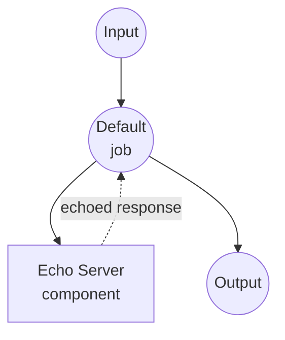

# Echo 服务器示例

此示例演示了一个简单的 HTTP echo 服务器，用于接收用户输入并将其返回，展示 model-compose 如何管理本地 HTTP 服务并与之通信。

## 概述

此工作流提供了一个基本的 echo 服务：

1. **本地服务器管理**：自动启动和管理本地 FastAPI echo 服务器
2. **HTTP 通信**：演示 model-compose 中 HTTP 客户端-服务器通信
3. **输入/输出处理**：展示数据如何在组件和工作流之间流动
4. **开发测试**：为测试 model-compose HTTP 功能提供简单服务

## 准备工作

### 前置条件

- 已安装 model-compose 并在您的 PATH 中可用
- Python 环境（带 FastAPI 和 Uvicorn，由组件自动管理）

### 环境配置

1. 导航到此示例目录：
   ```bash
   cd examples/echo-server
   ```

2. 不需要额外的环境配置 - 所有依赖项都是自动管理的。

## 运行方式

1. **启动服务：**
   ```bash
   model-compose up
   ```

2. **运行工作流：**

   **使用 API：**
   ```bash
   curl -X POST http://localhost:8080/api/workflows/runs \
     -H "Content-Type: application/json" \
     -d '{"input": {"text": "Hello, world!"}}'
   ```

   **使用 Web UI：**
   - 打开 Web UI：http://localhost:8081
   - 输入您的文本
   - 点击"运行工作流"按钮

   **使用 CLI：**
   ```bash
   model-compose run --input '{"text": "Hello, world!"}'
   ```

3. **直接服务器访问（替代方式）：**
   ```bash
   # 直接访问内部 echo 服务器
   curl -X POST http://localhost:8000/echo \
        -H "Content-Type: application/json" \
        -d '{"text": "Hello, world!"}'
   ```

## 组件详情

### Echo 服务器组件（默认）
- **类型**：具有托管生命周期的 HTTP 服务器组件
- **用途**：用于测试和演示的简单 echo 服务
- **框架**：带 Uvicorn 服务器的 FastAPI
- **端口**：8000（内部）
- **端点**：`/echo`
- **管理命令**：
  - **启动**：使用自动重载启动 FastAPI 服务器
    ```bash
    uvicorn main:app --reload
    ```
- **功能**：
  - 自动服务器启动和管理
  - JSON 请求/响应处理
  - 开发期间自动重载
  - 简单的 echo 功能，将输入包装在"echo"对象中

## 工作流详情

### "Echo 服务器"工作流（默认）

**描述**：将用户输入发送到 HTTP 服务器并返回回显的响应。

#### 作业流程

此示例使用简化的单组件配置，没有显式作业。



#### 输入参数

| 参数 | 类型 | 必需 | 默认值 | 描述 |
|-----------|------|----------|---------|-------------|
| `text` | text | 是 | - | 要由服务器回显的文本消息 |

#### 输出格式

| 字段 | 类型 | 描述 |
|-------|------|-------------|
| `text` | text | 从服务器响应中提取的回显文本 |

## 服务器实现

echo 服务器使用 FastAPI 在 `main.py` 中实现：

```python
from fastapi import FastAPI, Request
from fastapi.responses import JSONResponse

app = FastAPI()

@app.post("/echo")
async def echo(request: Request):
    body = await request.json()
    return JSONResponse(content={ "echo": body })
```

**工作原理：**
1. 在 `/echo` 端点接收 POST 请求
2. 从请求中提取 JSON 正文
3. 将接收到的数据包装在"echo"对象中
4. 将包装的数据作为 JSON 响应返回

## 数据流

完整的数据转换过程：

1. **输入**：`{"text": "Hello"}`
2. **HTTP 请求**：发送到 `http://localhost:8000/echo`
3. **服务器处理**：将输入包装在 echo 对象中：`{"echo": {"text": "Hello"}}`
4. **输出提取**：提取 `response.echo.text` → `"Hello"`
5. **最终输出**：`{"text": "Hello"}`

## 开发功能

- **FastAPI 文档**：交互式 API 文档可在 `http://localhost:8000/docs` 访问
- **简单调试**：易于修改和测试不同的响应格式
- **最小依赖**：只需要 FastAPI 和 Uvicorn

## 自定义

### 修改服务器响应
编辑 `main.py` 以更改响应格式：
```python
@app.post("/echo")
async def echo(request: Request):
    body = await request.json()
    return JSONResponse(content={
        "echo": body,
        "timestamp": "2024-01-01T00:00:00Z",
        "status": "processed"
    })
```

### 添加多个端点
```python
@app.post("/reverse")
async def reverse_text(request: Request):
    body = await request.json()
    reversed_text = body.get("text", "")[::-1]
    return JSONResponse(content={"reversed": reversed_text})
```

### 更改服务器配置
在 `model-compose.yml` 中修改 `start` 命令：
```yaml
start: [ uvicorn, main:app, --host, 0.0.0.0, --port, 8000, --reload ]
```

## 故障排除

### 常见问题

1. **端口已被占用**：如果 8000 端口被占用，在 `model-compose.yml` 中更改端口
2. **导入错误**：确保 FastAPI 和 Uvicorn 已安装在您的 Python 环境中
3. **服务器启动失败**：验证 `main.py` 是否存在于当前目录中