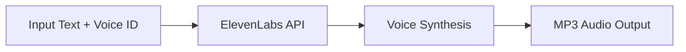

# ElevenLabs Text-to-Speech Example

This example demonstrates how to use model-compose with ElevenLabs AI to convert text into high-quality, natural-sounding speech. ElevenLabs provides state-of-the-art voice synthesis with multilingual support and realistic voice cloning capabilities.

## Overview

ElevenLabs offers premium text-to-speech services with advanced AI voice synthesis. This configuration showcases:

- High-quality voice synthesis using ElevenLabs' multilingual model
- Customizable voice selection with default fallback
- MP3 audio output at 44.1kHz/128kbps
- Web UI for interactive testing
- Production-ready API integration

## Prerequisites

### ElevenLabs API Setup

1. **Create Account**: Sign up at [ElevenLabs](https://elevenlabs.io/)
2. **Get API Key**: Navigate to Profile → API Key
3. **Choose Plan**: Select appropriate subscription based on usage needs

### Environment Setup

```bash
# Set your ElevenLabs API key
export ELEVENLABS_API_KEY="your_api_key_here"

# Install model-compose
pip install -e .
```

### Optional Dependencies
```bash
# For audio processing and playback testing
pip install pydub pygame
```

## Architecture

### Component Configuration

#### ElevenLabs TTS (`elevenlabs-text-to-speech`)
- **Type**: HTTP client
- **Endpoint**: `https://api.elevenlabs.io/v1/text-to-speech/{voice_id}`
- **Method**: POST
- **Model**: `eleven_multilingual_v2`
- **Output Format**: MP3 (44.1kHz, 128kbps)
- **Default Voice**: `JBFqnCBsd6RMkjVDRZzb` (Adam)

### API Configuration

| Parameter | Value | Description |
|-----------|-------|-------------|
| `endpoint` | `/v1/text-to-speech/{voice_id}` | ElevenLabs TTS endpoint |
| `method` | POST | HTTP method |
| `output_format` | mp3_44100_128 | Audio quality setting |
| `model_id` | eleven_multilingual_v2 | AI voice model |

## Workflow

### Generate Speech with ElevenLabs AI

Converts input text into realistic speech using ElevenLabs' advanced voice synthesis.



**Input Parameters:**
| Parameter | Type | Required | Description | Default |
|-----------|------|----------|-------------|---------|
| `text` | string | Yes | Text to convert to speech | - |
| `voice_id` | string | No | ElevenLabs voice ID | `JBFqnCBsd6RMkjVDRZzb` (Adam) |

**Output:**
- High-quality MP3 audio file
- Audio format: 44.1kHz sample rate, 128kbps bitrate
- Response type: Binary audio data

## How to Run Instructions

### 1. Start the Service

```bash
# Navigate to the example directory
cd examples/elevenlabs-text-to-speech

# Start the controller
model-compose up
```

This starts:
- HTTP API server on port 8080
- Gradio web interface on port 8081

### 2. Access the Web UI

Open http://localhost:8081 in your browser to interact with the text-to-speech service through a web interface.

### 3. API Usage

#### Basic Text-to-Speech
```bash
curl -X POST http://localhost:8080/api \
  -H "Content-Type: application/json" \
  -d '{"text": "Hello, this is a test of ElevenLabs text-to-speech synthesis."}' \
  --output speech.mp3
```

#### Custom Voice Selection
```bash
curl -X POST http://localhost:8080/api \
  -H "Content-Type: application/json" \
  -d '{
    "text": "This is spoken with a different voice.",
    "voice_id": "21m00Tcm4TlvDq8ikWAM"
  }' \
  --output custom_voice_speech.mp3
```

#### Long Text Example
```bash
curl -X POST http://localhost:8080/api \
  -H "Content-Type: application/json" \
  -d '{
    "text": "ElevenLabs provides cutting-edge voice AI technology that enables creators and businesses to generate high-quality spoken audio in any voice and style. Our advanced deep learning models can synthesize speech that is virtually indistinguishable from human recordings."
  }' \
  --output long_speech.mp3
```

## Voice Options

### Popular Pre-built Voices

| Voice ID | Name | Gender | Accent | Description |
|----------|------|--------|--------|-------------|
| `JBFqnCBsd6RMkjVDRZzb` | Adam | Male | American | Clear, professional (default) |
| `21m00Tcm4TlvDq8ikWAM` | Rachel | Female | American | Warm, friendly |
| `AZnzlk1XvdvUeBnXmlld` | Domi | Female | American | Young, energetic |
| `EXAVITQu4vr4xnSDxMaL` | Bella | Female | American | Soft, gentle |
| `ErXwobaYiN019PkySvjV` | Antoni | Male | American | Deep, authoritative |
| `MF3mGyEYCl7XYWbV9V6O` | Elli | Female | American | Cheerful, upbeat |
| `TxGEqnHWrfWFTfGW9XjX` | Josh | Male | American | Casual, conversational |
| `VR6AewLTigWG4xSOukaG` | Arnold | Male | American | Mature, confident |
| `pNInz6obpgDQGcFmaJgB` | Adam | Male | British | British accent |
| `yoZ06aMxZJJ28mfd3POQ` | Sam | Male | American | Narrator style |

### Getting Available Voices
```bash
# List all available voices
curl -X GET "https://api.elevenlabs.io/v1/voices" \
  -H "xi-api-key: $ELEVENLABS_API_KEY"
```

## Customization Options

### Voice Model Selection

#### Standard Model (Faster)
```yaml
body:
  text: ${input.text}
  model_id: eleven_monolingual_v1  # English only, faster
```

#### Multilingual Model (Default)
```yaml
body:
  text: ${input.text}
  model_id: eleven_multilingual_v2  # Multiple languages, higher quality
```

#### Turbo Model (Fastest)
```yaml
body:
  text: ${input.text}
  model_id: eleven_turbo_v2  # Fastest generation, good quality
```

### Audio Quality Settings

#### High Quality
```yaml
endpoint: https://api.elevenlabs.io/v1/text-to-speech/${input.voice_id | JBFqnCBsd6RMkjVDRZzb}?output_format=mp3_44100_192
```

#### Standard Quality (Default)
```yaml
endpoint: https://api.elevenlabs.io/v1/text-to-speech/${input.voice_id | JBFqnCBsd6RMkjVDRZzb}?output_format=mp3_44100_128
```

#### Lower Quality (Smaller Files)
```yaml
endpoint: https://api.elevenlabs.io/v1/text-to-speech/${input.voice_id | JBFqnCBsd6RMkjVDRZzb}?output_format=mp3_22050_32
```

### Voice Settings Customization

```yaml
body:
  text: ${input.text}
  model_id: eleven_multilingual_v2
  voice_settings:
    stability: 0.5          # 0-1, higher = more stable
    similarity_boost: 0.8   # 0-1, higher = more similar to training
    style: 0.2             # 0-1, style exaggeration
    use_speaker_boost: true # Enhance speaker characteristics
```

### Multiple Voice Support

```yaml
components:
  - id: elevenlabs-adam
    type: http-client
    endpoint: https://api.elevenlabs.io/v1/text-to-speech/JBFqnCBsd6RMkjVDRZzb
    # ... Adam voice configuration

  - id: elevenlabs-rachel
    type: http-client
    endpoint: https://api.elevenlabs.io/v1/text-to-speech/21m00Tcm4TlvDq8ikWAM
    # ... Rachel voice configuration
```

## Pricing and API Limits

### Subscription Tiers (as of 2024)

| Plan | Monthly Characters | Price | Features |
|------|-------------------|-------|----------|
| **Free** | 10,000 | $0 | 3 custom voices, standard quality |
| **Starter** | 30,000 | $5 | 10 custom voices, high quality |
| **Creator** | 100,000 | $22 | 30 custom voices, ultra quality |
| **Pro** | 500,000 | $99 | 160 custom voices, all features |
| **Scale** | 2,000,000 | $330 | Unlimited voices, priority support |

### Rate Limits

- **Concurrent Requests**: 2-10 depending on plan
- **Characters per Request**: Up to 5,000 characters
- **Request Rate**: Plan-dependent throttling

### Cost Optimization Tips

1. **Cache Generated Audio**: Store commonly used phrases
2. **Batch Processing**: Combine related text segments
3. **Choose Appropriate Quality**: Use lower bitrates for less critical audio
4. **Monitor Usage**: Track character consumption

## Advanced Features

### SSML Support

```bash
curl -X POST http://localhost:8080/api \
  -H "Content-Type: application/json" \
  -d '{
    "text": "<speak><prosody rate=\"slow\">This text is spoken slowly.</prosody> <break time=\"1s\"/> <prosody pitch=\"high\">This text has a higher pitch.</prosody></speak>"
  }'
```

### Pronunciation Dictionary

```yaml
body:
  text: ${input.text}
  model_id: eleven_multilingual_v2
  pronunciation_dictionary_locators:
    - pronunciation_dictionary_id: "your_dictionary_id"
      version_id: "latest"
```

### Voice Cloning

For custom voice creation:

1. **Upload Voice Samples**: Use ElevenLabs dashboard
2. **Train Custom Voice**: Wait for processing
3. **Use Custom Voice ID**: Replace in configuration

```yaml
endpoint: https://api.elevenlabs.io/v1/text-to-speech/your_custom_voice_id
```

## Use Cases

### Content Creation
- **Podcasts**: Generate professional narration
- **Audiobooks**: Convert written content to audio
- **Video Voiceovers**: Add narration to videos
- **Educational Content**: Create engaging learning materials

### Business Applications
- **IVR Systems**: Automated phone system responses
- **Chatbots**: Voice responses for conversational AI
- **Announcements**: Generate company announcements
- **Training Materials**: Voice-enabled learning platforms

### Accessibility
- **Text-to-Speech for Visually Impaired**: Screen reader enhancement
- **Language Learning**: Pronunciation assistance
- **Reading Assistance**: Help with dyslexia or reading difficulties

### Creative Projects
- **Character Voices**: Different voices for storytelling
- **Audio Drama**: Multiple character production
- **Gaming**: Dynamic NPC voice generation
- **Interactive Media**: Voice responses for apps

## Troubleshooting

### Authentication Issues
```bash
# Verify API key
curl -X GET "https://api.elevenlabs.io/v1/user" \
  -H "xi-api-key: $ELEVENLABS_API_KEY"
```

### Audio Quality Issues
- Check output format settings
- Verify voice_id exists and is accessible
- Ensure text doesn't exceed character limits

### Rate Limit Handling
```yaml
# Add retry logic in production
components:
  - id: elevenlabs-with-retry
    type: http-client
    endpoint: https://api.elevenlabs.io/v1/text-to-speech/${input.voice_id}
    retry_attempts: 3
    retry_delay: 2000  # milliseconds
```

### Common Error Responses

| Status Code | Error | Solution |
|-------------|--------|----------|
| 401 | Invalid API key | Check ELEVENLABS_API_KEY |
| 422 | Character limit exceeded | Reduce text length |
| 429 | Rate limit exceeded | Implement retry with backoff |
| 500 | Server error | Check ElevenLabs status page |

## Security Considerations

### API Key Protection
```bash
# Use environment variables, never hardcode
export ELEVENLABS_API_KEY="sk-..."

# For production, use secrets management
# AWS Secrets Manager, Azure Key Vault, etc.
```

### Content Filtering
- Review text content for appropriate use
- Implement content moderation for user-generated text
- Respect ElevenLabs usage policies

### Audio Content Security
- Scan generated audio for malicious content
- Implement rate limiting to prevent abuse
- Monitor usage patterns for anomalies

## Monitoring and Analytics

### How to Run Tracking
```yaml
# Add logging component
components:
  - id: usage-logger
    type: shell
    command: echo "TTS request: ${input.text_length} characters" >> /var/log/tts-usage.log
```

### Performance Monitoring
- Track API response times
- Monitor error rates and types
- Analyze character usage patterns
- Set up alerts for quota approaching limits