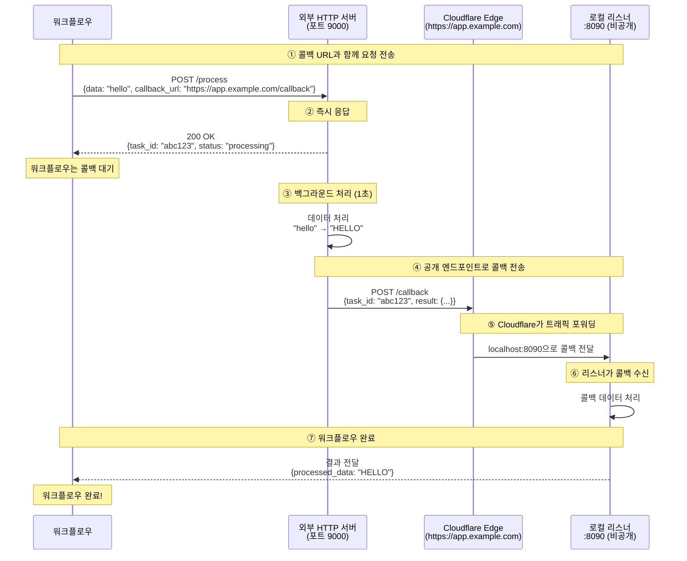

# Cloudflare 네임드 터널 게이트웨이 예제

이 예제는 **Cloudflare 네임드 터널(Named Tunnel)** 을 사용하여 Cloudflare 계정으로 관리하는 **안정적인 커스텀 도메인** 아래에 로컬 서비스를 인터넷에 노출하는 방법을 보여줍니다. 임시 `*.trycloudflare.com` URL을 발급하는 퀵 터널과 달리, 네임드 터널은 고정 호스트명에 바인딩되며 재시작 후에도 유지됩니다.

## 개요

이 워크플로우는 다음을 보여줍니다:

1. **Cloudflare 네임드 터널을 통한 HTTP 터널링**: 자신의 도메인 아래에 로컬 포트 노출
2. **안정적인 공개 URL**: 재시작 사이에 변경되지 않는 고정 호스트명
3. **인증된 터널**: 터널 토큰으로 Cloudflare 계정에 인증
4. **HTTP 콜백 통합**: 외부 서비스가 터널을 통해 로컬 리스너에 도달

## 아키텍처

### 워크플로우 실행 흐름



**핵심 사항:**
- **https://app.example.com** 은 공개적으로 접근 가능 (외부 서버가 도달 가능)
- **로컬:8090** 은 비공개 (Cloudflare 네임드 터널을 통해서만 접근 가능)
- 호스트명은 **재시작 사이에 안정적** — 스테이징/프로덕션 웹훅에 적합
- 터널은 Cloudflare 계정으로 인증됨

## 사전 요구사항

- model-compose 설치
- `cloudflared` 바이너리가 설치되어 있고 `PATH`에서 접근 가능해야 함
- Cloudflare 계정
- Cloudflare DNS로 관리되는 도메인
- Cloudflare 계정에 생성된 네임드 터널 (대시보드 또는 `cloudflared` CLI 사용)

### cloudflared 설치

```bash
# macOS
brew install cloudflared

# Linux (Debian/Ubuntu)
curl -L https://github.com/cloudflare/cloudflared/releases/latest/download/cloudflared-linux-amd64.deb \
  -o cloudflared.deb && sudo dpkg -i cloudflared.deb

# Windows
winget install --id Cloudflare.cloudflared
```

### 네임드 터널 생성

두 가지 옵션이 있습니다:

**옵션 A: Zero Trust 대시보드 (권장)**

1. [Zero Trust 대시보드 → Networks → Tunnels](https://one.dash.cloudflare.com/) 방문
2. **Create a tunnel** 클릭 → **Cloudflared** 선택
3. 터널 이름 지정 후 **터널 토큰** 복사
4. 공개 호스트명 추가 (예: `app.example.com`) 후 `http://localhost:8090`으로 라우팅

**옵션 B: cloudflared CLI**

```bash
cloudflared tunnel login
cloudflared tunnel create my-tunnel
# 자격 증명 파일이 ~/.cloudflared/<TUNNEL_ID>.json에 생성됨
cloudflared tunnel route dns my-tunnel app.example.com
```

## 설정

### 1. 터널 토큰 설정

이 예제 디렉토리에 `.env` 파일 생성:

```bash
cd examples/gateway/http-tunnel/cloudflare-named
cat > .env <<'EOF'
CLOUDFLARE_TUNNEL_TOKEN=your_tunnel_token_here
EOF
```

토큰은 `model-compose.yml`의 `${env.CLOUDFLARE_TUNNEL_TOKEN}`에서 읽힙니다.

### 2. 호스트명 설정

`model-compose.yml`을 편집하고 `app.example.com`을 Cloudflare 계정에서 설정한 호스트명으로 변경:

```yaml
gateway:
  type: http-tunnel
  driver: cloudflare
  token: ${env.CLOUDFLARE_TUNNEL_TOKEN}
  hostname: app.example.com   # ← 변경
  port:
    - 8090
```

## 예제 실행

### 서비스 시작

```bash
cd examples/gateway/http-tunnel/cloudflare-named
model-compose up
```

터널이 연결되었음을 나타내는 출력이 표시되어야 합니다:
```
INFO:     HTTP tunnel started on port 8090: https://app.example.com
```

### 워크플로우 실행

```bash
model-compose run --input '{"data": "hello world"}'
```

예상 출력:
```json
{
  "task_id": "abc123...",
  "result": {
    "processed_data": "HELLO WORLD",
    "length": 11
  }
}
```

## 설정 상세

### 게이트웨이 설정

```yaml
gateway:
  type: http-tunnel
  driver: cloudflare
  token: ${env.CLOUDFLARE_TUNNEL_TOKEN}   # 토큰 기반 터널에 필요
  hostname: app.example.com               # 선택사항이지만 권장
  port:
    - 8090
```

**토큰 vs 자격 증명 파일:**
- `token`: Zero Trust 대시보드의 터널 토큰 (가장 간단)
- `tunnel` + `credentials_file`: `cloudflared` CLI로 생성한 터널 사용

**호스트명:**
- `hostname`이 설정되면 공개 URL은 `https://<호스트명>`
- `hostname`이 생략되면 URL은 `https://<터널-id>.cfargotunnel.com`으로 폴백

### 토큰 대신 자격 증명 파일 사용

CLI로 터널을 생성한 경우:

```yaml
gateway:
  type: http-tunnel
  driver: cloudflare
  tunnel: my-tunnel
  credentials_file: /Users/me/.cloudflared/12345678-abcd-....json
  hostname: app.example.com
  port:
    - 8090
```

### 게이트웨이 컨텍스트 사용

설정에서 공개 URL에 접근:

```yaml
component:
  action:
    body:
      callback_url: ${gateway:8090.public_url}/callback
      # 변환됨: https://app.example.com/callback
```

### 리스너 설정

```yaml
listener:
  type: http-callback
  host: 0.0.0.0
  port: 8090
  path: /callback
  identify_by: ${body.task_id}
  result: ${body.result}
```

### 콜백을 사용하는 컴포넌트

```yaml
component:
  type: http-server
  start: [ uvicorn, server:app, --reload, --port, "9000" ]
  port: 9000
  action:
    method: POST
    path: /process
    body:
      data: ${input.data}
      callback_url: ${gateway:8090.public_url}/callback
      task_id: ${context.run_id}
    completion:
      type: callback
      wait_for: ${context.run_id}
    output:
      task_id: ${response.task_id}
      result: ${result as json}
```

## 트러블슈팅

### `Timed out waiting for Cloudflare named tunnel to become ready`

**원인 및 해결책:**
1. **잘못된 토큰** — Zero Trust 대시보드에서 토큰 재생성
2. **자격 증명 파일 경로 오류** — 경로와 파일 읽기 권한 확인
3. **네트워크가 Cloudflare edge로의 아웃바운드 트래픽 차단** — 다른 네트워크에서 시도
4. **터널 삭제 또는 비활성화** — Cloudflare 대시보드에서 터널 상태 확인

### 호스트명은 해석되지만 502 반환

**문제:** 공개 URL에 도달 가능하지만 `502 Bad Gateway` 반환

**해결책:**
1. 포트 `8090`의 로컬 서비스가 떠 있는지 확인:
   ```bash
   curl -i http://localhost:8090/callback
   ```
2. Zero Trust 대시보드에서 공개 호스트명이 `http://localhost:8090`으로 라우팅되는지 확인

### DNS가 해석되지 않음

**문제:** `app.example.com`이 해석되지 않음

**해결책:**
1. 도메인이 Cloudflare DNS에 있는지 확인 (오렌지 클라우드 프록시 활성화)
2. CLI 라우팅을 사용한 경우 CNAME 레코드가 생성되었는지 확인:
   ```bash
   cloudflared tunnel route dns my-tunnel app.example.com
   ```

## 퀵 터널 vs 네임드 터널

| 기능 | 퀵 터널 | 네임드 터널 (이 예제) |
|------|---------|----------------------|
| Cloudflare 계정 | 불필요 | 필요 |
| 커스텀 도메인 | 불가 (무작위 `*.trycloudflare.com`) | 가능 |
| URL 안정성 | 재시작마다 변경 | 고정 |
| 인증 | 없음 | 터널 토큰 또는 자격 증명 파일 |
| 적합한 용도 | 개발, 데모, 일회성 테스트 | 스테이징, 프로덕션 |

계정 없이 무설정으로 시작하려면 [`../cloudflare/`](../cloudflare/)를 참고하세요.

## 보안 고려사항

- 네임드 터널도 설정된 호스트명에서 공개적으로 접근 가능 — 서비스에 인증을 추가하거나 Cloudflare Access 정책을 사용하세요
- **터널 토큰**은 비밀로 취급하세요: `.env`에 저장하고 절대 커밋하지 마세요
- 공개 호스트명 앞에 Cloudflare Access (Zero Trust)를 활성화하여 SSO/IP 기반 접근 제어 고려
- 토큰을 주기적으로 교체하고 사용하지 않는 터널은 해지하세요

## 관련 예제

- [Cloudflare 퀵 터널](../cloudflare/) — 계정 불필요한 임시 URL
- [Ngrok HTTP 터널](../ngrok/) — ngrok을 사용한 유사 패턴
- [SSH 터널 게이트웨이](../../ssh-tunnel/) — SSH 원격 포트 포워딩을 사용한 자체 호스팅 대안

## 참고 자료

- [Cloudflare 터널 문서](https://developers.cloudflare.com/cloudflare-one/connections/connect-networks/)
- [Zero Trust 대시보드를 통한 터널 설정](https://developers.cloudflare.com/cloudflare-one/connections/connect-networks/get-started/create-remote-tunnel/)
- [cloudflared CLI를 통한 터널 설정](https://developers.cloudflare.com/cloudflare-one/connections/connect-networks/get-started/create-local-tunnel/)
- [Cloudflare Access (Zero Trust)](https://developers.cloudflare.com/cloudflare-one/policies/access/)
