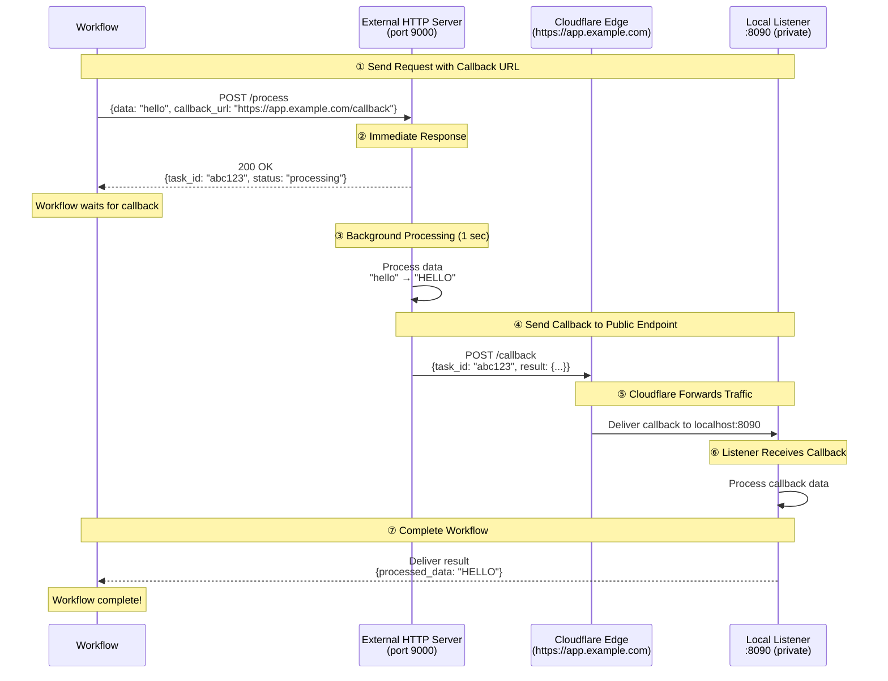

# Cloudflare Named Tunnel Gateway Example

This example demonstrates how to use a **Cloudflare Named Tunnel** to expose local services to the internet under a **stable, custom domain** managed by your Cloudflare account. Unlike Quick Tunnels which issue ephemeral `*.trycloudflare.com` URLs, Named Tunnels are bound to a fixed hostname and survive restarts.

## Overview

This workflow showcases:

1. **HTTP Tunnel via Cloudflare Named Tunnel**: Expose local ports under your own domain
2. **Stable Public URL**: A fixed hostname that does not change between restarts
3. **Authenticated Tunnel**: Backed by your Cloudflare account using a tunnel token
4. **HTTP Callback Integration**: External services reach your local listener over the tunnel

## Architecture

### Workflow Execution Flow



**Key Points:**
- **https://app.example.com** is publicly accessible (external server can reach it)
- **Local:8090** is private (only accessible via the Cloudflare Named Tunnel)
- The hostname is **stable across restarts** — suitable for staging/production webhooks
- The tunnel is authenticated against your Cloudflare account

## Prerequisites

- model-compose installed
- `cloudflared` binary installed and available in `PATH`
- A Cloudflare account
- A domain managed by Cloudflare DNS
- A Named Tunnel created in your Cloudflare account (either via Dashboard or `cloudflared` CLI)

### Install cloudflared

```bash
# macOS
brew install cloudflared

# Linux (Debian/Ubuntu)
curl -L https://github.com/cloudflare/cloudflared/releases/latest/download/cloudflared-linux-amd64.deb \
  -o cloudflared.deb && sudo dpkg -i cloudflared.deb

# Windows
winget install --id Cloudflare.cloudflared
```

### Create a Named Tunnel

You have two options:

**Option A: Zero Trust Dashboard (recommended)**

1. Go to [Zero Trust Dashboard → Networks → Tunnels](https://one.dash.cloudflare.com/)
2. Click **Create a tunnel** → choose **Cloudflared**
3. Name your tunnel, then copy the **tunnel token**
4. Add a public hostname (e.g. `app.example.com`) and route it to `http://localhost:8090`

**Option B: cloudflared CLI**

```bash
cloudflared tunnel login
cloudflared tunnel create my-tunnel
# credentials file is written to ~/.cloudflared/<TUNNEL_ID>.json
cloudflared tunnel route dns my-tunnel app.example.com
```

## Setup

### 1. Set the Tunnel Token

Create a `.env` file in this example directory:

```bash
cd examples/gateway/http-tunnel/cloudflare-named
cat > .env <<'EOF'
CLOUDFLARE_TUNNEL_TOKEN=your_tunnel_token_here
EOF
```

The token is read by `${env.CLOUDFLARE_TUNNEL_TOKEN}` in `model-compose.yml`.

### 2. Configure the Hostname

Edit `model-compose.yml` and replace `app.example.com` with the hostname you configured in your Cloudflare account:

```yaml
gateway:
  type: http-tunnel
  driver: cloudflare
  token: ${env.CLOUDFLARE_TUNNEL_TOKEN}
  hostname: app.example.com   # ← change this
  port:
    - 8090
```

## Running the Example

### Start the Service

```bash
cd examples/gateway/http-tunnel/cloudflare-named
model-compose up
```

You should see output indicating the tunnel is connected:
```
INFO:     HTTP tunnel started on port 8090: https://app.example.com
```

### Run the Workflow

```bash
model-compose run --input '{"data": "hello world"}'
```

Expected output:
```json
{
  "task_id": "abc123...",
  "result": {
    "processed_data": "HELLO WORLD",
    "length": 11
  }
}
```

## Configuration Details

### Gateway Configuration

```yaml
gateway:
  type: http-tunnel
  driver: cloudflare
  token: ${env.CLOUDFLARE_TUNNEL_TOKEN}   # required for token-based tunnels
  hostname: app.example.com               # optional but recommended
  port:
    - 8090
```

**Token vs. Credentials File:**
- `token`: Tunnel token from the Zero Trust Dashboard (simplest)
- `tunnel` + `credentials_file`: Use a tunnel created via the `cloudflared` CLI

**Hostname:**
- When `hostname` is set, the public URL is `https://<hostname>`
- When `hostname` is omitted, the URL falls back to `https://<tunnel-id>.cfargotunnel.com`

### Using Credentials File Instead of Token

If you created the tunnel with the CLI:

```yaml
gateway:
  type: http-tunnel
  driver: cloudflare
  tunnel: my-tunnel
  credentials_file: /Users/me/.cloudflared/12345678-abcd-....json
  hostname: app.example.com
  port:
    - 8090
```

### Using Gateway Context

Access the public URL in your configuration:

```yaml
component:
  action:
    body:
      callback_url: ${gateway:8090.public_url}/callback
      # Resolves to: https://app.example.com/callback
```

### Listener Configuration

```yaml
listener:
  type: http-callback
  host: 0.0.0.0
  port: 8090
  path: /callback
  identify_by: ${body.task_id}
  result: ${body.result}
```

### Component with Callback

```yaml
component:
  type: http-server
  start: [ uvicorn, server:app, --reload, --port, "9000" ]
  port: 9000
  action:
    method: POST
    path: /process
    body:
      data: ${input.data}
      callback_url: ${gateway:8090.public_url}/callback
      task_id: ${context.run_id}
    completion:
      type: callback
      wait_for: ${context.run_id}
    output:
      task_id: ${response.task_id}
      result: ${result as json}
```

## Troubleshooting

### `Timed out waiting for Cloudflare named tunnel to become ready`

**Causes & Solutions:**
1. **Invalid token** — Regenerate the token in the Zero Trust Dashboard
2. **Credentials file path wrong** — Verify the path and that the file is readable
3. **Network blocks outbound traffic to Cloudflare edge** — Try a different network
4. **Tunnel deleted or disabled** — Check the tunnel state in the Cloudflare Dashboard

### Hostname Resolves but Returns 502

**Problem:** The public URL is reachable but returns `502 Bad Gateway`

**Solutions:**
1. Confirm the local service on port `8090` is up:
   ```bash
   curl -i http://localhost:8090/callback
   ```
2. In the Zero Trust Dashboard, confirm the public hostname routes to `http://localhost:8090`

### DNS Not Resolving

**Problem:** `app.example.com` does not resolve

**Solutions:**
1. Verify your domain is on Cloudflare DNS (orange-cloud proxy enabled)
2. If you used the CLI route, ensure the CNAME record was created:
   ```bash
   cloudflared tunnel route dns my-tunnel app.example.com
   ```

## Quick Tunnel vs. Named Tunnel

| Feature | Quick Tunnel | Named Tunnel (this example) |
|---------|--------------|-----------------------------|
| Cloudflare account | Not required | Required |
| Custom domain | No (random `*.trycloudflare.com`) | Yes |
| URL stability | Changes on every restart | Stable |
| Authentication | None | Tunnel token or credentials file |
| Best for | Development, demos, ad-hoc tests | Staging, production |

For a no-account, zero-configuration setup, see [`../cloudflare/`](../cloudflare/).

## Security Considerations

- Named Tunnels are still publicly reachable at the configured hostname — add authentication in your service or via Cloudflare Access policies
- Treat the **tunnel token** as a secret: store it in `.env`, never commit it
- Consider enabling Cloudflare Access (Zero Trust) in front of the public hostname for SSO/IP-based access control
- Rotate tokens periodically and revoke unused tunnels

## Related Examples

- [Cloudflare Quick Tunnel](../cloudflare/) — Ephemeral URLs, no account required
- [Ngrok HTTP Tunnel](../ngrok/) — Similar pattern using ngrok
- [SSH Tunnel Gateway](../../ssh-tunnel/) — Self-hosted alternative using SSH remote port forwarding

## Resources

- [Cloudflare Tunnel Documentation](https://developers.cloudflare.com/cloudflare-one/connections/connect-networks/)
- [Set up a tunnel via Zero Trust Dashboard](https://developers.cloudflare.com/cloudflare-one/connections/connect-networks/get-started/create-remote-tunnel/)
- [Set up a tunnel via cloudflared CLI](https://developers.cloudflare.com/cloudflare-one/connections/connect-networks/get-started/create-local-tunnel/)
- [Cloudflare Access (Zero Trust)](https://developers.cloudflare.com/cloudflare-one/policies/access/)
