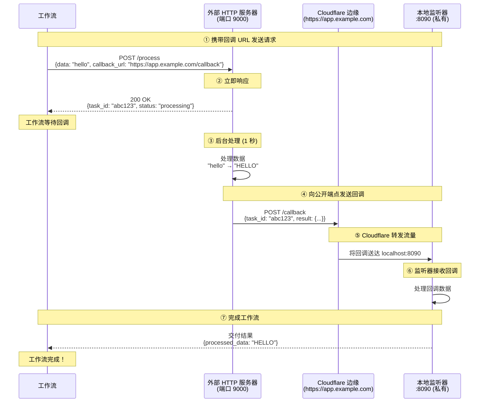

# Cloudflare 命名隧道网关示例

本示例演示如何使用 **Cloudflare 命名隧道（Named Tunnel）**，在由您的 Cloudflare 账户管理的 **稳定的自定义域名** 下将本地服务暴露到互联网。与发放临时 `*.trycloudflare.com` URL 的快速隧道不同，命名隧道绑定到固定主机名，并在重启后保持不变。

## 概述

本工作流展示以下功能：

1. **通过 Cloudflare 命名隧道实现 HTTP 隧道**：在您自己的域名下暴露本地端口
2. **稳定的公开 URL**：在重启之间不会变化的固定主机名
3. **已认证的隧道**：通过隧道令牌使用您的 Cloudflare 账户
4. **HTTP 回调集成**：外部服务通过隧道到达您的本地监听器

## 架构

### 工作流执行流程



**关键点：**
- **https://app.example.com** 可公开访问（外部服务器可达）
- **本地:8090** 是私有的（仅可通过 Cloudflare 命名隧道访问）
- 主机名在 **重启之间保持稳定** — 适用于预发布/生产 webhook
- 隧道通过您的 Cloudflare 账户进行身份验证

## 前置条件

- 已安装 model-compose
- 已安装 `cloudflared` 二进制文件并可在 `PATH` 中访问
- Cloudflare 账户
- 由 Cloudflare DNS 管理的域名
- 在您的 Cloudflare 账户中创建的命名隧道（通过仪表板或 `cloudflared` CLI）

### 安装 cloudflared

```bash
# macOS
brew install cloudflared

# Linux (Debian/Ubuntu)
curl -L https://github.com/cloudflare/cloudflared/releases/latest/download/cloudflared-linux-amd64.deb \
  -o cloudflared.deb && sudo dpkg -i cloudflared.deb

# Windows
winget install --id Cloudflare.cloudflared
```

### 创建命名隧道

有两种选择：

**选项 A：Zero Trust 仪表板（推荐）**

1. 访问 [Zero Trust 仪表板 → Networks → Tunnels](https://one.dash.cloudflare.com/)
2. 点击 **Create a tunnel** → 选择 **Cloudflared**
3. 命名您的隧道，然后复制 **隧道令牌**
4. 添加公开主机名（如 `app.example.com`）并将其路由到 `http://localhost:8090`

**选项 B：cloudflared CLI**

```bash
cloudflared tunnel login
cloudflared tunnel create my-tunnel
# 凭据文件将写入 ~/.cloudflared/<TUNNEL_ID>.json
cloudflared tunnel route dns my-tunnel app.example.com
```

## 设置

### 1. 设置隧道令牌

在本示例目录中创建 `.env` 文件：

```bash
cd examples/gateway/http-tunnel/cloudflare-named
cat > .env <<'EOF'
CLOUDFLARE_TUNNEL_TOKEN=your_tunnel_token_here
EOF
```

令牌由 `model-compose.yml` 中的 `${env.CLOUDFLARE_TUNNEL_TOKEN}` 读取。

### 2. 配置主机名

编辑 `model-compose.yml`，将 `app.example.com` 替换为您在 Cloudflare 账户中配置的主机名：

```yaml
gateway:
  type: http-tunnel
  driver: cloudflare
  token: ${env.CLOUDFLARE_TUNNEL_TOKEN}
  hostname: app.example.com   # ← 修改此处
  port:
    - 8090
```

## 运行示例

### 启动服务

```bash
cd examples/gateway/http-tunnel/cloudflare-named
model-compose up
```

应显示隧道已连接的输出：
```
INFO:     HTTP tunnel started on port 8090: https://app.example.com
```

### 运行工作流

```bash
model-compose run --input '{"data": "hello world"}'
```

预期输出：
```json
{
  "task_id": "abc123...",
  "result": {
    "processed_data": "HELLO WORLD",
    "length": 11
  }
}
```

## 配置详情

### 网关配置

```yaml
gateway:
  type: http-tunnel
  driver: cloudflare
  token: ${env.CLOUDFLARE_TUNNEL_TOKEN}   # 基于令牌的隧道必需
  hostname: app.example.com               # 可选但推荐
  port:
    - 8090
```

**令牌 vs 凭据文件：**
- `token`：来自 Zero Trust 仪表板的隧道令牌（最简单）
- `tunnel` + `credentials_file`：使用通过 `cloudflared` CLI 创建的隧道

**主机名：**
- 设置 `hostname` 时，公开 URL 为 `https://<主机名>`
- 省略 `hostname` 时，URL 回退到 `https://<隧道-id>.cfargotunnel.com`

### 使用凭据文件代替令牌

如果您通过 CLI 创建了隧道：

```yaml
gateway:
  type: http-tunnel
  driver: cloudflare
  tunnel: my-tunnel
  credentials_file: /Users/me/.cloudflared/12345678-abcd-....json
  hostname: app.example.com
  port:
    - 8090
```

### 使用网关上下文

在配置中访问公开 URL：

```yaml
component:
  action:
    body:
      callback_url: ${gateway:8090.public_url}/callback
      # 解析为：https://app.example.com/callback
```

### 监听器配置

```yaml
listener:
  type: http-callback
  host: 0.0.0.0
  port: 8090
  path: /callback
  identify_by: ${body.task_id}
  result: ${body.result}
```

### 使用回调的组件

```yaml
component:
  type: http-server
  start: [ uvicorn, server:app, --reload, --port, "9000" ]
  port: 9000
  action:
    method: POST
    path: /process
    body:
      data: ${input.data}
      callback_url: ${gateway:8090.public_url}/callback
      task_id: ${context.run_id}
    completion:
      type: callback
      wait_for: ${context.run_id}
    output:
      task_id: ${response.task_id}
      result: ${result as json}
```

## 故障排除

### `Timed out waiting for Cloudflare named tunnel to become ready`

**原因和解决方案：**
1. **令牌无效** — 在 Zero Trust 仪表板中重新生成令牌
2. **凭据文件路径错误** — 验证路径以及文件是否可读
3. **网络阻止到 Cloudflare 边缘的出站流量** — 尝试其他网络
4. **隧道已删除或禁用** — 在 Cloudflare 仪表板中检查隧道状态

### 主机名解析但返回 502

**问题：** 公开 URL 可达但返回 `502 Bad Gateway`

**解决方案：**
1. 确认端口 `8090` 上的本地服务已启动：
   ```bash
   curl -i http://localhost:8090/callback
   ```
2. 在 Zero Trust 仪表板中确认公开主机名路由到 `http://localhost:8090`

### DNS 无法解析

**问题：** `app.example.com` 无法解析

**解决方案：**
1. 验证您的域名是否在 Cloudflare DNS 上（橙色云朵代理已启用）
2. 如果使用 CLI 路由，请确保已创建 CNAME 记录：
   ```bash
   cloudflared tunnel route dns my-tunnel app.example.com
   ```

## 快速隧道 vs 命名隧道

| 功能 | 快速隧道 | 命名隧道（本示例） |
|------|---------|------------------|
| Cloudflare 账户 | 不需要 | 需要 |
| 自定义域名 | 否（随机 `*.trycloudflare.com`） | 是 |
| URL 稳定性 | 每次重启都变化 | 稳定 |
| 认证 | 无 | 隧道令牌或凭据文件 |
| 适用场景 | 开发、演示、临时测试 | 预发布、生产 |

如需无账户、零配置的设置，请参阅 [`../cloudflare/`](../cloudflare/)。

## 安全考量

- 命名隧道在配置的主机名仍然可公开访问 — 在您的服务中添加身份验证或使用 Cloudflare Access 策略
- 将 **隧道令牌** 视为机密：存储在 `.env` 中，绝不要提交
- 考虑在公开主机名前启用 Cloudflare Access (Zero Trust) 以实现 SSO/基于 IP 的访问控制
- 定期轮换令牌并撤销未使用的隧道

## 相关示例

- [Cloudflare 快速隧道](../cloudflare/) — 无需账户的临时 URL
- [Ngrok HTTP 隧道](../ngrok/) — 使用 ngrok 的类似模式
- [SSH 隧道网关](../../ssh-tunnel/) — 使用 SSH 远程端口转发的自托管替代方案

## 资源

- [Cloudflare 隧道文档](https://developers.cloudflare.com/cloudflare-one/connections/connect-networks/)
- [通过 Zero Trust 仪表板设置隧道](https://developers.cloudflare.com/cloudflare-one/connections/connect-networks/get-started/create-remote-tunnel/)
- [通过 cloudflared CLI 设置隧道](https://developers.cloudflare.com/cloudflare-one/connections/connect-networks/get-started/create-local-tunnel/)
- [Cloudflare Access (Zero Trust)](https://developers.cloudflare.com/cloudflare-one/policies/access/)
