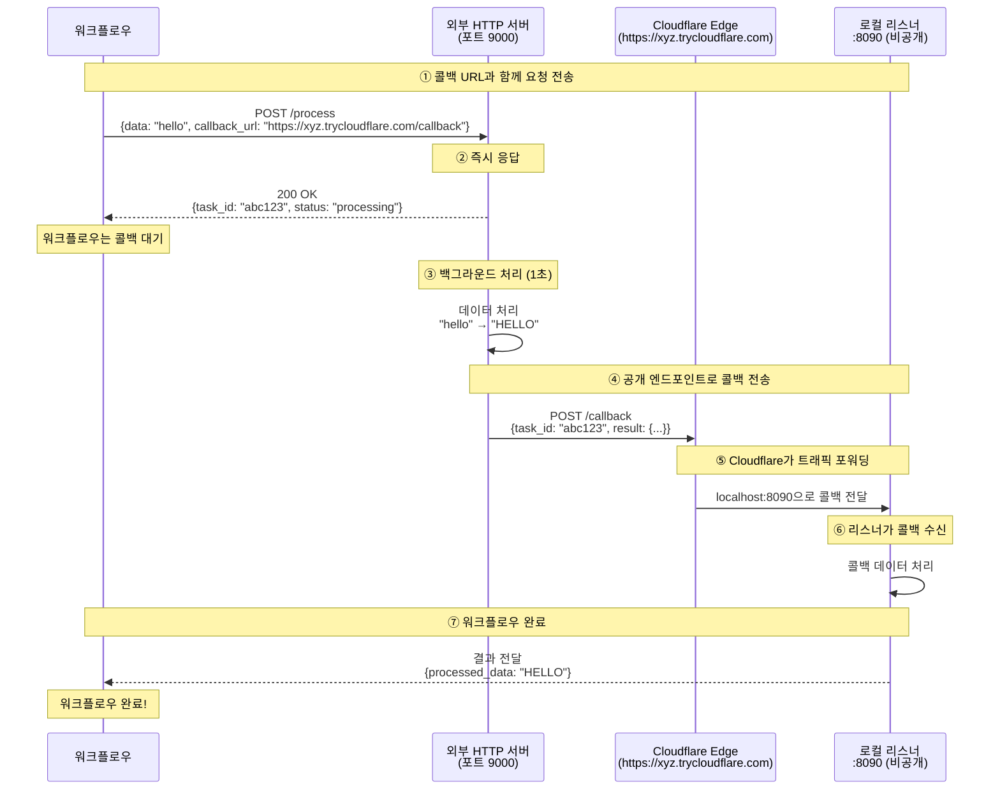

# Cloudflare 퀵 터널 게이트웨이 예제

이 예제는 **Cloudflare 퀵 터널(Quick Tunnel)** 을 사용하여 `cloudflared`를 통해 로컬 서비스를 인터넷에 노출하는 방법을 보여줍니다. 공인 IP, 포트 포워딩, Cloudflare 계정 없이도 외부 서비스가 로컬 엔드포인트로 콜백을 보낼 수 있습니다.

## 개요

이 워크플로우는 다음을 보여줍니다:

1. **Cloudflare 퀵 터널을 통한 HTTP 터널링**: `*.trycloudflare.com`을 통해 로컬 포트를 자동으로 노출
2. **무설정**: 계정, 토큰, 도메인이 필요 없음
3. **HTTP 콜백 통합**: 외부 서비스가 로컬 리스너에 도달 가능
4. **비동기 서비스 패턴**: 콜백 기반 완료로 장시간 실행 작업 처리

## 아키텍처

### 워크플로우 실행 흐름



**핵심 사항:**
- **https://xyz.trycloudflare.com** 은 공개적으로 접근 가능 (외부 서버가 도달 가능)
- **로컬:8090** 은 비공개 (Cloudflare 터널을 통해서만 접근 가능)
- Cloudflare가 트래픽 포워딩: `https://xyz.trycloudflare.com` → `로컬:8090`
- URL은 **재시작할 때마다 무작위로 생성됨** — 안정적인 프로덕션 엔드포인트가 아닌 개발 및 테스트용으로 사용하세요

## 사전 요구사항

- model-compose 설치
- `cloudflared` 바이너리가 설치되어 있고 `PATH`에서 접근 가능해야 함

### cloudflared 설치

```bash
# macOS
brew install cloudflared

# Linux (Debian/Ubuntu)
curl -L https://github.com/cloudflare/cloudflared/releases/latest/download/cloudflared-linux-amd64.deb \
  -o cloudflared.deb && sudo dpkg -i cloudflared.deb

# Windows
winget install --id Cloudflare.cloudflared
```

설치 확인:
```bash
cloudflared --version
```

## 예제 실행

### 서비스 시작

```bash
cd examples/gateway/http-tunnel/cloudflare
model-compose up
```

Cloudflare 터널 URL이 출력되어야 합니다:
```
INFO:     HTTP tunnel started on port 8090: https://gui-chan-inline-div.trycloudflare.com
```

### 워크플로우 실행

```bash
model-compose run --input '{"data": "hello world"}'
```

예상 출력:
```json
{
  "task_id": "abc123...",
  "result": {
    "processed_data": "HELLO WORLD",
    "length": 11
  }
}
```

## 설정 상세

### 게이트웨이 설정

```yaml
gateway:
  type: http-tunnel
  driver: cloudflare
  port:
    - 8090  # Cloudflare 퀵 터널을 통해 로컬 포트 8090 노출
```

**포트 형식:** 로컬 포트 번호만 지정
- `8090` — 로컬 포트 8090 노출 (Cloudflare가 무작위 `*.trycloudflare.com` URL 할당)
- 다중 포트 지원: `[8090, 8091, 8092]` (각 포트마다 별도 퀵 터널 생성)

### 게이트웨이 컨텍스트 사용

설정에서 공개 URL에 접근:

```yaml
component:
  action:
    body:
      callback_url: ${gateway:8090.public_url}/callback
      # 변환됨: https://xyz.trycloudflare.com/callback
```

형식: `${gateway:로컬_포트.public_url}`
- 반환값: `https://random-id.trycloudflare.com`

### 리스너 설정

```yaml
listener:
  type: http-callback
  host: 0.0.0.0
  port: 8090
  path: /callback
  identify_by: ${body.task_id}
  result: ${body.result}
```

### 콜백을 사용하는 컴포넌트

```yaml
component:
  type: http-server
  start: [ uvicorn, server:app, --reload, --port, "9000" ]
  port: 9000
  action:
    method: POST
    path: /process
    body:
      data: ${input.data}
      callback_url: ${gateway:8090.public_url}/callback
      task_id: ${context.run_id}
    completion:
      type: callback
      wait_for: ${context.run_id}
    output:
      task_id: ${response.task_id}
      result: ${result as json}
```

## 트러블슈팅

### `cloudflared`를 찾을 수 없음

**문제:** `Failed to obtain Cloudflare tunnel URL` 또는 `cloudflared: command not found`

**해결:** `cloudflared`를 설치하고 `PATH`에 있는지 확인:
```bash
which cloudflared
cloudflared --version
```

### 터널 URL이 타임아웃 안에 발급되지 않음

**문제:** `Timed out waiting for Cloudflare tunnel URL`

**해결책:**
1. Cloudflare로의 네트워크 연결 확인
2. `cloudflared tunnel --url http://localhost:8090`을 수동으로 실행하여 로그 확인
3. 일부 네트워크는 QUIC/HTTP/2 아웃바운드 트래픽을 차단 — 다른 네트워크에서 시도

### 외부 콜백이 도달하지 않음

**문제:** 외부 서비스가 콜백 URL에 도달할 수 없음

**해결책:**
1. **외부에서 터널 URL에 도달 가능한지 확인:**
   ```bash
   curl -i https://<터널-URL>.trycloudflare.com/callback \
     -H "Content-Type: application/json" \
     -d '{"task_id": "test", "result": {}}'
   ```
2. **로컬 리스너가 떠 있는지 확인:**
   ```bash
   curl http://localhost:8090/callback \
     -H "Content-Type: application/json" \
     -d '{"task_id": "test", "result": {}}'
   ```

### 재시작 시 URL이 변경됨

**문제:** `*.trycloudflare.com` URL이 재시작마다 변경됨

**해결:** 퀵 터널은 의도적으로 임시 URL을 발급합니다. 안정적인 URL이 필요하다면 자신의 도메인 아래 고정 호스트명을 사용할 수 있는 **Cloudflare 네임드 터널** 예제(`../cloudflare-named/`)를 참고하세요.

## 퀵 터널 vs 네임드 터널

| 기능 | 퀵 터널 (이 예제) | 네임드 터널 |
|------|------------------|------------|
| Cloudflare 계정 | 불필요 | 필요 |
| 커스텀 도메인 | 불가 (무작위 `*.trycloudflare.com`) | 가능 |
| URL 안정성 | 재시작마다 변경 | 고정 |
| 인증 | 없음 | 터널 토큰 또는 자격 증명 파일 |
| 적합한 용도 | 개발, 데모, 일회성 테스트 | 스테이징, 프로덕션 |

고정 도메인과 인증된 터널이 필요하다면 [`../cloudflare-named/`](../cloudflare-named/)를 참고하세요.

## 보안 고려사항

- 퀵 터널 URL은 기본적으로 공개적으로 접근 가능 — URL을 아는 누구나 로컬 서비스에 도달 가능
- 노출하는 서비스에 인증 추가를 고려하세요
- 프로덕션 시나리오에서 퀵 터널을 통한 민감한 데이터 전송을 피하세요
- 프로덕션에서는 적절한 접근 제어가 있는 네임드 터널을 선호하세요

## 관련 예제

- [Cloudflare 네임드 터널](../cloudflare-named/) — Cloudflare 계정을 통한 고정 도메인
- [Ngrok HTTP 터널](../ngrok/) — ngrok을 사용한 유사 패턴
- [SSH 터널 게이트웨이](../../ssh-tunnel/) — SSH 원격 포트 포워딩을 사용한 자체 호스팅 대안

## 참고 자료

- [Cloudflare 터널 문서](https://developers.cloudflare.com/cloudflare-one/connections/connect-networks/)
- [cloudflared GitHub 저장소](https://github.com/cloudflare/cloudflared)
- [퀵 터널 개요](https://developers.cloudflare.com/cloudflare-one/connections/connect-networks/do-more-with-tunnels/trycloudflare/)
