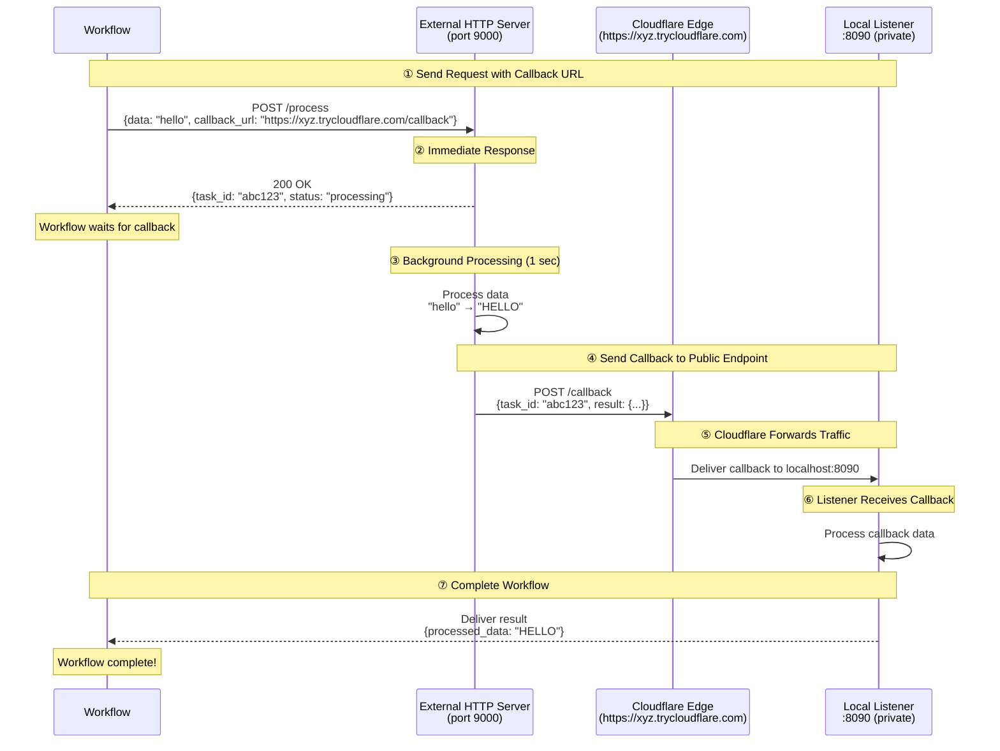

# Cloudflare Quick Tunnel Gateway Example

This example demonstrates how to use a **Cloudflare Quick Tunnel** to expose local services to the internet via `cloudflared`. It enables external services to send callbacks to your local endpoints without requiring a public IP, port forwarding, or a Cloudflare account.

## Overview

This workflow showcases:

1. **HTTP Tunnel via Cloudflare Quick Tunnel**: Automatically expose local ports through `*.trycloudflare.com`
2. **Zero Configuration**: No account, token, or domain required
3. **HTTP Callback Integration**: Enable external services to reach your local listener
4. **Async Service Pattern**: Handle long-running tasks with callback-based completion

## Architecture

### Workflow Execution Flow



**Key Points:**
- **https://xyz.trycloudflare.com** is publicly accessible (external server can reach it)
- **Local:8090** is private (only accessible via the Cloudflare tunnel)
- Cloudflare forwards traffic: `https://xyz.trycloudflare.com` → `Local:8090`
- The URL is **randomly generated on each restart** — use this example for development and testing, not for stable production endpoints

## Prerequisites

- model-compose installed
- `cloudflared` binary installed and available in `PATH`

### Install cloudflared

```bash
# macOS
brew install cloudflared

# Linux (Debian/Ubuntu)
curl -L https://github.com/cloudflare/cloudflared/releases/latest/download/cloudflared-linux-amd64.deb \
  -o cloudflared.deb && sudo dpkg -i cloudflared.deb

# Windows
winget install --id Cloudflare.cloudflared
```

Verify the installation:
```bash
cloudflared --version
```

## Running the Example

### Start the Service

```bash
cd examples/gateway/http-tunnel/cloudflare
model-compose up
```

You should see output indicating the Cloudflare tunnel URL:
```
INFO:     HTTP tunnel started on port 8090: https://gui-chan-inline-div.trycloudflare.com
```

### Run the Workflow

```bash
model-compose run --input '{"data": "hello world"}'
```

Expected output:
```json
{
  "task_id": "abc123...",
  "result": {
    "processed_data": "HELLO WORLD",
    "length": 11
  }
}
```

## Configuration Details

### Gateway Configuration

```yaml
gateway:
  type: http-tunnel
  driver: cloudflare
  port:
    - 8090  # Expose local port 8090 via Cloudflare Quick Tunnel
```

**Port Format:** Just specify the local port number
- `8090` — Expose local port 8090 (Cloudflare assigns a random `*.trycloudflare.com` URL)
- Multiple ports supported: `[8090, 8091, 8092]` (each port gets its own Quick Tunnel)

### Using Gateway Context

Access the public URL in your configuration:

```yaml
component:
  action:
    body:
      callback_url: ${gateway:8090.public_url}/callback
      # Resolves to: https://xyz.trycloudflare.com/callback
```

The format is: `${gateway:LOCAL_PORT.public_url}`
- Returns: `https://random-id.trycloudflare.com`

### Listener Configuration

```yaml
listener:
  type: http-callback
  host: 0.0.0.0
  port: 8090
  path: /callback
  identify_by: ${body.task_id}
  result: ${body.result}
```

### Component with Callback

```yaml
component:
  type: http-server
  start: [ uvicorn, server:app, --reload, --port, "9000" ]
  port: 9000
  action:
    method: POST
    path: /process
    body:
      data: ${input.data}
      callback_url: ${gateway:8090.public_url}/callback
      task_id: ${context.run_id}
    completion:
      type: callback
      wait_for: ${context.run_id}
    output:
      task_id: ${response.task_id}
      result: ${result as json}
```

## Troubleshooting

### `cloudflared` Not Found

**Problem:** `Failed to obtain Cloudflare tunnel URL` or `cloudflared: command not found`

**Solution:** Install `cloudflared` and ensure it is in `PATH`:
```bash
which cloudflared
cloudflared --version
```

### Tunnel URL Not Issued Within Timeout

**Problem:** `Timed out waiting for Cloudflare tunnel URL`

**Solutions:**
1. Check network connectivity to Cloudflare
2. Run `cloudflared tunnel --url http://localhost:8090` manually to inspect logs
3. Some networks block outbound QUIC/HTTP/2 traffic — try a different network

### External Callback Not Arriving

**Problem:** The external service can't reach the callback URL

**Solutions:**
1. **Verify the tunnel URL is reachable from outside:**
   ```bash
   curl -i https://<your-tunnel>.trycloudflare.com/callback \
     -H "Content-Type: application/json" \
     -d '{"task_id": "test", "result": {}}'
   ```
2. **Verify the local listener is up:**
   ```bash
   curl http://localhost:8090/callback \
     -H "Content-Type: application/json" \
     -d '{"task_id": "test", "result": {}}'
   ```

### URL Changes on Restart

**Problem:** The `*.trycloudflare.com` URL changes every time you restart

**Solution:** Quick Tunnels intentionally issue ephemeral URLs. For stable URLs, use the **Cloudflare Named Tunnel** example (`../cloudflare-named/`) which gives you a fixed hostname under your own domain.

## Quick Tunnel vs. Named Tunnel

| Feature | Quick Tunnel (this example) | Named Tunnel |
|---------|----------------------------|--------------|
| Cloudflare account | Not required | Required |
| Custom domain | No (random `*.trycloudflare.com`) | Yes |
| URL stability | Changes on every restart | Stable |
| Authentication | None | Tunnel token or credentials file |
| Best for | Development, demos, ad-hoc tests | Staging, production |

For a fixed domain and authenticated tunnel, see [`../cloudflare-named/`](../cloudflare-named/).

## Security Considerations

- Quick Tunnel URLs are publicly accessible by default — anyone with the URL can reach your local service
- Consider adding authentication to any service you expose
- Avoid sending sensitive data through Quick Tunnels in production scenarios
- For production, prefer Named Tunnels with proper access controls

## Related Examples

- [Cloudflare Named Tunnel](../cloudflare-named/) — Fixed domain via your Cloudflare account
- [Ngrok HTTP Tunnel](../ngrok/) — Similar pattern using ngrok
- [SSH Tunnel Gateway](../../ssh-tunnel/) — Self-hosted alternative using SSH remote port forwarding

## Resources

- [Cloudflare Tunnel Documentation](https://developers.cloudflare.com/cloudflare-one/connections/connect-networks/)
- [cloudflared GitHub Repository](https://github.com/cloudflare/cloudflared)
- [Quick Tunnels Overview](https://developers.cloudflare.com/cloudflare-one/connections/connect-networks/do-more-with-tunnels/trycloudflare/)
