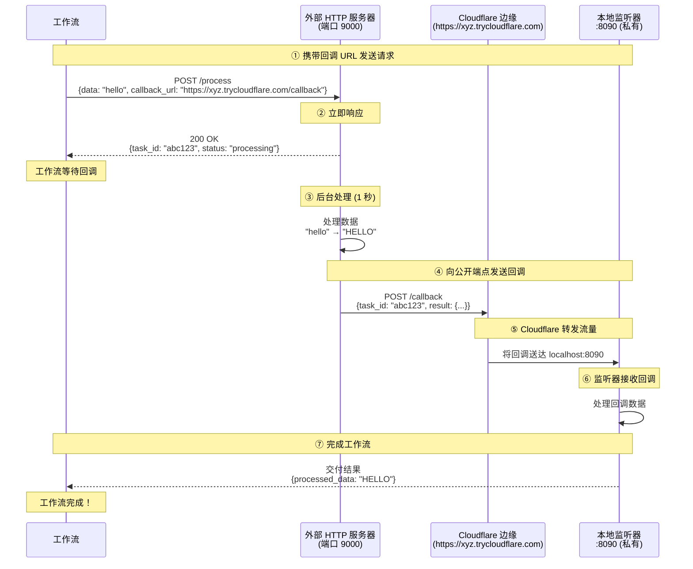

# Cloudflare 快速隧道网关示例

本示例演示如何使用 **Cloudflare 快速隧道（Quick Tunnel）** 通过 `cloudflared` 将本地服务暴露到互联网。无需公网 IP、端口转发或 Cloudflare 账户，外部服务即可向您的本地端点发送回调。

## 概述

本工作流展示以下功能：

1. **通过 Cloudflare 快速隧道实现 HTTP 隧道**：通过 `*.trycloudflare.com` 自动暴露本地端口
2. **零配置**：无需账户、令牌或域名
3. **HTTP 回调集成**：使外部服务能够访问本地监听器
4. **异步服务模式**：通过基于回调的完成机制处理长时间运行的任务

## 架构

### 工作流执行流程



**关键点：**
- **https://xyz.trycloudflare.com** 可公开访问（外部服务器可达）
- **本地:8090** 是私有的（仅可通过 Cloudflare 隧道访问）
- Cloudflare 转发流量：`https://xyz.trycloudflare.com` → `本地:8090`
- URL **每次重启时随机生成** — 适用于开发和测试，不适合稳定的生产端点

## 前置条件

- 已安装 model-compose
- 已安装 `cloudflared` 二进制文件并可在 `PATH` 中访问

### 安装 cloudflared

```bash
# macOS
brew install cloudflared

# Linux (Debian/Ubuntu)
curl -L https://github.com/cloudflare/cloudflared/releases/latest/download/cloudflared-linux-amd64.deb \
  -o cloudflared.deb && sudo dpkg -i cloudflared.deb

# Windows
winget install --id Cloudflare.cloudflared
```

验证安装：
```bash
cloudflared --version
```

## 运行示例

### 启动服务

```bash
cd examples/gateway/http-tunnel/cloudflare
model-compose up
```

应显示 Cloudflare 隧道 URL：
```
INFO:     HTTP tunnel started on port 8090: https://gui-chan-inline-div.trycloudflare.com
```

### 运行工作流

```bash
model-compose run --input '{"data": "hello world"}'
```

预期输出：
```json
{
  "task_id": "abc123...",
  "result": {
    "processed_data": "HELLO WORLD",
    "length": 11
  }
}
```

## 配置详情

### 网关配置

```yaml
gateway:
  type: http-tunnel
  driver: cloudflare
  port:
    - 8090  # 通过 Cloudflare 快速隧道暴露本地端口 8090
```

**端口格式：** 只需指定本地端口号
- `8090` — 暴露本地端口 8090（Cloudflare 分配随机的 `*.trycloudflare.com` URL）
- 支持多个端口：`[8090, 8091, 8092]`（每个端口获得独立的快速隧道）

### 使用网关上下文

在配置中访问公开 URL：

```yaml
component:
  action:
    body:
      callback_url: ${gateway:8090.public_url}/callback
      # 解析为：https://xyz.trycloudflare.com/callback
```

格式：`${gateway:本地端口.public_url}`
- 返回：`https://random-id.trycloudflare.com`

### 监听器配置

```yaml
listener:
  type: http-callback
  host: 0.0.0.0
  port: 8090
  path: /callback
  identify_by: ${body.task_id}
  result: ${body.result}
```

### 使用回调的组件

```yaml
component:
  type: http-server
  start: [ uvicorn, server:app, --reload, --port, "9000" ]
  port: 9000
  action:
    method: POST
    path: /process
    body:
      data: ${input.data}
      callback_url: ${gateway:8090.public_url}/callback
      task_id: ${context.run_id}
    completion:
      type: callback
      wait_for: ${context.run_id}
    output:
      task_id: ${response.task_id}
      result: ${result as json}
```

## 故障排除

### 找不到 `cloudflared`

**问题：** `Failed to obtain Cloudflare tunnel URL` 或 `cloudflared: command not found`

**解决：** 安装 `cloudflared` 并确保其在 `PATH` 中：
```bash
which cloudflared
cloudflared --version
```

### 隧道 URL 未在超时时间内发放

**问题：** `Timed out waiting for Cloudflare tunnel URL`

**解决方案：**
1. 检查到 Cloudflare 的网络连接
2. 手动运行 `cloudflared tunnel --url http://localhost:8090` 查看日志
3. 某些网络会阻止出站 QUIC/HTTP/2 流量 — 尝试其他网络

### 外部回调未到达

**问题：** 外部服务无法到达回调 URL

**解决方案：**
1. **验证隧道 URL 可从外部访问：**
   ```bash
   curl -i https://<您的隧道>.trycloudflare.com/callback \
     -H "Content-Type: application/json" \
     -d '{"task_id": "test", "result": {}}'
   ```
2. **验证本地监听器是否运行：**
   ```bash
   curl http://localhost:8090/callback \
     -H "Content-Type: application/json" \
     -d '{"task_id": "test", "result": {}}'
   ```

### 重启时 URL 变更

**问题：** `*.trycloudflare.com` URL 每次重启都会变化

**解决：** 快速隧道有意发放临时 URL。如需稳定 URL，请使用 **Cloudflare 命名隧道** 示例（`../cloudflare-named/`），可在您的域名下获得固定主机名。

## 快速隧道 vs 命名隧道

| 功能 | 快速隧道（本示例） | 命名隧道 |
|------|------------------|---------|
| Cloudflare 账户 | 不需要 | 需要 |
| 自定义域名 | 否（随机 `*.trycloudflare.com`） | 是 |
| URL 稳定性 | 每次重启都变化 | 稳定 |
| 认证 | 无 | 隧道令牌或凭据文件 |
| 适用场景 | 开发、演示、临时测试 | 预发布、生产 |

如需固定域名和已认证的隧道，请参阅 [`../cloudflare-named/`](../cloudflare-named/)。

## 安全考量

- 快速隧道 URL 默认可公开访问 — 任何知道 URL 的人都可以访问您的本地服务
- 考虑为暴露的任何服务添加身份验证
- 避免在生产场景中通过快速隧道发送敏感数据
- 生产环境优先选择具有适当访问控制的命名隧道

## 相关示例

- [Cloudflare 命名隧道](../cloudflare-named/) — 通过您的 Cloudflare 账户获得固定域名
- [Ngrok HTTP 隧道](../ngrok/) — 使用 ngrok 的类似模式
- [SSH 隧道网关](../../ssh-tunnel/) — 使用 SSH 远程端口转发的自托管替代方案

## 资源

- [Cloudflare 隧道文档](https://developers.cloudflare.com/cloudflare-one/connections/connect-networks/)
- [cloudflared GitHub 仓库](https://github.com/cloudflare/cloudflared)
- [快速隧道概览](https://developers.cloudflare.com/cloudflare-one/connections/connect-networks/do-more-with-tunnels/trycloudflare/)
