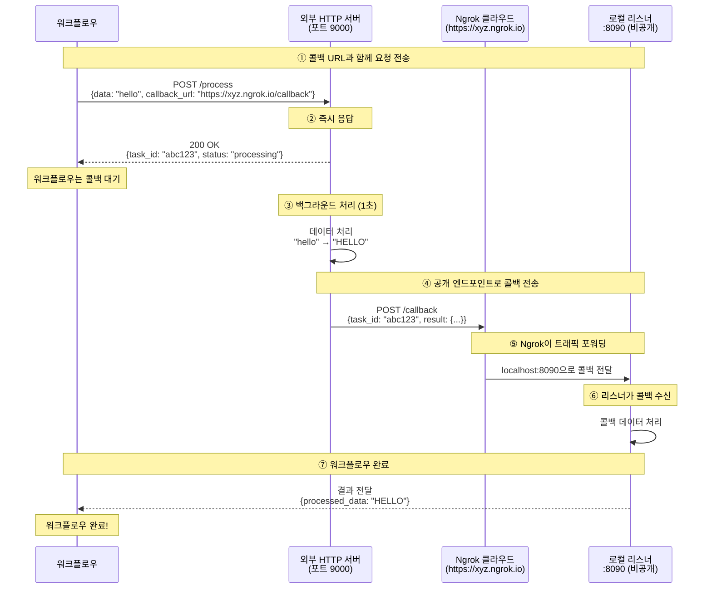

# Ngrok HTTP 터널 게이트웨이 예제

이 예제는 ngrok HTTP 터널 게이트웨이를 사용하여 로컬 서비스를 인터넷에 노출하는 방법을 보여줍니다. 공인 IP나 SSH 서버 없이도 외부 서비스가 로컬 엔드포인트로 콜백을 보낼 수 있습니다.

## 개요

이 워크플로우는 다음을 보여줍니다:

1. **Ngrok을 통한 HTTP 터널**: ngrok 클라우드 서비스를 통해 로컬 포트 자동 노출
2. **무설정**: SSH 서버나 공인 IP 불필요
3. **HTTP 콜백 통합**: 외부 서비스가 로컬 리스너에 도달 가능
4. **비동기 서비스 패턴**: 콜백 기반 완료로 장시간 실행 작업 처리

## 아키텍처

### 워크플로우 실행 흐름



**핵심 사항:**
- **https://xyz.ngrok.io** 는 공개적으로 접근 가능 (외부 서버가 도달 가능)
- **로컬:8090** 은 비공개 (ngrok 터널을 통해서만 접근 가능)
- Ngrok이 트래픽 포워딩: `https://xyz.ngrok.io` → `로컬:8090`
- SSH 서버나 포트 포워딩 설정 불필요

## 사전 요구사항

- model-compose 설치
- Python 패키지: `pyngrok` (model-compose가 자동 설치)
- 선택사항: 고급 기능을 위한 ngrok authtoken

## 설정

### 1. 의존성 설치

`pyngrok` 패키지는 워크플로우 시작 시 자동으로 설치됩니다.

### 2. 선택사항: Ngrok Authtoken 설정

기본 사용에는 authtoken이 필요하지 않습니다. 하지만 authtoken이 있으면 다음 기능을 사용할 수 있습니다:
- 더 긴 터널 세션 시간
- 커스텀 서브도메인
- 더 많은 동시 터널

Authtoken 설정 방법:

```bash
cd examples/gateway/ngrok
cp .env.example .env
```

`.env` 편집:
```bash
NGROK_AUTHTOKEN=your_ngrok_authtoken_here
```

Authtoken 발급: https://dashboard.ngrok.com/get-started/your-authtoken

## 예제 실행

### 서비스 시작

```bash
cd examples/gateway/ngrok
model-compose up
```

ngrok 터널 URL을 나타내는 출력이 표시되어야 합니다:
```
[Gateway] Ngrok tunnel started: https://abc123.ngrok.io -> localhost:8090
```

### 워크플로우 실행

```bash
model-compose run --input '{"data": "hello world"}'
```

예상 출력:
```json
{
  "task_id": "abc123...",
  "result": {
    "processed_data": "HELLO WORLD",
    "length": 11
  }
}
```

## 설정 상세

### 게이트웨이 설정

```yaml
gateway:
  type: http-tunnel
  driver: ngrok
  port:
    - 8090  # ngrok 터널을 통해 로컬 포트 8090 노출
```

**포트 형식:** 로컬 포트 번호만 지정
- `8090` - 로컬 포트 8090 노출 (ngrok이 무작위 공개 URL 할당)
- 다중 포트 지원: `[8090, 8091, 8092]`

### 게이트웨이 컨텍스트 사용

설정에서 공개 URL에 접근:

```yaml
component:
  action:
    body:
      callback_url: ${gateway:8090.public_url}/callback
      # 변환됨: https://abc123.ngrok.io/callback
```

형식: `${gateway:로컬_포트.public_url}`
- 반환값: `https://random-id.ngrok.io` (또는 커스텀 도메인)

### 리스너 설정

```yaml
listener:
  type: http-callback
  host: 0.0.0.0
  port: 8090
  path: /callback
  identify_by: ${body.task_id}
  result: ${body.result}
```

### 콜백을 사용하는 컴포넌트

```yaml
component:
  type: http-server
  start: [ uvicorn, server:app, --reload, --port, "9000" ]
  port: 9000
  action:
    method: POST
    path: /process
    body:
      data: ${input.data}
      callback_url: ${gateway:8090.public_url}/callback
      task_id: ${context.run_id}
    completion:
      type: callback
      wait_for: ${context.run_id}
    output:
      task_id: ${response.task_id}
      result: ${result}
```

## 트러블슈팅

### Ngrok 터널이 시작되지 않음

**문제:** ngrok 바이너리에 대한 에러 메시지

**해결:** pyngrok 설치:
```bash
pip install pyngrok
```

### 연결 타임아웃

**문제:** 외부 서비스가 콜백 URL에 도달할 수 없음

**해결책:**
1. **터널 상태 확인:**
   - 시작 로그에서 터널 URL 확인
   - URL이 접근 가능한지 확인: `curl https://your-tunnel.ngrok.io/callback`

2. **로컬 리스너 테스트:**
   ```bash
   curl http://localhost:8090/callback \
     -H "Content-Type: application/json" \
     -d '{"task_id": "test", "result": {}}'
   ```

3. **ngrok 제한 확인:**
   - 무료 티어에는 세션 시간 제한 있음
   - 더 긴 세션을 위해 가입하고 authtoken 추가

### Authtoken 문제

**문제:** Authtoken이 사용되지 않음

**해결책:**
1. `.env` 파일이 존재하고 토큰을 포함하는지 확인
2. 또는 ngrok을 직접 설정:
   ```bash
   ngrok config add-authtoken YOUR_TOKEN
   ```

### 포트가 이미 사용 중

**문제:** 포트 8090이 이미 사용 중

**해결책:**
1. **포트를 사용하는 프로세스 찾기:**
   ```bash
   lsof -i:8090
   ```

2. **프로세스 종료:**
   ```bash
   kill -9 <PID>
   ```

3. **또는 다른 포트 사용:**
   - `model-compose.yml`을 편집하고 포트 `8090`을 다른 포트로 변경

## 고급 설정

### 다중 포트 터널

여러 로컬 포트 노출:

```yaml
gateway:
  type: http-tunnel
  driver: ngrok
  port:
    - 8090  # 콜백 리스너
    - 8091  # 관리 인터페이스
    - 8092  # 메트릭 엔드포인트
```

각 터널에 접근:
```yaml
callback_url: ${gateway:8090.public_url}/callback
admin_url: ${gateway:8091.public_url}/admin
metrics_url: ${gateway:8092.public_url}/metrics
```

### 커스텀 서브도메인 (유료 플랜 필요)

```yaml
gateway:
  type: http-tunnel
  driver: ngrok
  port:
    - 8090
  config:
    subdomain: my-custom-name
    # 생성됨: https://my-custom-name.ngrok.io
```

### 다른 HTTP 터널 드라이버

`http-tunnel` 게이트웨이 타입은 여러 드라이버를 지원합니다:

1. **Ngrok** (이 예제)
   ```yaml
   gateway:
     type: http-tunnel
     driver: ngrok
   ```

2. **Cloudflared** (Cloudflare Tunnel)
   ```yaml
   gateway:
     type: http-tunnel
     driver: cloudflared
   ```

3. **LocalTunnel**
   ```yaml
   gateway:
     type: http-tunnel
     driver: localtunnel
   ```

## 보안 고려사항

### 터널 보안
- Ngrok 터널은 기본적으로 공개적으로 접근 가능
- URL을 아는 누구나 로컬 서비스에 접근 가능
- 서비스에 인증 구현 고려
- HTTPS 사용 (ngrok이 기본으로 제공)
- 민감한 데이터에 주의

### 모범 사례
1. 인증 없이 **민감한 서비스를 노출하지 마세요**
2. 더 나은 제어와 모니터링을 위해 **authtoken을 사용하세요**
3. 터널 활동을 위해 **ngrok 대시보드를 모니터링하세요**
4. 서비스에 **속도 제한을 구현하세요**
5. 설정에 **환경 변수를 사용하세요**
6. authtoken이 포함된 `.env` 파일을 **절대 커밋하지 마세요**

### 프로덕션 사용
프로덕션 환경의 경우 다음을 고려하세요:
- 예약 도메인이 있는 전용 ngrok 계정 사용
- 웹훅 서명 검증 구현
- IP 화이트리스트 사용 (ngrok 유료 기능)
- 모니터링 및 알림 설정
- 또는 더 많은 제어를 위해 ssh-tunnel 게이트웨이 사용

## SSH 터널과 비교

| 기능 | Ngrok (HTTP 터널) | SSH 터널 |
|------|------------------|---------|
| 설정 | 무설정 | SSH 서버 필요 |
| 비용 | 무료 티어 제공 | 무료 (자체 서버) |
| 프로토콜 | HTTP/HTTPS만 | 모든 TCP 프로토콜 |
| 제어 | 제한적 | 완전한 제어 |
| 속도 | 지연 발생 가능 | 직접 연결 |
| 프라이버시 | ngrok을 통한 데이터 | 자체 인프라 |
| URL | 재시작 시 변경 | 안정적 (자체 서버) |
| 적합한 용도 | 개발, 데모 | 프로덕션, 프라이버시 |

## Ngrok 터널의 장점

1. **인프라 불필요**
   - 공개 서버 불필요
   - SSH 설정 불필요
   - NAT/방화벽 뒤에서도 작동

2. **빠른 설정**
   - 몇 초 안에 터널링 시작
   - DNS나 포트 포워딩 설정 불필요
   - 자동 HTTPS

3. **개발 친화적**
   - 웹훅을 로컬에서 테스트하기 좋음
   - ngrok 대시보드로 트래픽 검사
   - 팀원과 쉽게 공유

4. **크로스 플랫폼**
   - Windows, Mac, Linux에서 작동
   - 플랫폼별 설정 불필요

## 관련 예제

- [SSH 터널 게이트웨이](../ssh-tunnel/) - SSH 원격 포트 포워딩 사용
- [Echo 서버](../../echo-server/) - 기본 HTTP 서버 예제

## 참고 자료

- [Ngrok 문서](https://ngrok.com/docs)
- [pyngrok 문서](https://pyngrok.readthedocs.io/)
- [Ngrok 대시보드](https://dashboard.ngrok.com/)
- [Authtoken 발급](https://dashboard.ngrok.com/get-started/your-authtoken)
