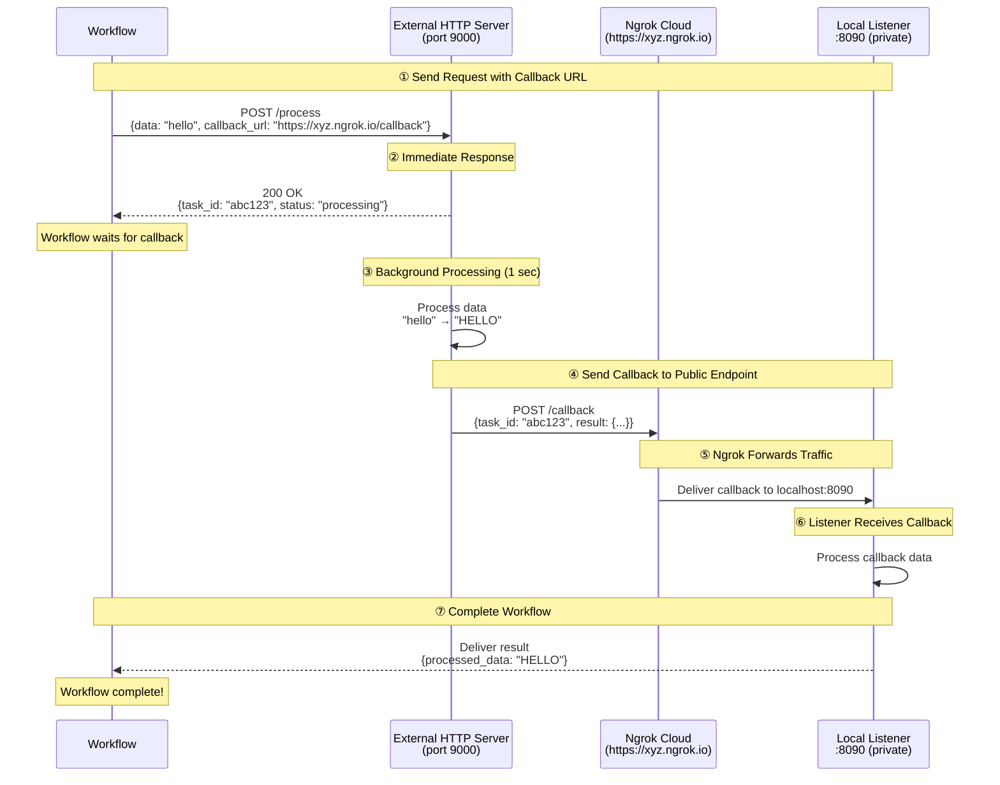

# Ngrok HTTP Tunnel Gateway Example

This example demonstrates how to use ngrok HTTP tunnel gateway to expose local services to the internet. This enables external services to send callbacks to your local endpoints without requiring a public IP or SSH server.

## Overview

This workflow showcases:

1. **HTTP Tunnel via Ngrok**: Automatically expose local ports through ngrok's cloud service
2. **Zero Configuration**: No SSH server or public IP required
3. **HTTP Callback Integration**: Enable external services to reach your local listener
4. **Async Service Pattern**: Handle long-running tasks with callback-based completion

## Architecture

### Workflow Execution Flow



**Key Points:**
- **https://xyz.ngrok.io** is publicly accessible (external server can reach it)
- **Local:8090** is private (only accessible via ngrok tunnel)
- Ngrok forwards traffic: `https://xyz.ngrok.io` → `Local:8090`
- No SSH server or port forwarding configuration required

## Prerequisites

- model-compose installed
- Python packages: `pyngrok` (auto-installed by model-compose)
- Optional: ngrok authtoken for advanced features

## Setup

### 1. Install Dependencies

The `pyngrok` package will be automatically installed when you start the workflow.

### 2. Optional: Configure Ngrok Authtoken

For basic usage, no authtoken is required. However, having an authtoken provides:
- Longer tunnel session times
- Custom subdomains
- More concurrent tunnels

To set up an authtoken:

```bash
cd examples/gateway/ngrok
cp .env.example .env
```

Edit `.env`:
```bash
NGROK_AUTHTOKEN=your_ngrok_authtoken_here
```

Get your authtoken from: https://dashboard.ngrok.com/get-started/your-authtoken

## Running the Example

### Start the Service

```bash
cd examples/gateway/ngrok
model-compose up
```

You should see output indicating the ngrok tunnel URL:
```
[Gateway] Ngrok tunnel started: https://abc123.ngrok.io -> localhost:8090
```

### Run the Workflow

```bash
model-compose run --input '{"data": "hello world"}'
```

Expected output:
```json
{
  "task_id": "abc123...",
  "result": {
    "processed_data": "HELLO WORLD",
    "length": 11
  }
}
```

## Configuration Details

### Gateway Configuration

```yaml
gateway:
  type: http-tunnel
  driver: ngrok
  port:
    - 8090  # Expose local port 8090 via ngrok tunnel
```

**Port Format:** Just specify the local port number
- `8090` - Expose local port 8090 (ngrok assigns a random public URL)
- Multiple ports supported: `[8090, 8091, 8092]`

### Using Gateway Context

Access the public URL in your configuration:

```yaml
component:
  action:
    body:
      callback_url: ${gateway:8090.public_url}/callback
      # Resolves to: https://abc123.ngrok.io/callback
```

The format is: `${gateway:LOCAL_PORT.public_url}`
- Returns: `https://random-id.ngrok.io` (or your custom domain)

### Listener Configuration

```yaml
listener:
  type: http-callback
  host: 0.0.0.0
  port: 8090
  path: /callback
  identify_by: ${body.task_id}
  result: ${body.result}
```

### Component with Callback

```yaml
component:
  type: http-server
  start: [ uvicorn, server:app, --reload, --port, "9000" ]
  port: 9000
  action:
    method: POST
    path: /process
    body:
      data: ${input.data}
      callback_url: ${gateway:8090.public_url}/callback
      task_id: ${context.run_id}
    completion:
      type: callback
      wait_for: ${context.run_id}
    output:
      task_id: ${response.task_id}
      result: ${result}
```

## Troubleshooting

### Ngrok Tunnel Not Starting

**Problem:** Error message about ngrok binary

**Solution:** Install pyngrok:
```bash
pip install pyngrok
```

### Connection Timeout

**Problem:** External service can't reach the callback URL

**Solutions:**
1. **Check tunnel status:**
   - Look for the tunnel URL in the startup logs
   - Verify the URL is accessible: `curl https://your-tunnel.ngrok.io/callback`

2. **Test local listener:**
   ```bash
   curl http://localhost:8090/callback \
     -H "Content-Type: application/json" \
     -d '{"task_id": "test", "result": {}}'
   ```

3. **Check ngrok limits:**
   - Free tier has session time limits
   - Sign up and add authtoken for longer sessions

### Authtoken Issues

**Problem:** Authtoken not being used

**Solution:**
1. Verify `.env` file exists and contains the token
2. Alternatively, configure ngrok directly:
   ```bash
   ngrok config add-authtoken YOUR_TOKEN
   ```

### Port Already in Use

**Problem:** Port 8090 is already in use

**Solution:**
1. **Find what's using the port:**
   ```bash
   lsof -i:8090
   ```

2. **Kill the process:**
   ```bash
   kill -9 <PID>
   ```

3. **Or use a different port:**
   - Edit `model-compose.yml` and change port `8090` to another port

## Advanced Configuration

### Multiple Port Tunnels

Expose multiple local ports:

```yaml
gateway:
  type: http-tunnel
  driver: ngrok
  port:
    - 8090  # Callback listener
    - 8091  # Admin interface
    - 8092  # Metrics endpoint
```

Access each tunnel:
```yaml
callback_url: ${gateway:8090.public_url}/callback
admin_url: ${gateway:8091.public_url}/admin
metrics_url: ${gateway:8092.public_url}/metrics
```

### Custom Subdomain (Requires Paid Plan)

```yaml
gateway:
  type: http-tunnel
  driver: ngrok
  port:
    - 8090
  config:
    subdomain: my-custom-name
    # Creates: https://my-custom-name.ngrok.io
```

### Other HTTP Tunnel Drivers

The `http-tunnel` gateway type supports multiple drivers:

1. **Ngrok** (this example)
   ```yaml
   gateway:
     type: http-tunnel
     driver: ngrok
   ```

2. **Cloudflared** (Cloudflare Tunnel)
   ```yaml
   gateway:
     type: http-tunnel
     driver: cloudflared
   ```

3. **LocalTunnel**
   ```yaml
   gateway:
     type: http-tunnel
     driver: localtunnel
   ```

## Security Considerations

### Tunnel Security
- Ngrok tunnels are publicly accessible by default
- Anyone with the URL can access your local service
- Consider implementing authentication in your service
- Use HTTPS (ngrok provides this by default)
- Be careful with sensitive data

### Best Practices
1. **Don't expose sensitive services** without authentication
2. **Use authtoken** for better control and monitoring
3. **Monitor ngrok dashboard** for tunnel activity
4. **Implement rate limiting** in your service
5. **Use environment variables** for configuration
6. **Never commit** `.env` files with authtokens

### Production Usage
For production environments, consider:
- Using a dedicated ngrok account with reserved domains
- Implementing webhook signature verification
- Using IP whitelisting (ngrok paid feature)
- Setting up monitoring and alerts
- Or using ssh-tunnel gateway for more control

## Comparison with SSH Tunnel

| Feature | Ngrok (HTTP Tunnel) | SSH Tunnel |
|---------|---------------------|------------|
| Setup | Zero configuration | Requires SSH server |
| Cost | Free tier available | Free (your server) |
| Protocol | HTTP/HTTPS only | Any TCP protocol |
| Control | Limited | Full control |
| Speed | May have latency | Direct connection |
| Privacy | Data through ngrok | Your infrastructure |
| URL | Changes on restart | Stable (your server) |
| Best For | Development, demos | Production, privacy |

## Ngrok Tunnel Advantages

1. **No Infrastructure Required**
   - No need for a public server
   - No SSH configuration
   - Works behind NAT/firewalls

2. **Quick Setup**
   - Start tunneling in seconds
   - No DNS or port forwarding configuration
   - Automatic HTTPS

3. **Development Friendly**
   - Great for testing webhooks locally
   - Inspect traffic via ngrok dashboard
   - Easy to share with team members

4. **Cross-Platform**
   - Works on Windows, Mac, Linux
   - No platform-specific configuration

## Related Examples

- [SSH Tunnel Gateway](../ssh-tunnel/) - Using SSH remote port forwarding
- [Echo Server](../../echo-server/) - Basic HTTP server example

## Resources

- [Ngrok Documentation](https://ngrok.com/docs)
- [pyngrok Documentation](https://pyngrok.readthedocs.io/)
- [Ngrok Dashboard](https://dashboard.ngrok.com/)
- [Get Authtoken](https://dashboard.ngrok.com/get-started/your-authtoken)
