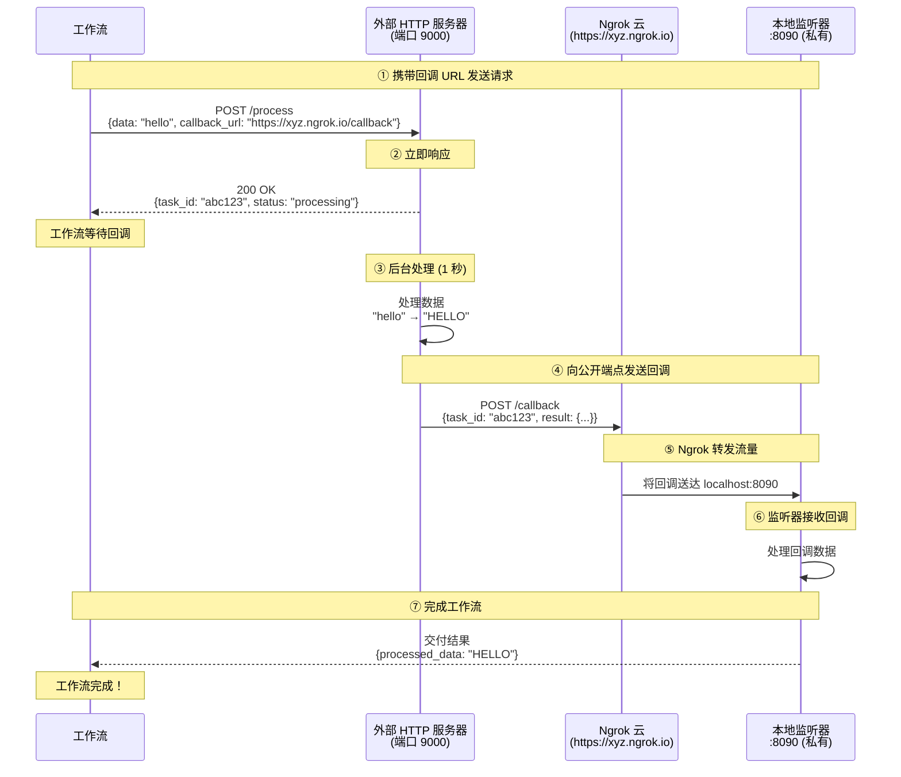

# Ngrok HTTP 隧道网关示例

本示例演示如何使用 ngrok HTTP 隧道网关将本地服务暴露到互联网。无需公网 IP 或 SSH 服务器，外部服务即可向您的本地端点发送回调。

## 概述

本工作流展示以下功能：

1. **通过 Ngrok 实现 HTTP 隧道**：通过 ngrok 云服务自动暴露本地端口
2. **零配置**：无需 SSH 服务器或公网 IP
3. **HTTP 回调集成**：使外部服务能够到达您的本地监听器
4. **异步服务模式**：通过基于回调的完成机制处理长时间运行的任务

## 架构

### 工作流执行流程



**关键点：**
- **https://xyz.ngrok.io** 可公开访问（外部服务器可达）
- **本地:8090** 是私有的（仅可通过 ngrok 隧道访问）
- Ngrok 转发流量：`https://xyz.ngrok.io` → `本地:8090`
- 无需 SSH 服务器或端口转发配置

## 前置条件

- 已安装 model-compose
- Python 包：`pyngrok`（由 model-compose 自动安装）
- 可选：用于高级功能的 ngrok authtoken

## 设置

### 1. 安装依赖

启动工作流时会自动安装 `pyngrok` 包。

### 2. 可选：配置 Ngrok Authtoken

基本使用不需要 authtoken。但是，拥有 authtoken 可获得：
- 更长的隧道会话时间
- 自定义子域名
- 更多的并发隧道

设置 authtoken：

```bash
cd examples/gateway/ngrok
cp .env.example .env
```

编辑 `.env`：
```bash
NGROK_AUTHTOKEN=your_ngrok_authtoken_here
```

获取您的 authtoken：https://dashboard.ngrok.com/get-started/your-authtoken

## 运行示例

### 启动服务

```bash
cd examples/gateway/ngrok
model-compose up
```

应显示指示 ngrok 隧道 URL 的输出：
```
[Gateway] Ngrok tunnel started: https://abc123.ngrok.io -> localhost:8090
```

### 运行工作流

```bash
model-compose run --input '{"data": "hello world"}'
```

预期输出：
```json
{
  "task_id": "abc123...",
  "result": {
    "processed_data": "HELLO WORLD",
    "length": 11
  }
}
```

## 配置详情

### 网关配置

```yaml
gateway:
  type: http-tunnel
  driver: ngrok
  port:
    - 8090  # 通过 ngrok 隧道暴露本地端口 8090
```

**端口格式：** 只需指定本地端口号
- `8090` - 暴露本地端口 8090（ngrok 分配随机公开 URL）
- 支持多个端口：`[8090, 8091, 8092]`

### 使用网关上下文

在配置中访问公开 URL：

```yaml
component:
  action:
    body:
      callback_url: ${gateway:8090.public_url}/callback
      # 解析为：https://abc123.ngrok.io/callback
```

格式：`${gateway:本地端口.public_url}`
- 返回：`https://random-id.ngrok.io`（或您的自定义域名）

### 监听器配置

```yaml
listener:
  type: http-callback
  host: 0.0.0.0
  port: 8090
  path: /callback
  identify_by: ${body.task_id}
  result: ${body.result}
```

### 使用回调的组件

```yaml
component:
  type: http-server
  start: [ uvicorn, server:app, --reload, --port, "9000" ]
  port: 9000
  action:
    method: POST
    path: /process
    body:
      data: ${input.data}
      callback_url: ${gateway:8090.public_url}/callback
      task_id: ${context.run_id}
    completion:
      type: callback
      wait_for: ${context.run_id}
    output:
      task_id: ${response.task_id}
      result: ${result}
```

## 故障排除

### Ngrok 隧道未启动

**问题：** 关于 ngrok 二进制文件的错误消息

**解决：** 安装 pyngrok：
```bash
pip install pyngrok
```

### 连接超时

**问题：** 外部服务无法到达回调 URL

**解决方案：**
1. **检查隧道状态：**
   - 在启动日志中查找隧道 URL
   - 验证 URL 可访问：`curl https://your-tunnel.ngrok.io/callback`

2. **测试本地监听器：**
   ```bash
   curl http://localhost:8090/callback \
     -H "Content-Type: application/json" \
     -d '{"task_id": "test", "result": {}}'
   ```

3. **检查 ngrok 限制：**
   - 免费层有会话时间限制
   - 注册并添加 authtoken 以获得更长的会话

### Authtoken 问题

**问题：** Authtoken 未被使用

**解决方案：**
1. 验证 `.env` 文件存在并包含令牌
2. 或者直接配置 ngrok：
   ```bash
   ngrok config add-authtoken YOUR_TOKEN
   ```

### 端口已被占用

**问题：** 端口 8090 已被占用

**解决方案：**
1. **查找占用端口的进程：**
   ```bash
   lsof -i:8090
   ```

2. **终止进程：**
   ```bash
   kill -9 <PID>
   ```

3. **或使用其他端口：**
   - 编辑 `model-compose.yml` 并将端口 `8090` 更改为其他端口

## 高级配置

### 多端口隧道

暴露多个本地端口：

```yaml
gateway:
  type: http-tunnel
  driver: ngrok
  port:
    - 8090  # 回调监听器
    - 8091  # 管理界面
    - 8092  # 指标端点
```

访问每个隧道：
```yaml
callback_url: ${gateway:8090.public_url}/callback
admin_url: ${gateway:8091.public_url}/admin
metrics_url: ${gateway:8092.public_url}/metrics
```

### 自定义子域名（需要付费计划）

```yaml
gateway:
  type: http-tunnel
  driver: ngrok
  port:
    - 8090
  config:
    subdomain: my-custom-name
    # 创建：https://my-custom-name.ngrok.io
```

### 其他 HTTP 隧道驱动

`http-tunnel` 网关类型支持多种驱动：

1. **Ngrok**（本示例）
   ```yaml
   gateway:
     type: http-tunnel
     driver: ngrok
   ```

2. **Cloudflared**（Cloudflare 隧道）
   ```yaml
   gateway:
     type: http-tunnel
     driver: cloudflared
   ```

3. **LocalTunnel**
   ```yaml
   gateway:
     type: http-tunnel
     driver: localtunnel
   ```

## 安全考量

### 隧道安全
- Ngrok 隧道默认可公开访问
- 任何知道 URL 的人都可以访问您的本地服务
- 考虑在您的服务中实现身份验证
- 使用 HTTPS（ngrok 默认提供）
- 注意敏感数据

### 最佳实践
1. **不要在没有身份验证的情况下暴露敏感服务**
2. **使用 authtoken** 以获得更好的控制和监控
3. **监控 ngrok 仪表板** 查看隧道活动
4. 在服务中 **实施速率限制**
5. 使用 **环境变量** 进行配置
6. **绝不要提交** 包含 authtoken 的 `.env` 文件

### 生产用途
对于生产环境，请考虑：
- 使用具有预留域名的专用 ngrok 账户
- 实施 webhook 签名验证
- 使用 IP 白名单（ngrok 付费功能）
- 设置监控和告警
- 或使用 ssh-tunnel 网关以获得更多控制

## 与 SSH 隧道的比较

| 功能 | Ngrok (HTTP 隧道) | SSH 隧道 |
|------|------------------|---------|
| 设置 | 零配置 | 需要 SSH 服务器 |
| 成本 | 提供免费层 | 免费（您自己的服务器）|
| 协议 | 仅 HTTP/HTTPS | 任何 TCP 协议 |
| 控制 | 有限 | 完全控制 |
| 速度 | 可能有延迟 | 直接连接 |
| 隐私 | 数据经过 ngrok | 您自己的基础设施 |
| URL | 重启时变更 | 稳定（您自己的服务器）|
| 适用场景 | 开发、演示 | 生产、隐私 |

## Ngrok 隧道的优势

1. **无需基础设施**
   - 无需公开服务器
   - 无需 SSH 配置
   - 在 NAT/防火墙后工作

2. **快速设置**
   - 几秒钟内开始隧道
   - 无需 DNS 或端口转发配置
   - 自动 HTTPS

3. **开发友好**
   - 非常适合本地测试 webhook
   - 通过 ngrok 仪表板检查流量
   - 易于与团队成员共享

4. **跨平台**
   - 在 Windows、Mac、Linux 上工作
   - 无需特定平台配置

## 相关示例

- [SSH 隧道网关](../ssh-tunnel/) - 使用 SSH 远程端口转发
- [Echo 服务器](../../echo-server/) - 基本 HTTP 服务器示例

## 资源

- [Ngrok 文档](https://ngrok.com/docs)
- [pyngrok 文档](https://pyngrok.readthedocs.io/)
- [Ngrok 仪表板](https://dashboard.ngrok.com/)
- [获取 Authtoken](https://dashboard.ngrok.com/get-started/your-authtoken)
