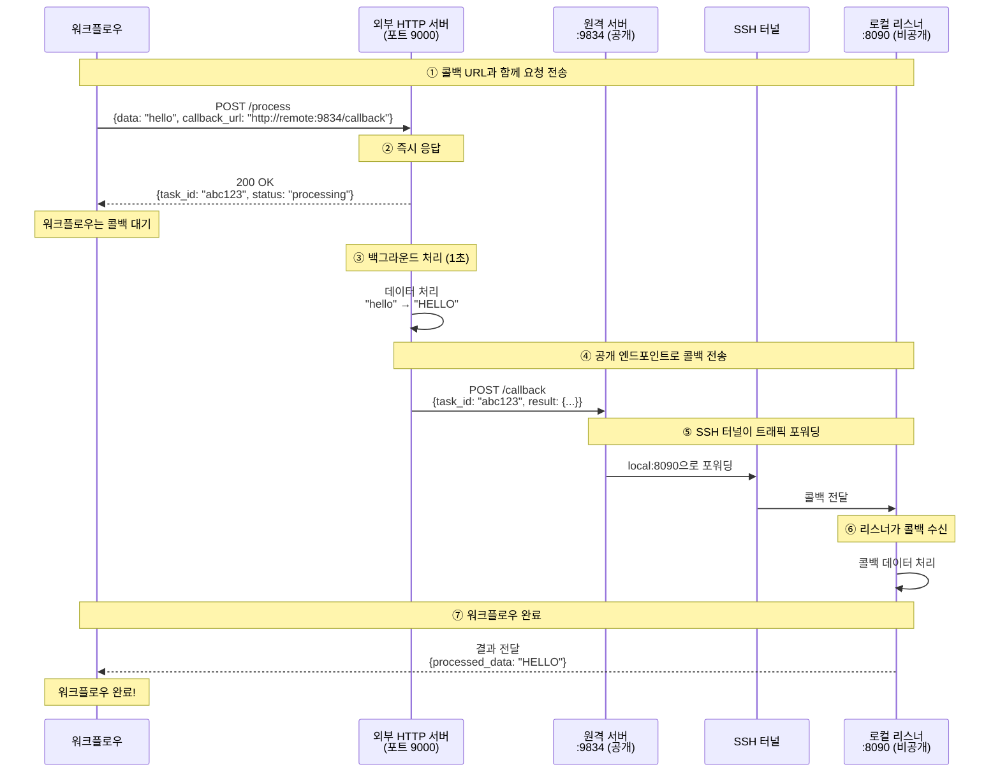

# SSH 터널 게이트웨이 예제

이 예제는 SSH 터널 게이트웨이를 사용하여 원격 포트 포워딩을 통해 로컬 서비스를 외부 네트워크에 노출하는 방법을 보여줍니다. 외부 서비스가 로컬 콜백 엔드포인트에 접근할 수 있도록 합니다.

## 개요

이 워크플로우는 다음을 보여줍니다:

1. **SSH 원격 포트 포워딩**: 원격 SSH 서버를 통해 로컬 포트 노출
2. **HTTP 콜백 통합**: 외부 서비스가 로컬 리스너에 접근 가능
3. **비동기 서비스 패턴**: 콜백 기반 완료로 장시간 실행 작업 처리
4. **보안 터널링**: SSH 인증을 사용한 안전한 연결

## 아키텍처

### 설정: SSH 터널 연결
```
로컬 머신 (내 노트북)                원격 SSH 서버 (공개 IP)
┌─────────────────────┐              ┌─────────────────────┐
│                     │              │                     │
│  리스너:8090 ◄────────┼──SSH 터널─────┼──── :9834 (공개)     │
│                     │              │                     │
└─────────────────────┘              └─────────────────────┘
```

### 워크플로우 실행 흐름



**핵심 포인트:**
- **원격:9834**는 공개적으로 접근 가능 (외부 서버가 접근 가능)
- **로컬:8090**은 비공개 (SSH 터널을 통해서만 접근 가능)
- SSH 터널이 트래픽 포워딩: `원격:9834` → `로컬:8090`

## 사전 요구사항

- model-compose 설치
- 원격 서버에 SSH 접근 권한
- 원격 서버의 `/etc/ssh/sshd_config`에 `GatewayPorts yes` 설정
- SSH 키 또는 비밀번호 인증

## 설정

### 1. 환경 설정

환경 파일 복사 및 편집:

```bash
cd examples/gateway/ssh-tunnel
cp .env.example .env
```

`.env` 편집:

```bash
# SSH 서버 설정
SSH_TUNNEL_HOST=your-server.example.com
SSH_TUNNEL_PORT=22
SSH_USERNAME=your-username
SSH_AUTH_TYPE=keyfile
SSH_KEYFILE=~/.ssh/id_rsa
```

### 2. SSH 서버 설정 확인

원격 SSH 서버가 원격 포트 포워딩을 허용하는지 확인합니다. 원격 서버에서 `/etc/ssh/sshd_config` 확인:

```bash
GatewayPorts yes
AllowTcpForwarding yes
```

설정 변경이 필요한 경우:

```bash
sudo nano /etc/ssh/sshd_config
sudo systemctl restart sshd
```

**참고:** `GatewayPorts yes`는 `0.0.0.0`(모든 인터페이스)에 바인딩을 허용합니다. 이 설정이 없으면 포트가 `127.0.0.1`에만 바인딩되어 외부 접근이 불가능합니다.

### 3. SSH 연결 테스트

```bash
ssh your-username@your-server.example.com
```

## 예제 실행

### 서비스 시작

```bash
model-compose up
```

### 터널 작동 확인

원격 서버에서:
```bash
netstat -tuln | grep 9834
# 다음이 표시되어야 함: tcp  0  0.0.0.0:9834  0.0.0.0:*  LISTEN
```

원격 서버에서 콜백 테스트:
```bash
curl http://localhost:9834/callback \
  -H "Content-Type: application/json" \
  -d '{"task_id": "test-123", "result": {"data": "test"}}'
```

### 워크플로우 실행

```bash
model-compose run --input '{"data": "hello world"}'
```

예상 출력:
```json
{
  "task_id": "abc123...",
  "result": {
    "processed_data": "HELLO WORLD",
    "length": 11
  }
}
```

## 설정 상세

### 게이트웨이 설정

```yaml
gateway:
  type: ssh-tunnel
  port:
    - "9834:8090"  # 원격 포트 9834를 로컬 포트 8090으로 포워딩
  connection:
    host: ${env.SSH_TUNNEL_HOST}
    port: ${env.SSH_TUNNEL_PORT | 22}
    auth:
      type: ${env.SSH_AUTH_TYPE | keyfile}
      username: ${env.SSH_USERNAME}
      keyfile: ${env.SSH_KEYFILE | ~/.ssh/id_rsa}
```

**포트 형식:** `"원격_포트:로컬_포트"`
- `"9834:8090"` - 원격 서버 포트 9834를 로컬 포트 8090으로 포워딩
- `"8080:8080"` - 양쪽 동일한 포트
- 다중 포트 지원: `["9834:8090", "9835:8091"]`

### 게이트웨이 컨텍스트 사용

설정에서 공개 주소 접근:

```yaml
component:
  body:
    callback_url: http://${gateway:8090.public_address}/callback
    # 다음으로 해석됨: http://your-server.example.com:9834/callback
```

형식: `${gateway:로컬_포트.public_address}`
- 반환값: `원격-호스트:원격-포트`

### 리스너 설정

```yaml
listener:
  type: http-callback
  host: 0.0.0.0
  port: 8090
  path: /callback
  identify_by: ${body.task_id}
  result: ${body.result}
```

### 콜백을 사용하는 컴포넌트

```yaml
component:
  type: http-server
  start: [ uvicorn, server:app, --reload, --port, "9000" ]
  port: 9000
  method: POST
  path: /process
  body:
    data: ${input.data}
    callback_url: http://${gateway:8090.public_address}/callback
    task_id: ${context.run_id}
  completion:
    type: callback
    wait_for: ${context.run_id}
  output:
    task_id: ${response.task_id}
    result: ${result}
```

## 문제 해결

### 포트 외부 접근 불가

**문제:** 원격 포트가 `0.0.0.0:9834` 대신 `127.0.0.1:9834`에 바인딩됨

```bash
# 원격 서버에서
netstat -tuln | grep 9834
# 표시: tcp  127.0.0.1:9834  0.0.0.0:*  LISTEN  ❌
# 원하는 결과:  tcp  0.0.0.0:9834    0.0.0.0:*  LISTEN  ✅
```

**해결:** SSH 서버 설정에서 `GatewayPorts` 활성화:

```bash
# 원격 서버에서
sudo nano /etc/ssh/sshd_config
# 다음 추가 또는 변경:
GatewayPorts yes

sudo systemctl restart sshd
```

### SSH 연결 실패

```bash
# SSH 연결 테스트
ssh -v your-username@your-server.example.com

# 특정 키로 테스트
ssh -i ~/.ssh/id_rsa your-username@your-server.example.com

# 키 권한 확인
chmod 600 ~/.ssh/id_rsa
```

### 포트 이미 사용 중

```bash
# 원격 서버에서 포트 사용 확인
ssh your-server.example.com "lsof -i:9834"

# 기존 터널 종료
pkill -f "ssh.*9834:8090"
```

### 콜백 수신 안 됨

1. **터널 활성화 확인:**
   ```bash
   ssh your-server.example.com "netstat -tuln | grep 9834"
   ```

2. **로컬 리스너 테스트:**
   ```bash
   curl http://localhost:8090/callback \
     -H "Content-Type: application/json" \
     -d '{"task_id": "test", "result": {}}'
   ```

3. **원격 서버에서 테스트:**
   ```bash
   ssh your-server.example.com
   curl http://localhost:9834/callback \
     -H "Content-Type: application/json" \
     -d '{"task_id": "test", "result": {}}'
   ```

4. **방화벽 확인:**
   ```bash
   # 원격 서버에서
   sudo ufw status
   sudo ufw allow 9834/tcp
   ```

## 보안 고려사항

### SSH 키 보안
- 강력한 키 사용 (RSA 4096 또는 Ed25519)
- 개인 키 보호: `chmod 600 ~/.ssh/id_rsa`
- 키 암호문구 사용
- 개인 키를 버전 관리에 커밋하지 않기

### 네트워크 보안
- 필요한 포트만 노출
- 방화벽 규칙으로 접근 제한
- `yes` 대신 `GatewayPorts clientspecified` 사용 고려
- SSH 접근 로그 모니터링

### 설정 보안
- `.env` 파일 커밋하지 않기
- 자격증명에 환경 변수 사용
- SSH 키 정기적으로 교체
- 원격 서버의 SSH 사용자 권한 제한

## 고급 사용법

### 다중 포트 포워딩

```yaml
gateway:
  type: ssh-tunnel
  port:
    - "9834:8090"  # 콜백 리스너
    - "9835:8091"  # 관리 인터페이스
    - "9836:8092"  # 메트릭 엔드포인트
```

### 비밀번호 인증

```yaml
gateway:
  connection:
    auth:
      type: password
      username: ${env.SSH_USERNAME}
      password: ${env.SSH_PASSWORD}
```

### 동적 포트 할당

원격 포트에 `0`을 사용하면 SSH가 자동으로 포트 선택:

```yaml
gateway:
  port:
    - "0:8090"  # SSH가 사용 가능한 포트 할당
```

할당된 포트는 로그에서 확인:
```
[Gateway] Remote port forwarding started: server.com:54321 -> localhost:8090
```

## HTTP 터널과의 비교

| 특징 | SSH 터널 | HTTP 터널 (ngrok) |
|------|----------|-------------------|
| 설정 | SSH 서버 필요 | 서드파티 서비스 |
| 비용 | 무료 (자체 서버) | 무료 티어 제한 |
| 프로토콜 | 모든 TCP | HTTP/HTTPS만 |
| 제어 | 완전한 제어 | 서비스에 의존 |
| 속도 | 직접 연결 | 프록시 지연 가능 |
| 프라이버시 | 자체 인프라 | 서드파티 경유 |

## 관련 예제

- [HTTP 터널 게이트웨이](../http-tunnel/) - ngrok/Cloudflare 사용
- [에코 서버](../../echo-server/) - 기본 HTTP 서버 예제
