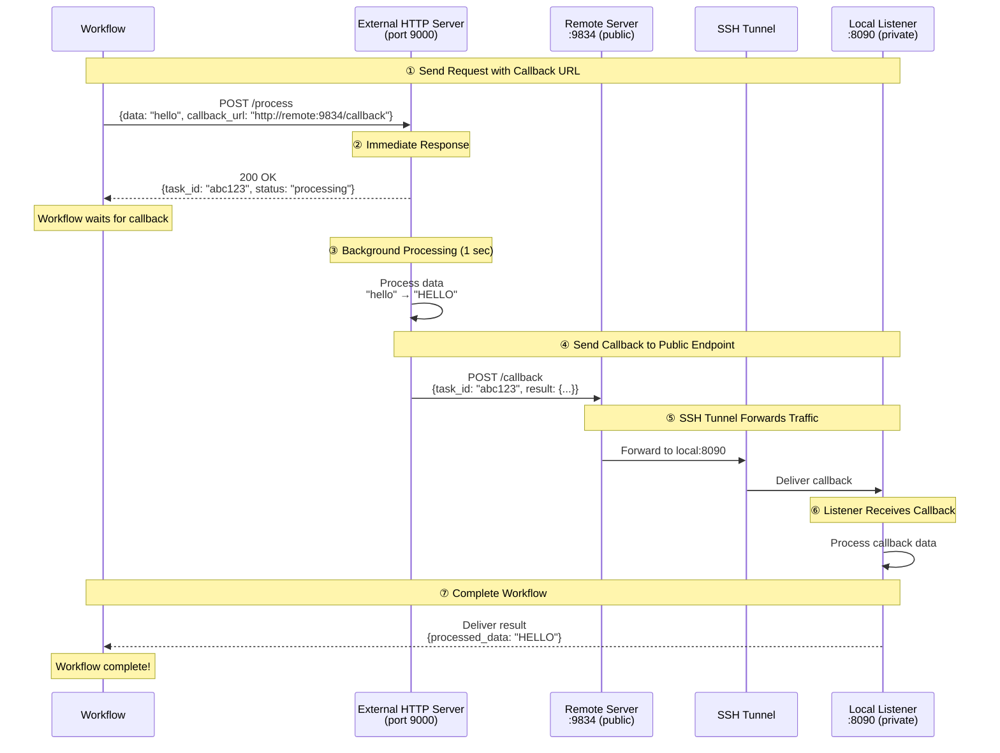

# SSH Tunnel Gateway Example

This example demonstrates how to use SSH tunnel gateway to expose local services to external networks through remote port forwarding. This enables external services to send callbacks to your local endpoints.

## Overview

This workflow showcases:

1. **SSH Remote Port Forwarding**: Expose local ports through a remote SSH server
2. **HTTP Callback Integration**: Enable external services to reach your local listener
3. **Async Service Pattern**: Handle long-running tasks with callback-based completion
4. **Secure Tunneling**: Uses SSH authentication for secure connections

## Architecture

### Setup: SSH Tunnel Connection
```
Local Machine (your laptop)          Remote SSH Server (public IP)
┌─────────────────────┐              ┌─────────────────────┐
│                     │              │                     │
│  Listener:8090 ◄────┼──SSH Tunnel──┼──── :9834 (public)  │
│                     │              │                     │
└─────────────────────┘              └─────────────────────┘
```

### Workflow Execution Flow



**Key Points:**
- **Remote:9834** is publicly accessible (external server can reach it)
- **Local:8090** is private (only accessible via SSH tunnel)
- SSH tunnel forwards traffic: `Remote:9834` → `Local:8090`

## Prerequisites

- model-compose installed
- SSH access to a remote server
- Remote server with `GatewayPorts yes` enabled in `/etc/ssh/sshd_config`
- SSH key or password for authentication

## Setup

### 1. Configure Environment

Copy and edit the environment file:

```bash
cd examples/gateway/ssh-tunnel
cp .env.example .env
```

Edit `.env`:

```bash
# SSH Server Configuration
SSH_TUNNEL_HOST=your-server.example.com
SSH_TUNNEL_PORT=22
SSH_USERNAME=your-username
SSH_AUTH_TYPE=keyfile
SSH_KEYFILE=~/.ssh/id_rsa
```

### 2. Verify SSH Server Configuration

Ensure your remote SSH server allows remote port forwarding. On the remote server, check `/etc/ssh/sshd_config`:

```bash
GatewayPorts yes
AllowTcpForwarding yes
```

If you need to change these settings:

```bash
sudo nano /etc/ssh/sshd_config
sudo systemctl restart sshd
```

**Note:** `GatewayPorts yes` allows binding to `0.0.0.0` (all interfaces). Without this, ports bind to `127.0.0.1` only, preventing external access.

### 3. Test SSH Connection

```bash
ssh your-username@your-server.example.com
```

## Running the Example

### Start the Service

```bash
model-compose up
```

### Verify Tunnel is Working

On the remote server:
```bash
netstat -tuln | grep 9834
# Should show: tcp  0  0.0.0.0:9834  0.0.0.0:*  LISTEN
```

Test callback from remote server:
```bash
curl http://localhost:9834/callback \
  -H "Content-Type: application/json" \
  -d '{"task_id": "test-123", "result": {"data": "test"}}'
```

### Run the Workflow

```bash
model-compose run --input '{"data": "hello world"}'
```

Expected output:
```json
{
  "task_id": "abc123...",
  "result": {
    "processed_data": "HELLO WORLD",
    "length": 11
  }
}
```

## Configuration Details

### Gateway Configuration

```yaml
gateway:
  type: ssh-tunnel
  port:
    - "9834:8090"  # Forward from remote port 9834 to local port 8090
  connection:
    host: ${env.SSH_TUNNEL_HOST}
    port: ${env.SSH_TUNNEL_PORT | 22}
    auth:
      type: ${env.SSH_AUTH_TYPE | keyfile}
      username: ${env.SSH_USERNAME}
      keyfile: ${env.SSH_KEYFILE | ~/.ssh/id_rsa}
```

**Port Format:** `"remote_port:local_port"`
- `"9834:8090"` - Remote server port 9834 forwards to local port 8090
- `"8080:8080"` - Same port on both sides
- Multiple ports supported: `["9834:8090", "9835:8091"]`

### Using Gateway Context

Access the public address in your configuration:

```yaml
component:
  action:
    body:
      callback_url: http://${gateway:8090.public_address}/callback
      # Resolves to: http://your-server.example.com:9834/callback
```

The format is: `${gateway:LOCAL_PORT.public_address}`
- Returns: `remote-host:remote-port`

### Listener Configuration

```yaml
listener:
  type: http-callback
  host: 0.0.0.0
  port: 8090
  path: /callback
  identify_by: ${body.task_id}
  result: ${body.result}
```

### Component with Callback

```yaml
component:
  type: http-server
  start: [ uvicorn, server:app, --reload, --port, "9000" ]
  port: 9000
  action:
    method: POST
    path: /process
    body:
      data: ${input.data}
      callback_url: http://${gateway:8090.public_address}/callback
      task_id: ${context.run_id}
    completion:
      type: callback
      wait_for: ${context.run_id}
    output:
      task_id: ${response.task_id}
      result: ${result}
```

## Troubleshooting

### Port Not Accessible Externally

**Problem:** Remote port binds to `127.0.0.1:9834` instead of `0.0.0.0:9834`

```bash
# On remote server
netstat -tuln | grep 9834
# Shows: tcp  127.0.0.1:9834  0.0.0.0:*  LISTEN  ❌
# Want:  tcp  0.0.0.0:9834    0.0.0.0:*  LISTEN  ✅
```

**Solution:** Enable `GatewayPorts` in SSH server config:

```bash
# On remote server
sudo nano /etc/ssh/sshd_config
# Add or change:
GatewayPorts yes

sudo systemctl restart sshd
```

### SSH Connection Fails

```bash
# Test SSH connection
ssh -v your-username@your-server.example.com

# Test with specific key
ssh -i ~/.ssh/id_rsa your-username@your-server.example.com

# Check key permissions
chmod 600 ~/.ssh/id_rsa
```

### Port Already in Use

```bash
# Check what's using the port on remote server
ssh your-server.example.com "lsof -i:9834"

# Kill existing tunnel
pkill -f "ssh.*9834:8090"
```

### Callback Not Received

1. **Verify tunnel is active:**
   ```bash
   ssh your-server.example.com "netstat -tuln | grep 9834"
   ```

2. **Test local listener:**
   ```bash
   curl http://localhost:8090/callback \
     -H "Content-Type: application/json" \
     -d '{"task_id": "test", "result": {}}'
   ```

3. **Test from remote server:**
   ```bash
   ssh your-server.example.com
   curl http://localhost:9834/callback \
     -H "Content-Type: application/json" \
     -d '{"task_id": "test", "result": {}}'
   ```

4. **Check firewall:**
   ```bash
   # On remote server
   sudo ufw status
   sudo ufw allow 9834/tcp
   ```

## Security Considerations

### SSH Key Security
- Use strong keys (RSA 4096 or Ed25519)
- Protect private keys: `chmod 600 ~/.ssh/id_rsa`
- Use key passphrases
- Never commit private keys to version control

### Network Security
- Only expose necessary ports
- Use firewall rules to restrict access
- Consider using `GatewayPorts clientspecified` instead of `yes`
- Monitor SSH access logs

### Configuration Security
- Never commit `.env` files
- Use environment variables for credentials
- Rotate SSH keys regularly
- Limit SSH user permissions on remote server

## Advanced Usage

### Multiple Port Forwarding

```yaml
gateway:
  type: ssh-tunnel
  port:
    - "9834:8090"  # Callback listener
    - "9835:8091"  # Admin interface
    - "9836:8092"  # Metrics endpoint
```

### Password Authentication

```yaml
gateway:
  connection:
    auth:
      type: password
      username: ${env.SSH_USERNAME}
      password: ${env.SSH_PASSWORD}
```

### Dynamic Port Allocation

Use `0` for remote port to let SSH choose:

```yaml
gateway:
  port:
    - "0:8090"  # SSH will allocate a free port
```

Check logs for the allocated port:
```
[Gateway] Remote port forwarding started: server.com:54321 -> localhost:8090
```

## Comparison with HTTP Tunnels

| Feature | SSH Tunnel | HTTP Tunnel (ngrok) |
|---------|------------|---------------------|
| Setup | Requires SSH server | Third-party service |
| Cost | Free (your server) | Free tier limited |
| Protocol | Any TCP | HTTP/HTTPS only |
| Control | Full control | Depends on service |
| Speed | Direct connection | May have latency |
| Privacy | Your infrastructure | Data through third-party |

## Related Examples

- [HTTP Tunnel Gateway](../http-tunnel/) - Using ngrok/Cloudflare
- [Echo Server](../../echo-server/) - Basic HTTP server example
