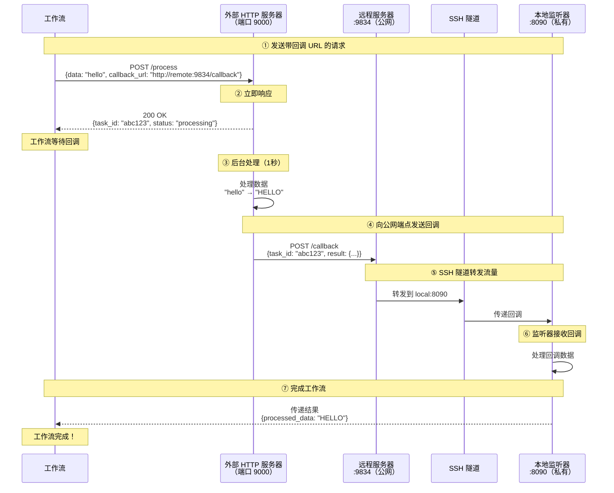

# SSH 隧道网关示例

本示例演示如何使用 SSH 隧道网关通过远程端口转发将本地服务暴露到外部网络。这使外部服务能够向您的本地端点发送回调。

## 概述

此工作流展示了：

1. **SSH 远程端口转发**：通过远程 SSH 服务器暴露本地端口
2. **HTTP 回调集成**：使外部服务能够访问您的本地监听器
3. **异步服务模式**：通过基于回调的完成处理长时间运行的任务
4. **安全隧道**：使用 SSH 身份验证进行安全连接

## 架构

### 设置：SSH 隧道连接
```
本地机器（您的笔记本电脑）         远程 SSH 服务器（公网 IP）
┌─────────────────────┐              ┌─────────────────────┐
│                     │              │                     │
│  监听器:8090 ◄───────┼──SSH 隧道─────┼──── :9834（公网）     │
│                     │              │                     │
└─────────────────────┘              └─────────────────────┘
```

### 工作流执行流程



**关键点：**
- **远程:9834** 是公开可访问的（外部服务器可以访问）
- **本地:8090** 是私有的（仅通过 SSH 隧道访问）
- SSH 隧道转发流量：`远程:9834` → `本地:8090`

## 前提条件

- 已安装 model-compose
- 具有远程服务器的 SSH 访问权限
- 远程服务器在 `/etc/ssh/sshd_config` 中启用了 `GatewayPorts yes`
- SSH 密钥或密码身份验证

## 设置

### 1. 配置环境

复制并编辑环境文件：

```bash
cd examples/gateway/ssh-tunnel
cp .env.example .env
```

编辑 `.env`：

```bash
# SSH 服务器配置
SSH_TUNNEL_HOST=your-server.example.com
SSH_TUNNEL_PORT=22
SSH_USERNAME=your-username
SSH_AUTH_TYPE=keyfile
SSH_KEYFILE=~/.ssh/id_rsa
```

### 2. 验证 SSH 服务器配置

确保您的远程 SSH 服务器允许远程端口转发。在远程服务器上，检查 `/etc/ssh/sshd_config`：

```bash
GatewayPorts yes
AllowTcpForwarding yes
```

如果需要更改这些设置：

```bash
sudo nano /etc/ssh/sshd_config
sudo systemctl restart sshd
```

**注意：** `GatewayPorts yes` 允许绑定到 `0.0.0.0`（所有接口）。如果没有此设置，端口只会绑定到 `127.0.0.1`，阻止外部访问。

### 3. 测试 SSH 连接

```bash
ssh your-username@your-server.example.com
```

## 运行示例

### 启动服务

```bash
model-compose up
```

### 验证隧道是否正常工作

在远程服务器上：
```bash
netstat -tuln | grep 9834
# 应该显示：tcp  0  0.0.0.0:9834  0.0.0.0:*  LISTEN
```

从远程服务器测试回调：
```bash
curl http://localhost:9834/callback \
  -H "Content-Type: application/json" \
  -d '{"task_id": "test-123", "result": {"data": "test"}}'
```

### 运行工作流

```bash
model-compose run --input '{"data": "hello world"}'
```

预期输出：
```json
{
  "task_id": "abc123...",
  "result": {
    "processed_data": "HELLO WORLD",
    "length": 11
  }
}
```

## 配置详情

### 网关配置

```yaml
gateway:
  type: ssh-tunnel
  port:
    - "9834:8090"  # 从远程端口 9834 转发到本地端口 8090
  connection:
    host: ${env.SSH_TUNNEL_HOST}
    port: ${env.SSH_TUNNEL_PORT | 22}
    auth:
      type: ${env.SSH_AUTH_TYPE | keyfile}
      username: ${env.SSH_USERNAME}
      keyfile: ${env.SSH_KEYFILE | ~/.ssh/id_rsa}
```

**端口格式：** `"远程端口:本地端口"`
- `"9834:8090"` - 远程服务器端口 9834 转发到本地端口 8090
- `"8080:8080"` - 两端使用相同端口
- 支持多端口：`["9834:8090", "9835:8091"]`

### 使用网关上下文

在配置中访问公网地址：

```yaml
component:
  action:
    body:
      callback_url: http://${gateway:8090.public_address}/callback
      # 解析为：http://your-server.example.com:9834/callback
```

格式为：`${gateway:本地端口.public_address}`
- 返回：`远程主机:远程端口`

### 监听器配置

```yaml
listener:
  type: http-callback
  host: 0.0.0.0
  port: 8090
  path: /callback
  identify_by: ${body.task_id}
  result: ${body.result}
```

### 带回调的组件

```yaml
component:
  type: http-server
  start: [ uvicorn, server:app, --reload, --port, "9000" ]
  port: 9000
  action:
    method: POST
    path: /process
    body:
      data: ${input.data}
      callback_url: http://${gateway:8090.public_address}/callback
      task_id: ${context.run_id}
    completion:
      type: callback
      wait_for: ${context.run_id}
    output:
      task_id: ${response.task_id}
      result: ${result}
```

## 故障排除

### 端口无法从外部访问

**问题：** 远程端口绑定到 `127.0.0.1:9834` 而不是 `0.0.0.0:9834`

```bash
# 在远程服务器上
netstat -tuln | grep 9834
# 显示：tcp  127.0.0.1:9834  0.0.0.0:*  LISTEN  ❌
# 期望：tcp  0.0.0.0:9834    0.0.0.0:*  LISTEN  ✅
```

**解决方案：** 在 SSH 服务器配置中启用 `GatewayPorts`：

```bash
# 在远程服务器上
sudo nano /etc/ssh/sshd_config
# 添加或更改：
GatewayPorts yes

sudo systemctl restart sshd
```

### SSH 连接失败

```bash
# 测试 SSH 连接
ssh -v your-username@your-server.example.com

# 使用特定密钥测试
ssh -i ~/.ssh/id_rsa your-username@your-server.example.com

# 检查密钥权限
chmod 600 ~/.ssh/id_rsa
```

### 端口已被占用

```bash
# 检查远程服务器上使用端口的进程
ssh your-server.example.com "lsof -i:9834"

# 终止现有隧道
pkill -f "ssh.*9834:8090"
```

### 未收到回调

1. **验证隧道是否活动：**
   ```bash
   ssh your-server.example.com "netstat -tuln | grep 9834"
   ```

2. **测试本地监听器：**
   ```bash
   curl http://localhost:8090/callback \
     -H "Content-Type: application/json" \
     -d '{"task_id": "test", "result": {}}'
   ```

3. **从远程服务器测试：**
   ```bash
   ssh your-server.example.com
   curl http://localhost:9834/callback \
     -H "Content-Type: application/json" \
     -d '{"task_id": "test", "result": {}}'
   ```

4. **检查防火墙：**
   ```bash
   # 在远程服务器上
   sudo ufw status
   sudo ufw allow 9834/tcp
   ```

## 安全注意事项

### SSH 密钥安全
- 使用强密钥（RSA 4096 或 Ed25519）
- 保护私钥：`chmod 600 ~/.ssh/id_rsa`
- 使用密钥密码短语
- 切勿将私钥提交到版本控制

### 网络安全
- 仅暴露必要的端口
- 使用防火墙规则限制访问
- 考虑使用 `GatewayPorts clientspecified` 而不是 `yes`
- 监控 SSH 访问日志

### 配置安全
- 切勿提交 `.env` 文件
- 使用环境变量存储凭据
- 定期轮换 SSH 密钥
- 限制远程服务器上的 SSH 用户权限

## 高级用法

### 多端口转发

```yaml
gateway:
  type: ssh-tunnel
  port:
    - "9834:8090"  # 回调监听器
    - "9835:8091"  # 管理界面
    - "9836:8092"  # 指标端点
```

### 密码身份验证

```yaml
gateway:
  connection:
    auth:
      type: password
      username: ${env.SSH_USERNAME}
      password: ${env.SSH_PASSWORD}
```

### 动态端口分配

使用 `0` 作为远程端口让 SSH 自动选择：

```yaml
gateway:
  port:
    - "0:8090"  # SSH 将分配一个空闲端口
```

检查日志中的分配端口：
```
[Gateway] Remote port forwarding started: server.com:54321 -> localhost:8090
```

## 与 HTTP 隧道的比较

| 特性 | SSH 隧道 | HTTP 隧道（ngrok） |
|------|----------|-------------------|
| 设置 | 需要 SSH 服务器 | 第三方服务 |
| 成本 | 免费（自己的服务器） | 免费层有限制 |
| 协议 | 任何 TCP | 仅 HTTP/HTTPS |
| 控制 | 完全控制 | 依赖服务 |
| 速度 | 直接连接 | 可能有延迟 |
| 隐私 | 自己的基础设施 | 数据经过第三方 |

## 相关示例

- [HTTP 隧道网关](../http-tunnel/) - 使用 ngrok/Cloudflare
- [回声服务器](../../echo-server/) - 基本 HTTP 服务器示例