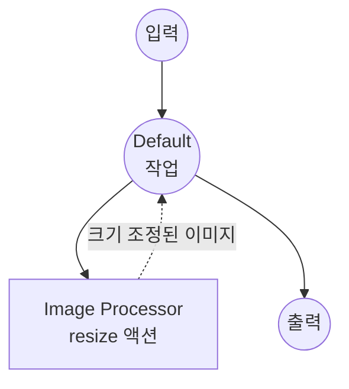

# Image Processor 예제

이 예제는 `image-processor` 컴포넌트를 사용한 종합 이미지 처리 서비스를 보여주며, model-compose가 단일 컴포넌트의 다양한 액션을 통해 여러 이미지 조작 작업을 조합하는 방법을 시연합니다.

## 개요

이 워크플로우는 다음과 같은 이미지 처리 기능을 제공합니다:

1. **이미지 변환**: 설정 가능한 매개변수로 이미지 크기 조정, 자르기, 회전, 뒤집기
2. **이미지 보정**: 블러, 선명도, 밝기, 대비, 채도 조정 적용
3. **포맷 변환**: 이미지를 그레이스케일로 변환
4. **웹 UI 통합**: 인터랙티브 이미지 처리를 위한 Gradio 기반 인터페이스 제공

## 준비사항

### 필수 요구사항

- model-compose가 설치되어 PATH에서 사용 가능
- 추가 API 키 불필요 (로컬 처리)

### 환경 구성

1. 이 예제 디렉토리로 이동:
   ```bash
   cd examples/image-processor
   ```

2. 추가 환경 구성 불필요 - 모든 처리가 로컬에서 수행됩니다.

## 실행 방법

1. **서비스 시작:**
   ```bash
   model-compose up
   ```

2. **워크플로우 실행:**

   **웹 UI 사용:**
   - Web UI 열기: http://localhost:8081
   - 워크플로우 선택 (resize, crop, rotate 등)
   - 이미지를 업로드하고 매개변수 설정
   - "Run Workflow" 버튼 클릭
   - 처리된 이미지 확인 및 다운로드

   **API 사용:**
   ```bash
   # 이미지 크기 조정
   curl -X POST http://localhost:8080/api/workflows/runs \
     -H "Content-Type: multipart/form-data" \
     -F "workflow_id=resize" \
     -F "image=@input.png" \
     -F "width=800" \
     -F "height=600" \
     -F "scale_mode=fit"

   # 가우시안 블러 적용
   curl -X POST http://localhost:8080/api/workflows/runs \
     -H "Content-Type: multipart/form-data" \
     -F "workflow_id=blur" \
     -F "image=@input.png" \
     -F "radius=5.0"

   # 그레이스케일 변환
   curl -X POST http://localhost:8080/api/workflows/runs \
     -H "Content-Type: multipart/form-data" \
     -F "workflow_id=grayscale" \
     -F "image=@input.png"
   ```

   **CLI 사용:**
   ```bash
   model-compose run resize --input '{"image": "path/to/input.png", "width": 800, "height": 600}'
   model-compose run blur --input '{"image": "path/to/input.png", "radius": 5.0}'
   ```

## 컴포넌트 세부사항

### Image Processor 컴포넌트
- **유형**: `image-processor`
- **목적**: 다양한 작업으로 이미지 처리 및 조작
- **액션**: resize, crop, rotate, flip, grayscale, blur, sharpen, adjust-brightness, adjust-contrast, adjust-saturation

## 워크플로우 세부사항

### "Resize Image" 워크플로우

**설명**: fit, fill 또는 stretch 모드로 이미지 크기를 조정합니다.

#### 작업 흐름



#### 입력 매개변수

| 매개변수 | 유형 | 필수 | 기본값 | 설명 |
|---------|------|------|--------|------|
| `image` | image | 예 | - | 크기를 조정할 이미지 |
| `width` | integer | 예 | - | 대상 너비 (픽셀) |
| `height` | integer | 예 | - | 대상 높이 (픽셀) |
| `scale_mode` | select | 아니오 | `fit` | 스케일링 모드: fit, fill, stretch |

### "Crop Image" 워크플로우

**설명**: 이미지에서 직사각형 영역을 잘라냅니다.

#### 입력 매개변수

| 매개변수 | 유형 | 필수 | 기본값 | 설명 |
|---------|------|------|--------|------|
| `image` | image | 예 | - | 잘라낼 이미지 |
| `x` | integer | 아니오 | `0` | 자르기 시작점의 X 좌표 |
| `y` | integer | 아니오 | `0` | 자르기 시작점의 Y 좌표 |
| `width` | integer | 예 | - | 자르기 너비 (픽셀) |
| `height` | integer | 예 | - | 자르기 높이 (픽셀) |

### "Rotate Image" 워크플로우

**설명**: 지정된 각도로 이미지를 회전합니다.

#### 입력 매개변수

| 매개변수 | 유형 | 필수 | 기본값 | 설명 |
|---------|------|------|--------|------|
| `image` | image | 예 | - | 회전할 이미지 |
| `angle` | number | 예 | - | 회전 각도 (도) |
| `expand` | boolean | 아니오 | `true` | 회전된 이미지에 맞게 캔버스 확장 |

### "Flip Image" 워크플로우

**설명**: 이미지를 수평 또는 수직으로 뒤집습니다.

#### 입력 매개변수

| 매개변수 | 유형 | 필수 | 기본값 | 설명 |
|---------|------|------|--------|------|
| `image` | image | 예 | - | 뒤집을 이미지 |
| `direction` | select | 아니오 | `horizontal` | 뒤집기 방향: horizontal, vertical |

### "Convert to Grayscale" 워크플로우

**설명**: 이미지를 그레이스케일로 변환합니다.

#### 입력 매개변수

| 매개변수 | 유형 | 필수 | 기본값 | 설명 |
|---------|------|------|--------|------|
| `image` | image | 예 | - | 변환할 이미지 |

### "Blur Image" 워크플로우

**설명**: 이미지에 가우시안 블러를 적용합니다.

#### 입력 매개변수

| 매개변수 | 유형 | 필수 | 기본값 | 설명 |
|---------|------|------|--------|------|
| `image` | image | 예 | - | 블러를 적용할 이미지 |
| `radius` | number | 아니오 | `2.0` | 블러 반경 |

### "Sharpen Image" 워크플로우

**설명**: 이미지 선명도를 향상시킵니다.

#### 입력 매개변수

| 매개변수 | 유형 | 필수 | 기본값 | 설명 |
|---------|------|------|--------|------|
| `image` | image | 예 | - | 선명하게 할 이미지 |
| `factor` | number | 아니오 | `1.5` | 선명도 계수 (높을수록 선명) |

### "Adjust Brightness" 워크플로우

**설명**: 이미지 밝기를 조정합니다.

#### 입력 매개변수

| 매개변수 | 유형 | 필수 | 기본값 | 설명 |
|---------|------|------|--------|------|
| `image` | image | 예 | - | 조정할 이미지 |
| `factor` | number | 아니오 | `1.0` | 밝기 계수 (< 1.0 = 어둡게, > 1.0 = 밝게) |

### "Adjust Contrast" 워크플로우

**설명**: 이미지 대비를 조정합니다.

#### 입력 매개변수

| 매개변수 | 유형 | 필수 | 기본값 | 설명 |
|---------|------|------|--------|------|
| `image` | image | 예 | - | 조정할 이미지 |
| `factor` | number | 아니오 | `1.0` | 대비 계수 (< 1.0 = 낮은 대비, > 1.0 = 높은 대비) |

### "Adjust Saturation" 워크플로우

**설명**: 이미지 채도를 조정합니다.

#### 입력 매개변수

| 매개변수 | 유형 | 필수 | 기본값 | 설명 |
|---------|------|------|--------|------|
| `image` | image | 예 | - | 조정할 이미지 |
| `factor` | number | 아니오 | `1.0` | 채도 계수 (0.0 = 그레이스케일, > 1.0 = 더 선명한 색상) |

### 출력 형식

모든 워크플로우는 동일한 출력 형식을 반환합니다:

| 필드 | 유형 | 설명 |
|-----|------|------|
| `image` | image (base64) | 처리된 이미지 |

## 문제 해결

### 일반적인 문제

1. **지원되지 않는 이미지 포맷**: 입력 이미지가 일반적인 포맷(PNG, JPEG, BMP, WebP 등)인지 확인
2. **잘못된 자르기 영역**: 자르기 좌표와 크기가 원본 이미지 범위 내에 있어야 함
3. **메모리 부족**: 매우 큰 이미지는 많은 메모리가 필요할 수 있음 - 먼저 크기 조정을 고려
