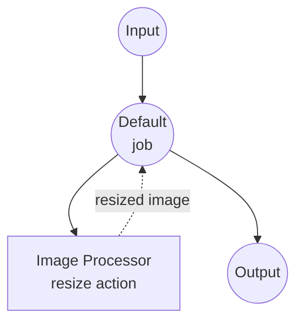

# Image Processor Example

This example demonstrates a comprehensive image processing service using the `image-processor` component, showcasing how model-compose can orchestrate various image manipulation operations through a single component with multiple actions.

## Overview

This workflow provides image processing capabilities that:

1. **Image Transformation**: Resize, crop, rotate, and flip images with configurable parameters
2. **Image Enhancement**: Apply blur, sharpen, brightness, contrast, and saturation adjustments
3. **Format Conversion**: Convert images to grayscale
4. **Web UI Integration**: Provides a Gradio-based interface for interactive image processing

## Preparation

### Prerequisites

- model-compose installed and available in your PATH
- No additional API keys required (local processing)

### Environment Configuration

1. Navigate to this example directory:
   ```bash
   cd examples/image-processor
   ```

2. No additional environment configuration required - all processing is done locally.

## How to Run

1. **Start the service:**
   ```bash
   model-compose up
   ```

2. **Run a workflow:**

   **Using Web UI:**
   - Open the Web UI: http://localhost:8081
   - Select a workflow (resize, crop, rotate, etc.)
   - Upload an image and configure parameters
   - Click the "Run Workflow" button
   - View and download the processed image

   **Using API:**
   ```bash
   # Resize an image
   curl -X POST http://localhost:8080/api/workflows/resize/runs \
     -H "Content-Type: multipart/form-data" \
     -F "image=@input.png" \
     -F "width=800" \
     -F "height=600" \
     -F "scale_mode=fit"

   # Apply Gaussian blur
   curl -X POST http://localhost:8080/api/workflows/blur/runs \
     -H "Content-Type: multipart/form-data" \
     -F "image=@input.png" \
     -F "radius=5.0"

   # Convert to grayscale
   curl -X POST http://localhost:8080/api/workflows/grayscale/runs \
     -H "Content-Type: multipart/form-data" \
     -F "image=@input.png"
   ```

   **Using CLI:**
   ```bash
   model-compose run resize --input '{"image": "path/to/input.png", "width": 800, "height": 600}'
   model-compose run blur --input '{"image": "path/to/input.png", "radius": 5.0}'
   ```

## Component Details

### Image Processor Component
- **Type**: `image-processor`
- **Purpose**: Process and manipulate images with various operations
- **Actions**: resize, crop, rotate, flip, grayscale, blur, sharpen, adjust-brightness, adjust-contrast, adjust-saturation

## Workflow Details

### "Resize Image" Workflow

**Description**: Resize image with fit, fill, or stretch mode.

#### Job Flow



#### Input Parameters

| Parameter | Type | Required | Default | Description |
|-----------|------|----------|---------|-------------|
| `image` | image | Yes | - | The image to resize |
| `width` | integer | Yes | - | Target width in pixels |
| `height` | integer | Yes | - | Target height in pixels |
| `scale_mode` | select | No | `fit` | Scaling mode: fit, fill, stretch |

### "Crop Image" Workflow

**Description**: Crop a rectangular region from an image.

#### Input Parameters

| Parameter | Type | Required | Default | Description |
|-----------|------|----------|---------|-------------|
| `image` | image | Yes | - | The image to crop |
| `x` | integer | No | `0` | X coordinate of crop origin |
| `y` | integer | No | `0` | Y coordinate of crop origin |
| `width` | integer | Yes | - | Crop width in pixels |
| `height` | integer | Yes | - | Crop height in pixels |

### "Rotate Image" Workflow

**Description**: Rotate image by a specified angle.

#### Input Parameters

| Parameter | Type | Required | Default | Description |
|-----------|------|----------|---------|-------------|
| `image` | image | Yes | - | The image to rotate |
| `angle` | number | Yes | - | Rotation angle in degrees |
| `expand` | boolean | No | `true` | Expand canvas to fit rotated image |

### "Flip Image" Workflow

**Description**: Flip image horizontally or vertically.

#### Input Parameters

| Parameter | Type | Required | Default | Description |
|-----------|------|----------|---------|-------------|
| `image` | image | Yes | - | The image to flip |
| `direction` | select | No | `horizontal` | Flip direction: horizontal, vertical |

### "Convert to Grayscale" Workflow

**Description**: Convert image to grayscale.

#### Input Parameters

| Parameter | Type | Required | Default | Description |
|-----------|------|----------|---------|-------------|
| `image` | image | Yes | - | The image to convert |

### "Blur Image" Workflow

**Description**: Apply Gaussian blur to image.

#### Input Parameters

| Parameter | Type | Required | Default | Description |
|-----------|------|----------|---------|-------------|
| `image` | image | Yes | - | The image to blur |
| `radius` | number | No | `2.0` | Blur radius |

### "Sharpen Image" Workflow

**Description**: Enhance image sharpness.

#### Input Parameters

| Parameter | Type | Required | Default | Description |
|-----------|------|----------|---------|-------------|
| `image` | image | Yes | - | The image to sharpen |
| `factor` | number | No | `1.5` | Sharpening factor (higher = sharper) |

### "Adjust Brightness" Workflow

**Description**: Adjust image brightness.

#### Input Parameters

| Parameter | Type | Required | Default | Description |
|-----------|------|----------|---------|-------------|
| `image` | image | Yes | - | The image to adjust |
| `factor` | number | No | `1.0` | Brightness factor (< 1.0 = darker, > 1.0 = brighter) |

### "Adjust Contrast" Workflow

**Description**: Adjust image contrast.

#### Input Parameters

| Parameter | Type | Required | Default | Description |
|-----------|------|----------|---------|-------------|
| `image` | image | Yes | - | The image to adjust |
| `factor` | number | No | `1.0` | Contrast factor (< 1.0 = less contrast, > 1.0 = more contrast) |

### "Adjust Saturation" Workflow

**Description**: Adjust image saturation.

#### Input Parameters

| Parameter | Type | Required | Default | Description |
|-----------|------|----------|---------|-------------|
| `image` | image | Yes | - | The image to adjust |
| `factor` | number | No | `1.0` | Saturation factor (0.0 = grayscale, > 1.0 = more vivid) |

### Output Format

All workflows return the same output format:

| Field | Type | Description |
|-------|------|-------------|
| `image` | image (base64) | The processed image |

## Troubleshooting

### Common Issues

1. **Unsupported Image Format**: Ensure the input image is in a common format (PNG, JPEG, BMP, WebP, etc.)
2. **Invalid Crop Region**: Crop coordinates and dimensions must be within the original image bounds
3. **Out of Memory**: Very large images may require significant memory - consider resizing first
