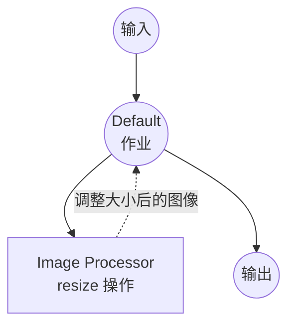

# Image Processor 示例

此示例演示了使用 `image-processor` 组件的综合图像处理服务，展示 model-compose 如何通过单个组件的多个操作编排各种图像处理任务。

## 概述

此工作流提供以下图像处理功能：

1. **图像变换**：使用可配置参数调整大小、裁剪、旋转和翻转图像
2. **图像增强**：应用模糊、锐化、亮度、对比度和饱和度调整
3. **格式转换**：将图像转换为灰度
4. **Web UI 集成**：提供基于 Gradio 的交互式图像处理界面

## 准备工作

### 前置条件

- 已安装 model-compose 并在您的 PATH 中可用
- 无需额外的 API 密钥（本地处理）

### 环境配置

1. 导航到此示例目录：
   ```bash
   cd examples/image-processor
   ```

2. 无需额外的环境配置 - 所有处理均在本地完成。

## 运行方式

1. **启动服务：**
   ```bash
   model-compose up
   ```

2. **运行工作流：**

   **使用 Web UI：**
   - 打开 Web UI：http://localhost:8081
   - 选择工作流（resize、crop、rotate 等）
   - 上传图像并配置参数
   - 点击"运行工作流"按钮
   - 查看并下载处理后的图像

   **使用 API：**
   ```bash
   # 调整图像大小
   curl -X POST http://localhost:8080/api/workflows/resize/runs \
     -H "Content-Type: multipart/form-data" \
     -F "image=@input.png" \
     -F "width=800" \
     -F "height=600" \
     -F "scale_mode=fit"

   # 应用高斯模糊
   curl -X POST http://localhost:8080/api/workflows/blur/runs \
     -H "Content-Type: multipart/form-data" \
     -F "image=@input.png" \
     -F "radius=5.0"

   # 转换为灰度
   curl -X POST http://localhost:8080/api/workflows/grayscale/runs \
     -H "Content-Type: multipart/form-data" \
     -F "image=@input.png"
   ```

   **使用 CLI：**
   ```bash
   model-compose run resize --input '{"image": "path/to/input.png", "width": 800, "height": 600}'
   model-compose run blur --input '{"image": "path/to/input.png", "radius": 5.0}'
   ```

## 组件详情

### Image Processor 组件
- **类型**：`image-processor`
- **用途**：使用各种操作处理和操控图像
- **操作**：resize、crop、rotate、flip、grayscale、blur、sharpen、adjust-brightness、adjust-contrast、adjust-saturation

## 工作流详情

### "Resize Image" 工作流

**描述**：使用 fit、fill 或 stretch 模式调整图像大小。

#### 作业流程



#### 输入参数

| 参数 | 类型 | 必需 | 默认值 | 描述 |
|------|------|------|--------|------|
| `image` | image | 是 | - | 要调整大小的图像 |
| `width` | integer | 是 | - | 目标宽度（像素） |
| `height` | integer | 是 | - | 目标高度（像素） |
| `scale_mode` | select | 否 | `fit` | 缩放模式：fit、fill、stretch |

### "Crop Image" 工作流

**描述**：从图像中裁剪矩形区域。

#### 输入参数

| 参数 | 类型 | 必需 | 默认值 | 描述 |
|------|------|------|--------|------|
| `image` | image | 是 | - | 要裁剪的图像 |
| `x` | integer | 否 | `0` | 裁剪起始点的 X 坐标 |
| `y` | integer | 否 | `0` | 裁剪起始点的 Y 坐标 |
| `width` | integer | 是 | - | 裁剪宽度（像素） |
| `height` | integer | 是 | - | 裁剪高度（像素） |

### "Rotate Image" 工作流

**描述**：按指定角度旋转图像。

#### 输入参数

| 参数 | 类型 | 必需 | 默认值 | 描述 |
|------|------|------|--------|------|
| `image` | image | 是 | - | 要旋转的图像 |
| `angle` | number | 是 | - | 旋转角度（度） |
| `expand` | boolean | 否 | `true` | 扩展画布以适应旋转后的图像 |

### "Flip Image" 工作流

**描述**：水平或垂直翻转图像。

#### 输入参数

| 参数 | 类型 | 必需 | 默认值 | 描述 |
|------|------|------|--------|------|
| `image` | image | 是 | - | 要翻转的图像 |
| `direction` | select | 否 | `horizontal` | 翻转方向：horizontal、vertical |

### "Convert to Grayscale" 工作流

**描述**：将图像转换为灰度。

#### 输入参数

| 参数 | 类型 | 必需 | 默认值 | 描述 |
|------|------|------|--------|------|
| `image` | image | 是 | - | 要转换的图像 |

### "Blur Image" 工作流

**描述**：对图像应用高斯模糊。

#### 输入参数

| 参数 | 类型 | 必需 | 默认值 | 描述 |
|------|------|------|--------|------|
| `image` | image | 是 | - | 要模糊的图像 |
| `radius` | number | 否 | `2.0` | 模糊半径 |

### "Sharpen Image" 工作流

**描述**：增强图像锐度。

#### 输入参数

| 参数 | 类型 | 必需 | 默认值 | 描述 |
|------|------|------|--------|------|
| `image` | image | 是 | - | 要锐化的图像 |
| `factor` | number | 否 | `1.5` | 锐化系数（越高越锐利） |

### "Adjust Brightness" 工作流

**描述**：调整图像亮度。

#### 输入参数

| 参数 | 类型 | 必需 | 默认值 | 描述 |
|------|------|------|--------|------|
| `image` | image | 是 | - | 要调整的图像 |
| `factor` | number | 否 | `1.0` | 亮度系数（< 1.0 = 更暗，> 1.0 = 更亮） |

### "Adjust Contrast" 工作流

**描述**：调整图像对比度。

#### 输入参数

| 参数 | 类型 | 必需 | 默认值 | 描述 |
|------|------|------|--------|------|
| `image` | image | 是 | - | 要调整的图像 |
| `factor` | number | 否 | `1.0` | 对比度系数（< 1.0 = 低对比度，> 1.0 = 高对比度） |

### "Adjust Saturation" 工作流

**描述**：调整图像饱和度。

#### 输入参数

| 参数 | 类型 | 必需 | 默认值 | 描述 |
|------|------|------|--------|------|
| `image` | image | 是 | - | 要调整的图像 |
| `factor` | number | 否 | `1.0` | 饱和度系数（0.0 = 灰度，> 1.0 = 更鲜艳） |

### 输出格式

所有工作流返回相同的输出格式：

| 字段 | 类型 | 描述 |
|------|------|------|
| `image` | image (base64) | 处理后的图像 |

## 故障排除

### 常见问题

1. **不支持的图像格式**：确保输入图像为常见格式（PNG、JPEG、BMP、WebP 等）
2. **无效的裁剪区域**：裁剪坐标和尺寸必须在原始图像范围内
3. **内存不足**：非常大的图像可能需要大量内存 - 建议先调整大小
