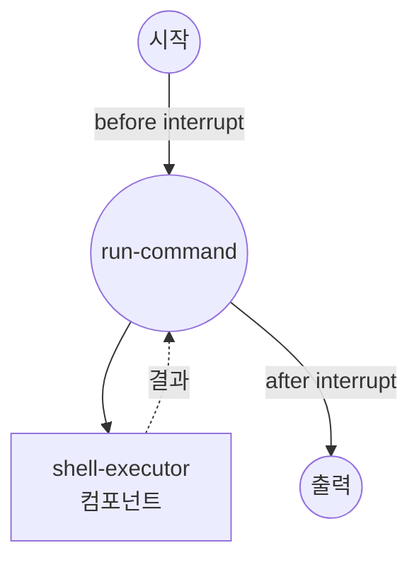

# Interrupt 예제

이 예제는 Human-in-the-Loop (HITL) interrupt 기능을 보여줍니다. 셸 명령어를 실행하기 전과 후에 워크플로우를 일시 중지하여 사람이 검토할 수 있도록 합니다.

## 개요

이 워크플로우는 interrupt 기능을 시연합니다:

1. **Before Interrupt**: 명령어 실행 전 일시 중지하여 사용자가 검토 및 승인
2. **After Interrupt**: 실행 후 일시 중지하여 사용자가 결과 검토
3. **CLI 대화형 프롬프트**: `model-compose run`의 대화형 interrupt 처리 시연
4. **Auto Resume**: 비대화형 환경을 위한 `--auto-resume` 플래그 지원

## 준비사항

### 필수 요구사항

- model-compose가 설치되어 PATH에서 사용 가능

### 환경 구성

1. 이 예제 디렉토리로 이동:
   ```bash
   cd examples/interrupt
   ```

2. 추가 환경 구성 불필요

## 실행 방법

1. **워크플로우 실행 (대화형):**

   ```bash
   model-compose run
   ```

   워크플로우가 두 번 일시 중지됩니다:
   - **실행 전**: 실행할 명령어를 표시합니다. Enter를 눌러 계속하거나 응답을 입력합니다.
   - **실행 후**: 검토 프롬프트를 표시합니다. Enter를 눌러 완료합니다.

2. **Auto-resume으로 실행 (비대화형):**

   ```bash
   model-compose run --auto-resume
   ```

3. **API로 실행:**

   ```bash
   # 서버 시작
   model-compose up

   # 워크플로우 실행
   curl -X POST http://localhost:8080/api/workflows/runs \
     -H "Content-Type: application/json" \
     -d '{}'
   ```

   API는 `status: "interrupted"` 상태로 반환됩니다. 다음으로 재개합니다:

   ```bash
   curl -X POST http://localhost:8080/api/tasks/{task_id}/resume \
     -H "Content-Type: application/json" \
     -d '{"job_id": "run-command"}'
   ```

## 워크플로우 세부사항

### "Shell Command Executor with Human Review" 워크플로우

**설명**: interrupt point를 사용하여 사람의 승인을 받은 후 셸 명령어를 실행합니다.

#### 작업 흐름



#### Interrupt 포인트

| Phase | 메시지 | 설명 |
|-------|--------|------|
| `before` | "About to execute: ls -la" | 명령어 실행 전 일시 중지. 사용자가 명령어를 검토할 수 있습니다. |
| `after` | "Command finished. Review the output above." | 명령어 실행 후 일시 중지. 사용자가 결과를 검토할 수 있습니다. |

#### 출력 형식

| 필드 | 유형 | 설명 |
|------|------|------|
| `result` | text | 실행된 셸 명령어의 stdout 출력 |

## 컴포넌트 세부사항

### Shell Executor 컴포넌트
- **유형**: 셸 명령어 실행기
- **명령어**: 제공된 명령어 문자열로 `sh -c` 실행
- **타임아웃**: 10초
- **출력**: 실행된 명령어의 stdout 캡처

## Interrupt 설정

Interrupt는 job 정의에서 설정합니다:

```yaml
interrupt:
  before:
    message: "About to execute: ls -la"
    metadata:
      command: ls -la
  after:
    message: "Command finished. Review the output above."
```

- `before`: 컴포넌트 실행 전에 발동. `true`로 간단히 일시 중지하거나, `message`와 `metadata`를 제공합니다.
- `after`: 컴포넌트 실행 후에 발동. `before`와 동일한 옵션을 사용합니다.
- `condition`: (선택) 특정 조건이 충족될 때만 interrupt가 발생하도록 조건을 추가합니다.
