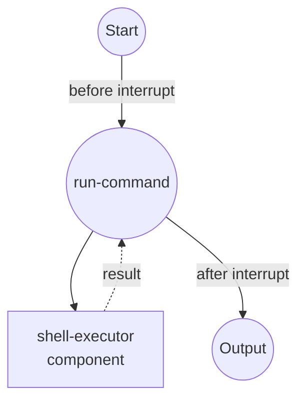

# Interrupt Example

This example demonstrates the Human-in-the-Loop (HITL) interrupt feature, which pauses a workflow for human review before and after executing a shell command.

## Overview

This workflow showcases the interrupt functionality:

1. **Before Interrupt**: Pauses before executing a command, allowing the user to review and approve
2. **After Interrupt**: Pauses after execution, allowing the user to review the result
3. **CLI Interactive Prompt**: Demonstrates the `model-compose run` interactive interrupt handling
4. **Auto Resume**: Supports `--auto-resume` flag for non-interactive environments

## Preparation

### Prerequisites

- model-compose installed and available in your PATH

### Environment Configuration

1. Navigate to this example directory:
   ```bash
   cd examples/interrupt
   ```

2. No additional environment configuration required.

## How to Run

1. **Run the workflow (interactive):**

   ```bash
   model-compose run
   ```

   The workflow will pause twice:
   - **Before execution**: Displays the command to be executed. Press Enter to continue, or type a response.
   - **After execution**: Displays a review prompt. Press Enter to finish.

2. **Run with auto-resume (non-interactive):**

   ```bash
   model-compose run --auto-resume
   ```

3. **Run via API:**

   ```bash
   # Start the server
   model-compose up

   # Run the workflow
   curl -X POST http://localhost:8080/api/workflows/runs \
     -H "Content-Type: application/json" \
     -d '{}'
   ```

   The API returns with `status: "interrupted"`. Resume with:

   ```bash
   curl -X POST http://localhost:8080/api/tasks/{task_id}/resume \
     -H "Content-Type: application/json" \
     -d '{"job_id": "run-command"}'
   ```

## Workflow Details

### "Shell Command Executor with Human Review" Workflow

**Description**: Executes a shell command after pausing for human approval using an interrupt point.

#### Job Flow



#### Interrupt Points

| Phase | Message | Description |
|-------|---------|-------------|
| `before` | "About to execute: ls -la" | Pauses before the command runs. The user can review the command. |
| `after` | "Command finished. Review the output above." | Pauses after the command runs. The user can review the result. |

#### Output Format

| Field | Type | Description |
|-------|------|-------------|
| `result` | text | The stdout output of the executed shell command |

## Component Details

### Shell Executor Component
- **Type**: Shell command executor
- **Command**: Runs `sh -c` with the provided command string
- **Timeout**: 10 seconds
- **Output**: Captures stdout from the executed command

## Interrupt Configuration

The interrupt is configured in the job definition:

```yaml
interrupt:
  before:
    message: "About to execute: ls -la"
    metadata:
      command: ls -la
  after:
    message: "Command finished. Review the output above."
```

- `before`: Fires before the component executes. Set to `true` for a simple pause, or provide `message` and `metadata`.
- `after`: Fires after the component executes. Same options as `before`.
- `condition`: (Optional) Add a condition to only interrupt when certain criteria are met.
