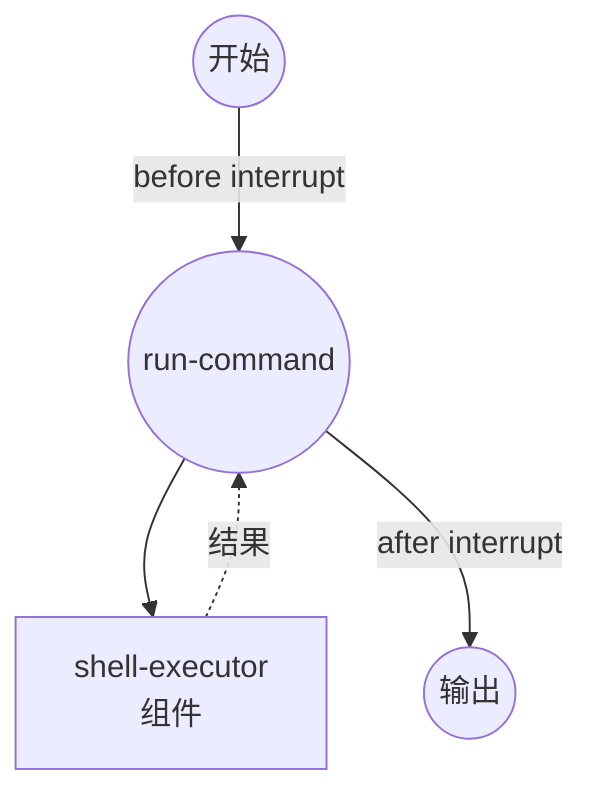

# Interrupt 示例

此示例演示了 Human-in-the-Loop (HITL) interrupt 功能，在执行 shell 命令前后暂停工作流，以便人工审核。

## 概述

此工作流展示了 interrupt 功能：

1. **Before Interrupt**：在命令执行前暂停，允许用户审核和批准
2. **After Interrupt**：在执行后暂停，允许用户审核结果
3. **CLI 交互式提示**：演示 `model-compose run` 的交互式 interrupt 处理
4. **Auto Resume**：支持 `--auto-resume` 标志用于非交互式环境

## 准备工作

### 前置条件

- 已安装 model-compose 并在您的 PATH 中可用

### 环境配置

1. 导航到此示例目录：
   ```bash
   cd examples/interrupt
   ```

2. 不需要额外的环境配置。

## 运行方式

1. **运行工作流（交互式）：**

   ```bash
   model-compose run
   ```

   工作流将暂停两次：
   - **执行前**：显示要执行的命令。按 Enter 继续，或输入响应。
   - **执行后**：显示审核提示。按 Enter 完成。

2. **使用 auto-resume 运行（非交互式）：**

   ```bash
   model-compose run --auto-resume
   ```

3. **通过 API 运行：**

   ```bash
   # 启动服务器
   model-compose up

   # 运行工作流
   curl -X POST http://localhost:8080/api/workflows/runs \
     -H "Content-Type: application/json" \
     -d '{}'
   ```

   API 返回 `status: "interrupted"` 状态。使用以下命令恢复：

   ```bash
   curl -X POST http://localhost:8080/api/tasks/{task_id}/resume \
     -H "Content-Type: application/json" \
     -d '{"job_id": "run-command"}'
   ```

## 工作流详情

### "Shell Command Executor with Human Review" 工作流

**描述**：使用 interrupt point 获得人工批准后执行 shell 命令。

#### 作业流程



#### Interrupt 点

| Phase | 消息 | 描述 |
|-------|------|------|
| `before` | "About to execute: ls -la" | 在命令运行前暂停。用户可以审核命令。 |
| `after` | "Command finished. Review the output above." | 在命令运行后暂停。用户可以审核结果。 |

#### 输出格式

| 字段 | 类型 | 描述 |
|------|------|------|
| `result` | text | 执行的 shell 命令的 stdout 输出 |

## 组件详情

### Shell Executor 组件
- **类型**：Shell 命令执行器
- **命令**：使用提供的命令字符串运行 `sh -c`
- **超时**：10 秒
- **输出**：捕获执行命令的 stdout

## Interrupt 配置

Interrupt 在 job 定义中配置：

```yaml
interrupt:
  before:
    message: "About to execute: ls -la"
    metadata:
      command: ls -la
  after:
    message: "Command finished. Review the output above."
```

- `before`：在组件执行前触发。设置为 `true` 进行简单暂停，或提供 `message` 和 `metadata`。
- `after`：在组件执行后触发。与 `before` 相同的选项。
- `condition`：（可选）添加条件，仅在满足特定条件时才触发 interrupt。
