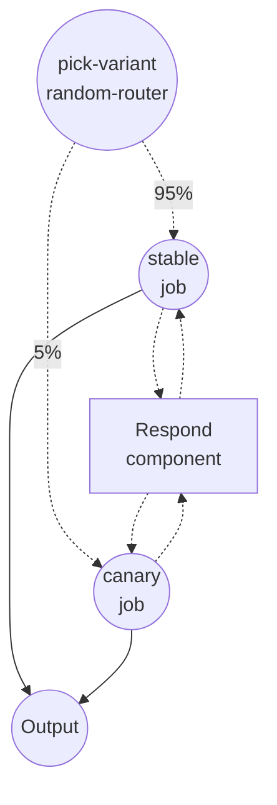

# 카나리 롤아웃 예제

이 예제는 `random-router` job 타입을 이용한 **세션 고정(sticky) 라우팅**을 보여줍니다. 소수의 트래픽만 카나리 변형으로 보내고 나머지는 안정 변형에 유지하되, 중요한 점으로 각 세션은 모든 요청에 대해 같은 변형으로 고정됩니다. 같은 기법이 A/B 실험, 모델 점진적 롤아웃, 다크 런치에도 그대로 적용됩니다.

## 개요

`chat` 워크플로우는 매 실행을 두 변형에 `95 : 5`로 분배합니다:

- **`stable`** — 현재 운영 중인 경로 (95%)
- **`canary`** — 평가 중인 새 변형 (5%)

두 분기 모두 같은 `respond` shell 컴포넌트를 호출합니다. 핵심은 라우터입니다. 라우터는 `${context.session_id}`를 기준으로 추첨을 하므로, 한 세션이 `canary`로 배정되면 그 세션에서 오는 이후 요청은 모두 `canary`로 갑니다. 대화형 에이전트에서 "대화 중간에 모델이 바뀌면 안 된다"는 요구와, 카나리 분석에서 "세션별 동작의 내적 일관성이 유지돼야 한다"는 요구를 동시에 만족시키는 방식입니다.

## 준비사항

### 필수 요구사항

- model-compose가 설치되어 PATH에서 사용 가능

### 환경 구성

1. 이 예제 디렉토리로 이동:
   ```bash
   cd examples/job-flow/canary-rollout
   ```

2. 추가 환경 구성은 필요 없습니다 — 로컬 `shell` 컴포넌트만 사용합니다.

## 실행 방법

1. **서비스 시작:**
   ```bash
   model-compose up
   ```

2. **워크플로우 실행:**

   **API 사용** — 라우터가 세션을 고정할 수 있도록 요청 body에 `session_id`를 포함합니다:
   ```bash
   # 세션 alice로 호출. 반복해도 같은 변형이 나옵니다.
   curl -X POST http://localhost:8080/api/workflows/chat/runs \
     -H "Content-Type: application/json" \
     -d '{"session_id": "alice", "input": {"message": "hello"}}'

   curl -X POST http://localhost:8080/api/workflows/chat/runs \
     -H "Content-Type: application/json" \
     -d '{"session_id": "alice", "input": {"message": "still me"}}'

   # 다른 세션 — 둘 중 어디로 갈지는 모르지만, 한 번 정해지면 그대로 유지됩니다.
   curl -X POST http://localhost:8080/api/workflows/chat/runs \
     -H "Content-Type: application/json" \
     -d '{"session_id": "bob", "input": {"message": "hi"}}'
   ```

   **Web UI 사용:**
   - Web UI 열기: http://localhost:8081
   - 클릭 사이에 고정 동작을 관찰할 수 있도록 `session_id`를 지정하세요

   **CLI 사용** — `--session-id` 전달:
   ```bash
   for i in 1 2 3 4 5; do
     model-compose run chat --session-id alice --input '{"message":"ping"}'
   done
   ```

   세션 `alice`로 호출할 때마다 **같은** `variant` 필드가 반환됩니다. 세션 ID를 바꾸면 `canary`로 갈 수도 안 갈 수도 있지만, 한번 가면 그 세션은 그 변형에 머뭅니다.

## 컴포넌트 상세

### Respond 컴포넌트 (`respond`)

- **타입**: Shell 컴포넌트
- **목적**: 어느 변형이 요청을 처리했는지 식별하는 한 줄을 생성
- **명령어**: `echo "[${input.variant}] you said: ${input.message}"`
- **출력**: `variant`와 렌더링된 `reply` 라인을 담은 객체

## 워크플로우 상세

### "카나리 롤아웃" 워크플로우 (`chat`)

**설명**: `session_id`로 고정된 상태에서 세션의 95%를 `stable`로, 5%를 `canary`로 라우팅합니다.

#### Job 흐름

1. **pick-variant** — `session: ${context.session_id}`가 설정된 `random-router`. 같은 세션에서는 결정론적, 세션 간에는 무작위.
2. **stable / canary** — 둘 중 하나가 실행되며, 선택된 variant 라벨로 `respond`를 호출합니다.



#### 입력 파라미터

| 필드 | 타입 | 설명 |
|------|------|------|
| `message` | text | 선택된 변형으로 전달할 메시지 |

라우팅 결정은 요청의 `session_id`가 좌우하며, 이는 input 내부가 아니라 input 옆에 함께 실립니다.

#### 출력 형식

| 필드 | 타입 | 설명 |
|------|------|------|
| `variant` | text | 요청을 처리한 쪽 — `stable` 또는 `canary` |
| `reply` | text | `echo` 명령이 출력한 라인 전체 |

## 예제 출력

```json
{
  "variant": "stable",
  "reply": "[stable] you said: hello\n"
}
```

같은 세션으로 다시 호출해도 `variant`는 그대로 유지됩니다.

## 라우팅 결정이 이뤄지는 방식

`session:`이 설정되면 라우터는 `(salt, session, to)`에 대한 **가중 랑데부 해싱**을 사용합니다:

- 같은 `session_id`와 같은 `to` ID 집합이면 매 호출마다 같은 승자가 나옵니다 — 이것이 고정의 근원입니다.
- `routings` 목록의 순서를 바꿔도 사용자 배정이 재구성되지 않습니다. 배정은 리스트 순서가 아닌 목적지 ID에 의해 결정됩니다.
- 가중치를 올리면 사용자가 그 경로 쪽으로 **이동**합니다. `canary`를 5에서 25로 올리면, 넘어오는 사용자는 모두 `stable` 쪽에서 오고, 이미 `canary`에 있던 세션은 그대로 유지됩니다. 이미 평가된 사용자를 흔들지 않으면서 카나리를 점진적으로 올리고 싶을 때 필요한 성질입니다.
- 같은 워크플로우 안의 서로 다른 라우터는 기본적으로 독립적입니다: `salt`가 `{workflow_id}:{job_id}`로 폴백되기 때문에, 같은 session을 쓰는 두 라우터도 분할이 독립적으로 일어납니다. 두 라우터가 서로의 결정을 반영하길 원하면 양쪽에 같은 `salt:`를 명시하세요.

`session_id` 없이 요청이 들어오면 라우터가 안정적으로 키를 잡을 수 없으므로, 그 요청 한 번에 한해 독립적인 무작위 추첨으로 폴백합니다. 세션 키가 실제로 존재할 때만 고정 동작이 켜집니다.

## 커스터마이즈

- **카나리 비율 올리기** — `weight: 5`를 `25`로, 다시 `50`으로 올리세요. 기존 카나리 세션은 그대로 카나리에 남고, 추가되는 비율은 `stable`에서 넘어옵니다.
- **A/B 실험** — `weight: 50/50`으로 뒤집고 분기 이름을 비교하려는 두 대상으로 바꾸세요.
- **세션 외의 다른 단위로 고정** — 다른 입도로 고정하고 싶다면 `session: ${input.user_id}` 같은 다른 렌더링 표현식으로 교체할 수 있습니다.
- **두 라우터 격리/일치** — 워크플로우 내 다른 라우터와 **독립**이면 양쪽 모두 `salt`를 비워 두세요. 같은 사용자에 대해 **일치**해야 하면 양쪽에 같은 `salt:`를 명시하세요.
- **실제 분기 연결** — shell 컴포넌트를 두 개의 서로 다른 모델 컴포넌트 호출로 바꿔 실제 모델 업그레이드의 카나리로 사용할 수 있습니다.

## 참고

- 고정 라우팅은 라우터에 `session:`이 지정되어 있어야 동작합니다. 지정하지 않으면 라우터는 요청마다 독립적인 무작위 추첨으로 폴백합니다 — 같은 사용자가 변형 사이를 오갈 수 있습니다.
- 고정 키는 평범한 문자열입니다. `${context.session_id}`가 보통의 선택지인 이유는, HTTP 서버가 이미 요청으로부터 전파하고 트레이싱 레이어가 이미 세션 단위로 그룹화하기 때문입니다 — 그 결과 세션별 카나리 vs 안정 분포가 자동으로 집계됩니다.
- 결정은 워크플로우 실행당 한 번 내려지며, 선택된 분기로 진입한 뒤에는 바뀌지 않습니다.
