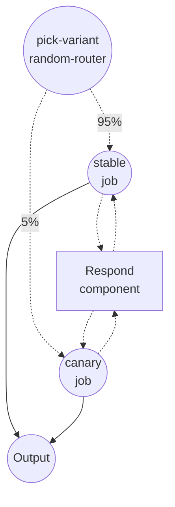

# Canary Rollout Example

This example demonstrates **session-sticky routing** with the `random-router` job type. A small slice of traffic is sent to a canary variant while the rest stays on the stable one, and — crucially — each session is pinned to the same variant across every request it makes. The same technique applies to A/B experiments, gradual model rollouts, and dark launches.

## Overview

The `chat` workflow splits each run between two variants with weights `95 : 5`:

- **`stable`** — the current production path (95%)
- **`canary`** — the new variant under evaluation (5%)

Both branches call the same `respond` shell component. The twist is the router: it keys the random draw on `${context.session_id}`, so once a session has been routed to `canary`, every follow-up request from that session also lands on `canary`. This is what you want for conversational agents (a user shouldn't flip between models mid-dialog) and for honest canary analysis (per-session behavior must stay internally consistent).

## Preparation

### Prerequisites

- model-compose installed and available in your PATH

### Environment Configuration

1. Navigate to this example directory:
   ```bash
   cd examples/job-flow/canary-rollout
   ```

2. No additional environment configuration is required — this example uses only the local `shell` component.

## How to Run

1. **Start the service:**
   ```bash
   model-compose up
   ```

2. **Run the workflow:**

   **Using API** — include `session_id` in the request body so the router can pin the session:
   ```bash
   # Call once with session alice; repeat and you'll see the same variant each time.
   curl -X POST http://localhost:8080/api/workflows/chat/runs \
     -H "Content-Type: application/json" \
     -d '{"session_id": "alice", "input": {"message": "hello"}}'

   curl -X POST http://localhost:8080/api/workflows/chat/runs \
     -H "Content-Type: application/json" \
     -d '{"session_id": "alice", "input": {"message": "still me"}}'

   # Different session — may land on either variant, but will stay on it.
   curl -X POST http://localhost:8080/api/workflows/chat/runs \
     -H "Content-Type: application/json" \
     -d '{"session_id": "bob", "input": {"message": "hi"}}'
   ```

   **Using Web UI:**
   - Open the Web UI: http://localhost:8081
   - Provide a `session_id` so you can observe sticky behavior across clicks

   **Using CLI** — pass `--session-id`:
   ```bash
   for i in 1 2 3 4 5; do
     model-compose run chat --session-id alice --input '{"message":"ping"}'
   done
   ```

   Every call for session `alice` returns the **same** `variant` field. Switch the session id and you may or may not land on `canary`, but once you do, that session stays there.

## Component Details

### Respond Component (`respond`)

- **Type**: Shell component
- **Purpose**: Produces a line that identifies which variant handled the request
- **Command**: `echo "[${input.variant}] you said: ${input.message}"`
- **Output**: An object containing `variant` and the rendered `reply` line

## Workflow Details

### "Canary Rollout" Workflow (`chat`)

**Description**: Routes 95% of sessions to `stable` and 5% to `canary`, pinned by `session_id`.

#### Job Flow

1. **pick-variant** — a `random-router` with `session: ${context.session_id}`. Deterministic for a given session, random across sessions.
2. **stable / canary** — one of the two runs, calling `respond` with the chosen variant label.



#### Input Parameters

| Field | Type | Description |
|-------|------|-------------|
| `message` | text | Message sent to the chosen variant |

The routing decision is driven by the request's `session_id`, which travels alongside the input rather than inside it.

#### Output Format

| Field | Type | Description |
|-------|------|-------------|
| `variant` | text | `stable` or `canary` — which side handled this request |
| `reply` | text | The full line emitted by the `echo` command |

## Example Output

```json
{
  "variant": "stable",
  "reply": "[stable] you said: hello\n"
}
```

Call the same session again and `variant` stays the same.

## How the Routing Decision Works

When `session:` is set, the router uses **weighted rendezvous hashing** over `(salt, session, to)`:

- The same `session_id` and the same `to` IDs produce the same winner on every call — that's where stickiness comes from.
- Reordering the `routings` list does **not** reshuffle users. Assignment depends on the destination IDs, not list order.
- Raising a weight only pulls users **into** that route. If you bump `canary` from 5 to 25, the ~20% of users moving over all come from `stable`; sessions that were already on `canary` stay there. This is the property you want for gradually ramping a canary without disturbing users who have already been evaluated.
- Different routers in the same workflow stay independent by default: `salt` falls back to `{workflow_id}:{job_id}`, so two routers keyed on the same session still split traffic independently. Set `salt:` explicitly on both routers if you want them to agree.

If a request arrives without a `session_id`, the router can't key on anything stable, so it falls back to an independent random draw for that single request. Sticky behavior only kicks in when the session key is actually present.

## Customization

- **Ramp the canary** — raise `weight: 5` to `25`, then `50`. Existing canary sessions stay on canary; the extra slice is pulled from `stable`.
- **A/B experiment** — flip to `weight: 50/50` and rename the branches to the two things you're comparing.
- **Pin on something other than session** — swap in `session: ${input.user_id}` (or any other rendered expression) if you want stickiness at a different granularity.
- **Isolate two routers** — if a second router elsewhere in the workflow should be independent of this one, leave `salt` unset on both; if they should agree on the same user, set the same explicit `salt:` on both.
- **Wire to real branches** — replace the shell component with calls to two different model components to canary a real model upgrade.

## Notes

- Sticky routing requires `session:` on the router. Without it, the router falls back to independent random draws per request — the same user can hop between variants.
- The sticky key is a plain string. `${context.session_id}` is the usual choice because the HTTP server already propagates it from the request and the tracing layer already groups by it, which gives you free per-session attribution of canary vs. stable.
- The decision is made once per workflow run; it does not change once the workflow continues into the chosen branch.
