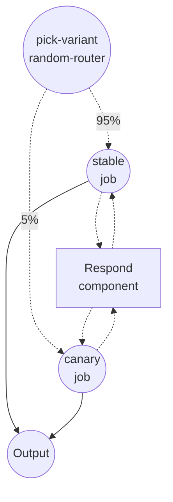

# 金丝雀发布示例

此示例使用 `random-router` 作业类型演示**会话粘性路由**。一小部分流量被发送到金丝雀变体，其余留在稳定变体上——关键在于，每个会话在其所有请求中都被固定到同一个变体。相同的技术也适用于 A/B 实验、模型渐进式发布和暗启动（dark launch）。

## 概述

`chat` 工作流以 `95 : 5` 的权重将每次运行在两个变体之间分配：

- **`stable`** — 当前生产路径（95%）
- **`canary`** — 待评估的新变体（5%）

两个分支都调用同一个 `respond` shell 组件。关键在路由器：它以 `${context.session_id}` 为随机抽签的键，所以一旦某个会话被路由到 `canary`，该会话之后的每次请求也都会落到 `canary`。这正是对话型智能体（用户不应在对话中途在模型之间来回切换）和诚实的金丝雀分析（按会话的内部行为必须保持一致）所需要的性质。

## 准备工作

### 前置条件

- 已安装 model-compose 并在您的 PATH 中可用

### 环境配置

1. 进入此示例目录：
   ```bash
   cd examples/job-flow/canary-rollout
   ```

2. 无需额外环境配置 —— 本示例仅使用本地 `shell` 组件。

## 运行方式

1. **启动服务：**
   ```bash
   model-compose up
   ```

2. **运行工作流：**

   **使用 API** — 在请求 body 中包含 `session_id`，让路由器可以固定会话：
   ```bash
   # 以会话 alice 调用一次；重复调用将每次得到相同的变体。
   curl -X POST http://localhost:8080/api/workflows/chat/runs \
     -H "Content-Type: application/json" \
     -d '{"session_id": "alice", "input": {"message": "hello"}}'

   curl -X POST http://localhost:8080/api/workflows/chat/runs \
     -H "Content-Type: application/json" \
     -d '{"session_id": "alice", "input": {"message": "still me"}}'

   # 不同的会话 —— 可能落到任一变体，但一旦确定便会保持。
   curl -X POST http://localhost:8080/api/workflows/chat/runs \
     -H "Content-Type: application/json" \
     -d '{"session_id": "bob", "input": {"message": "hi"}}'
   ```

   **使用 Web UI：**
   - 打开 Web UI：http://localhost:8081
   - 提供 `session_id` 以便观察跨点击的粘性行为

   **使用 CLI** — 传入 `--session-id`：
   ```bash
   for i in 1 2 3 4 5; do
     model-compose run chat --session-id alice --input '{"message":"ping"}'
   done
   ```

   对会话 `alice` 的每次调用都会返回**相同**的 `variant` 字段。切换会话 ID 后可能会落到 `canary`，也可能不会；但一旦落到某个变体，该会话就会保持在那里。

## 组件详情

### Respond 组件（`respond`）

- **类型**：Shell 组件
- **用途**：生成一行用于标识哪个变体处理了请求的信息
- **命令**：`echo "[${input.variant}] you said: ${input.message}"`
- **输出**：包含 `variant` 和渲染后的 `reply` 行的对象

## 工作流详情

### "金丝雀发布" 工作流（`chat`）

**描述**：按 `session_id` 固定，将 95% 的会话路由到 `stable`，5% 到 `canary`。

#### 作业流程

1. **pick-variant** —— 设置了 `session: ${context.session_id}` 的 `random-router`。对给定会话是确定性的，对不同会话之间则是随机的。
2. **stable / canary** —— 其中一个执行，用所选的 variant 标签调用 `respond`。



#### 输入参数

| 字段 | 类型 | 说明 |
|------|------|------|
| `message` | text | 发送给所选变体的消息 |

路由决策由请求的 `session_id` 驱动，它与输入并列传递，而不是放在 input 内部。

#### 输出格式

| 字段 | 类型 | 说明 |
|------|------|------|
| `variant` | text | `stable` 或 `canary` —— 哪一侧处理了该请求 |
| `reply` | text | `echo` 命令输出的完整行 |

## 示例输出

```json
{
  "variant": "stable",
  "reply": "[stable] you said: hello\n"
}
```

对相同会话再次调用，`variant` 保持不变。

## 路由决策的工作原理

设置了 `session:` 后，路由器对 `(salt, session, to)` 使用**加权会合哈希（weighted rendezvous hashing）**：

- 相同的 `session_id` 与相同的 `to` ID 集合在每次调用中都会产生相同的赢家 —— 这就是粘性的来源。
- 调整 `routings` 列表的顺序**不会**重新分配用户。分配只依赖于目标 ID，而非列表顺序。
- 提高某个路由的权重只会把用户**吸引**到该路由。如果将 `canary` 从 5 提升到 25，新增的约 20% 的用户全部来自 `stable`；已经在 `canary` 上的会话会保留在那里。这正是在不扰动已评估用户的前提下渐进加大金丝雀所需的性质。
- 同一工作流中不同的路由器默认是相互独立的：`salt` 回退为 `{workflow_id}:{job_id}`，因此即使以同一个会话键，两个路由器也会独立分流。若希望两个路由器达成一致，在两处都明确设置相同的 `salt:`。

如果请求没有携带 `session_id`，路由器就无法以稳定的键进行哈希，于是会对这一次请求回退为独立的随机抽签。只有当会话键确实存在时，粘性行为才会生效。

## 定制化

- **放量金丝雀** —— 将 `weight: 5` 提升到 `25`，再到 `50`。已有的金丝雀会话会继续留在金丝雀；额外的份额都从 `stable` 中吸走。
- **A/B 实验** —— 将权重翻为 `50/50`，并把两个分支重命名为要比较的两种实现。
- **按会话之外的键固定** —— 换成 `session: ${input.user_id}`（或任意其他渲染表达式），即可以不同的粒度进行粘性路由。
- **隔离或对齐两个路由器** —— 若需要工作流中另一个路由器**独立**于本路由器，两处都不要设置 `salt`；若需要它们对同一用户**对齐**，在两处都明确设置相同的 `salt:`。
- **接入真实分支** —— 将 shell 组件替换为对两个不同模型组件的调用，即可将本例改造为真实模型升级的金丝雀发布。

## 备注

- 粘性路由要求路由器上存在 `session:`。否则，路由器会对每个请求回退为独立的随机抽签 —— 同一用户可能在不同变体之间跳动。
- 粘性键只是一个普通字符串。`${context.session_id}` 之所以是常用选择，是因为 HTTP 服务器已经从请求中传播它，并且追踪层已经按它分组 —— 这样就能免费得到按会话的金丝雀 vs 稳定归因分析。
- 决策在工作流的每次运行中只做一次；一旦进入所选分支，路由决定就不会再改变。
