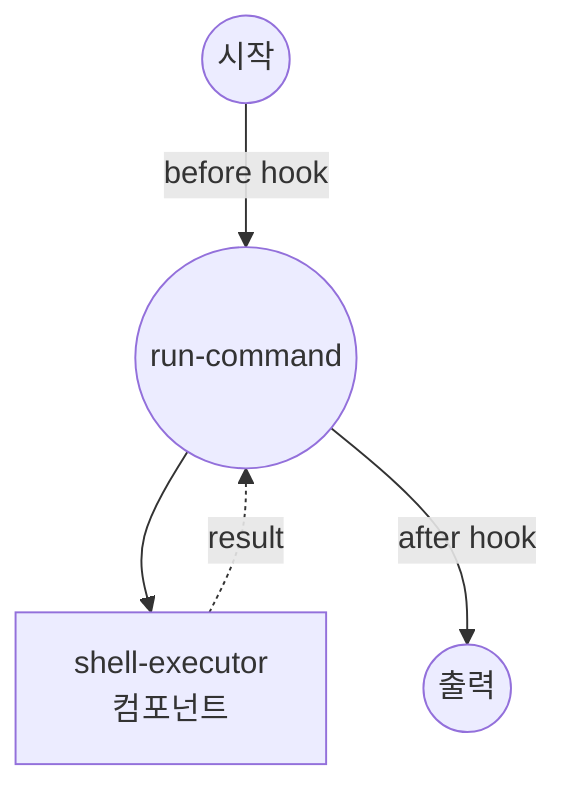

# Hook 예제

이 예제는 각 job 실행 전후에 인라인 Python 코드를 실행하여 입력을 변환하고 출력을 후처리하는 job hook을 보여줍니다.

## 개요

이 워크플로우는 hook 기능을 보여줍니다:

1. **Before Hook**: 컴포넌트가 실행되기 직전에 job 입력을 변환 (예: 로깅, 인수 재작성)
2. **After Hook**: 컴포넌트가 실행된 후 job 출력을 후처리 (예: 요약, 편집, 재구성)
3. **Inline Python**: hook은 YAML에 직접 Python 소스로 작성됩니다
4. **Async 지원**: I/O가 필요한 경우 hook을 `async def hook(...)`로 정의할 수 있습니다

## 준비사항

### 필수 요구사항

- model-compose가 설치되어 PATH에서 사용 가능

### 환경 구성

1. 이 예제 디렉토리로 이동:
   ```bash
   cd examples/hook
   ```

2. 추가 환경 구성 필요 없음.

## 실행 방법

1. **CLI로 워크플로우 실행:**

   ```bash
   model-compose run
   ```

   hook에서 출력된 두 개의 로그 라인(before 하나, after 하나)이 표시되고, 최종 출력에는 원시 stdout이 아닌 `line_count`와 `preview` 리스트가 포함됩니다.

2. **API로 실행:**

   ```bash
   # 서버 시작
   model-compose up

   # 워크플로우 실행
   curl -X POST http://localhost:8080/api/workflows/runs \
     -H "Content-Type: application/json" \
     -d '{"path": "."}'
   ```

## 워크플로우 세부사항

### "Shell Command Executor with Hooks" 워크플로우

**설명**: 입력을 변환하고 출력을 후처리하는 인라인 Python hook과 함께 shell 명령을 실행합니다.

#### 작업 흐름



#### Hook 지점

| 단계 | 목적 | 설명 |
|-----|------|------|
| `before` | 입력 재작성 | 명령을 로깅하고 stderr가 stdout과 함께 캡처되도록 `2>&1`을 추가합니다. |
| `after` | 출력 요약 | 원시 stdout을 `line_count`와 처음 다섯 줄의 `preview`를 포함하는 구조화된 요약으로 대체합니다. |

#### 출력 형식

| 필드 | 유형 | 설명 |
|-----|------|------|
| `line_count` | integer | 명령이 생성한 라인 수 |
| `preview` | list[str] | stdout의 처음 다섯 줄 |

## 컴포넌트 세부사항

### Shell Executor 컴포넌트
- **유형**: Shell 명령 실행기
- **명령**: 제공된 명령 문자열로 `sh -c` 실행
- **타임아웃**: 10초
- **출력**: 실행된 명령의 stdout 캡처

## Hook 구성

hook은 job 정의에 구성됩니다:

```yaml
hook:
  before:
    script: |
      def hook(input, *, task_id, job_id, run_id, phase):
          print(f"[{phase}] job={job_id} run={run_id} command={input['command']!r}")
          input["command"] = f"{input['command']} 2>&1"
          return input
  after:
    script: |
      def hook(input, output, *, task_id, job_id, run_id, phase):
          lines = output.splitlines()
          print(f"[{phase}] job={job_id} run={run_id} produced {len(lines)} lines")
          return {
              "line_count": len(lines),
              "preview": lines[:5],
          }
```

after hook의 반환 값은 job의 최종 출력이 됩니다. 이 예제의 job에는 명시적인 `output:` 매핑이 없으므로 shell 컴포넌트의 원시 stdout 문자열이 hook에 그대로 전달되고, hook이 반환하는 dict가 다운스트림 소비자(또는 워크플로우 출력)가 보는 것입니다.

### Hook 함수 시그니처

- **before**: `def hook(input, *, task_id, job_id, run_id, phase)` — 컴포넌트에 전달되는 (변경 가능한) 입력을 반환해야 합니다
- **after**: `def hook(input, output, *, task_id, job_id, run_id, phase)` — job에서 방출되는 (변환 가능한) 출력을 반환해야 합니다

### 참고 사항

- 각 스크립트는 `hook`이라는 이름의 호출 가능한 함수를 정의해야 합니다. 스크립트의 다른 항목은 실행 중에 모듈 범위에서 사용 가능합니다.
- hook은 `async def`일 수 있습니다 — model-compose가 자동으로 await합니다.
- 단계당 여러 hook이 지원됩니다. `before:` 또는 `after:` 아래에 리스트를 전달하면 각 hook이 이전 hook의 출력을 받습니다.
- hook은 워크플로우 프로세스에서 실행되므로 가볍고 부작용을 인지하여 유지하세요.
