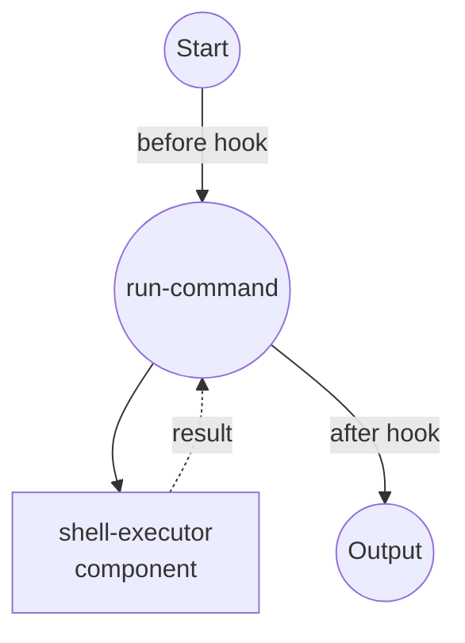

# Hook Example

This example demonstrates job hooks, which run inline Python code before and/or after each job execution to transform inputs and post-process outputs.

## Overview

This workflow showcases the hook functionality:

1. **Before Hook**: Transforms the job input just before the component runs (e.g. logging, rewriting arguments)
2. **After Hook**: Post-processes the job output after the component runs (e.g. summarizing, redacting, restructuring)
3. **Inline Python**: Hooks are written directly in the YAML as Python source
4. **Async Support**: Hooks may be defined as `async def hook(...)` when I/O is required

## Preparation

### Prerequisites

- model-compose installed and available in your PATH

### Environment Configuration

1. Navigate to this example directory:
   ```bash
   cd examples/hook
   ```

2. No additional environment configuration required.

## How to Run

1. **Run the workflow via CLI:**

   ```bash
   model-compose run
   ```

   You should see two log lines printed from the hooks (one before, one after), and the final output includes a `line_count` and a `preview` list rather than the raw stdout.

2. **Run via API:**

   ```bash
   # Start the server
   model-compose up

   # Run the workflow
   curl -X POST http://localhost:8080/api/workflows/runs \
     -H "Content-Type: application/json" \
     -d '{"path": "."}'
   ```

## Workflow Details

### "Shell Command Executor with Hooks" Workflow

**Description**: Executes a shell command with inline Python hooks that transform the input and post-process the output.

#### Job Flow



#### Hook Points

| Phase | Purpose | Description |
|-------|---------|-------------|
| `before` | Rewrite input | Logs the command and appends `2>&1` so stderr is captured together with stdout. |
| `after` | Summarize output | Replaces raw stdout with a structured summary containing `line_count` and a `preview` of the first five lines. |

#### Output Format

| Field | Type | Description |
|-------|------|-------------|
| `line_count` | integer | Number of lines produced by the command |
| `preview` | list[str] | First five lines of stdout |

## Component Details

### Shell Executor Component
- **Type**: Shell command executor
- **Command**: Runs `sh -c` with the provided command string
- **Timeout**: 10 seconds
- **Output**: Captures stdout from the executed command

## Hook Configuration

Hooks are configured in the job definition:

```yaml
hook:
  before:
    script: |
      def hook(input, *, task_id, job_id, run_id, phase):
          print(f"[{phase}] job={job_id} run={run_id} command={input['command']!r}")
          input["command"] = f"{input['command']} 2>&1"
          return input
  after:
    script: |
      def hook(input, output, *, task_id, job_id, run_id, phase):
          lines = output.splitlines()
          print(f"[{phase}] job={job_id} run={run_id} produced {len(lines)} lines")
          return {
              "line_count": len(lines),
              "preview": lines[:5],
          }
```

The after hook's return value becomes the job's final output. Because the job in this example has no explicit `output:` mapping, the shell component's raw stdout string is passed straight to the hook, and the dict the hook returns is what downstream consumers (or the workflow output) see.

### Hook Function Signatures

- **before**: `def hook(input, *, task_id, job_id, run_id, phase)` — must return the (possibly modified) input passed to the component
- **after**: `def hook(input, output, *, task_id, job_id, run_id, phase)` — must return the (possibly transformed) output emitted from the job

### Notes

- Each script must define a callable named `hook`. Anything else in the script is available at module scope during execution.
- Hooks may be `async def` — model-compose awaits them automatically.
- Multiple hooks per phase are supported. Pass a list under `before:` or `after:`, and each hook receives the output of the previous one.
- Hooks run in the workflow process, so keep them lightweight and side-effect aware.
