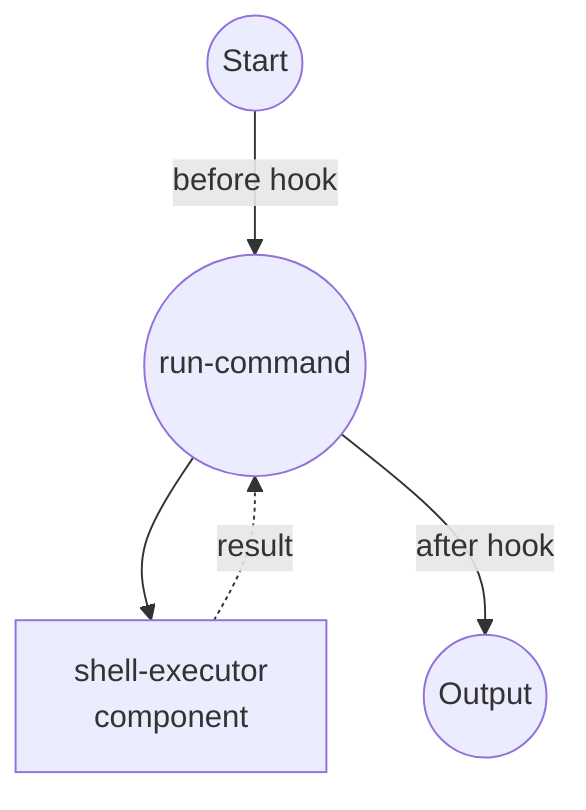

# Hook 示例

此示例演示了作业钩子（job hooks），它在每个作业执行前后运行内联 Python 代码，以转换输入和后处理输出。

## 概述

此工作流展示了 hook 功能：

1. **Before Hook**：在组件运行之前转换作业输入（例如日志记录、重写参数）
2. **After Hook**：在组件运行之后后处理作业输出（例如摘要、编辑、重组）
3. **内联 Python**：hook 直接在 YAML 中作为 Python 源代码编写
4. **异步支持**：当需要 I/O 时，hook 可以定义为 `async def hook(...)`

## 准备工作

### 前置条件

- 已安装 model-compose 并在您的 PATH 中可用

### 环境配置

1. 导航到此示例目录：
   ```bash
   cd examples/hook
   ```

2. 无需其他环境配置。

## 运行方式

1. **通过 CLI 运行工作流：**

   ```bash
   model-compose run
   ```

   您应该看到从 hook 打印的两行日志（一个 before，一个 after），最终输出包括 `line_count` 和 `preview` 列表，而不是原始 stdout。

2. **通过 API 运行：**

   ```bash
   # 启动服务器
   model-compose up

   # 运行工作流
   curl -X POST http://localhost:8080/api/workflows/runs \
     -H "Content-Type: application/json" \
     -d '{"path": "."}'
   ```

## 工作流详情

### "Shell Command Executor with Hooks" 工作流

**描述**：使用内联 Python hook 执行 shell 命令，该 hook 转换输入并后处理输出。

#### 作业流程



#### Hook 点

| 阶段 | 用途 | 描述 |
|------|------|------|
| `before` | 重写输入 | 记录命令并追加 `2>&1`，以便与 stdout 一起捕获 stderr。 |
| `after` | 摘要输出 | 用包含 `line_count` 和前五行 `preview` 的结构化摘要替换原始 stdout。 |

#### 输出格式

| 字段 | 类型 | 描述 |
|------|------|------|
| `line_count` | integer | 命令产生的行数 |
| `preview` | list[str] | stdout 的前五行 |

## 组件详情

### Shell Executor 组件
- **类型**：Shell 命令执行器
- **命令**：使用提供的命令字符串运行 `sh -c`
- **超时**：10 秒
- **输出**：捕获执行命令的 stdout

## Hook 配置

hook 在作业定义中配置：

```yaml
hook:
  before:
    script: |
      def hook(input, *, task_id, job_id, run_id, phase):
          print(f"[{phase}] job={job_id} run={run_id} command={input['command']!r}")
          input["command"] = f"{input['command']} 2>&1"
          return input
  after:
    script: |
      def hook(input, output, *, task_id, job_id, run_id, phase):
          lines = output.splitlines()
          print(f"[{phase}] job={job_id} run={run_id} produced {len(lines)} lines")
          return {
              "line_count": len(lines),
              "preview": lines[:5],
          }
```

after hook 的返回值成为作业的最终输出。因为此示例中的作业没有显式的 `output:` 映射，所以 shell 组件的原始 stdout 字符串直接传递给 hook，hook 返回的字典是下游消费者（或工作流输出）看到的内容。

### Hook 函数签名

- **before**：`def hook(input, *, task_id, job_id, run_id, phase)` — 必须返回传递给组件的（可能已修改的）输入
- **after**：`def hook(input, output, *, task_id, job_id, run_id, phase)` — 必须返回从作业发出的（可能已转换的）输出

### 备注

- 每个脚本必须定义一个名为 `hook` 的可调用对象。脚本中的其他内容在执行期间在模块作用域中可用。
- hook 可以是 `async def` — model-compose 会自动 await 它们。
- 支持每个阶段多个 hook。在 `before:` 或 `after:` 下传递一个列表，每个 hook 都会接收前一个 hook 的输出。
- hook 在工作流进程中运行，因此请保持它们轻量且注意副作用。
