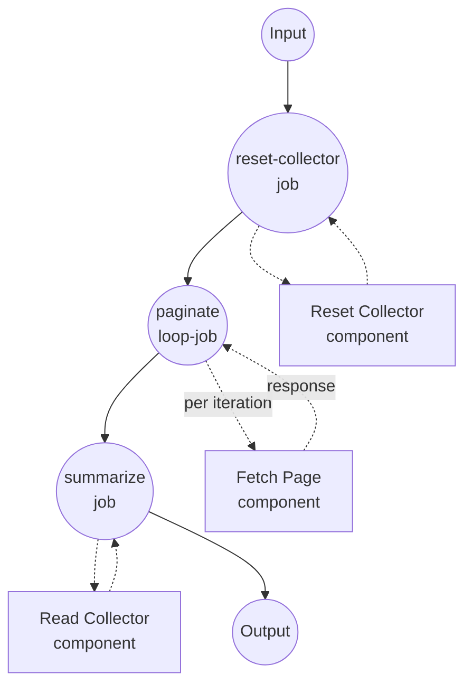

# `loop`을 사용한 커서 페이지네이션 예제

이 예제는 `loop` job 타입을 `while` 조건 및 `${output}`을 통한 피드포워드와 함께 사용하는 방법을 보여줍니다. 이전 페이지의 응답이 다음 요청의 커서를 공급합니다. 페이지네이션 API를 `next_cursor` 반환이 중단될 때까지 순회하는 것을 시뮬레이션합니다.

## 개요

이 워크플로우는 다음 과정을 통해 동작합니다:

1. **상태 초기화**: `reset-collector` job이 디스크상의 페이지 카운터와 아이템 누적 파일을 제거하여 각 실행이 비어있는 상태로 시작하도록 합니다
2. **모든 페이지 순회**: `paginate` 루프가 `fetch-page`를 반복 호출합니다. 각 iteration은 이전 응답의 `${output.next_cursor}`를 읽어 다음 요청의 `cursor`로 전달합니다. 첫 iteration에서는 `${output}`이 설정되어 있지 않아 `cursor`가 `null`로 해결됩니다 — 이는 페이지 1을 가져오라는 신호입니다.
3. **커서가 끝날 때까지 계속**: `while` 조건은 이전 응답의 `next_cursor`가 null이 아닌 한 루프를 유지합니다. 엔드포인트가 `next_cursor: null`을 반환하면 루프가 종료됩니다.
4. **전체 결과 집합 수집**: 최종 `summarize` job이 공유 아이템 파일(페이지네이션 중 `fetch-page`에 의해 채워짐)을 읽어 루프의 마지막 응답에서 얻은 총 페이지 수와 함께 반환합니다.

Iteration 시맨틱:

- iteration 0의 `${output}`은 설정되어 있지 않습니다. `${output.next_cursor}` 같은 표현식은 `null`로 해결됩니다.
- 이후 iteration에서 `${output}`은 이전 iteration의 응답입니다(루프가 제공하는 고정된 "피드포워드" 메커니즘).
- `max_iteration_count: 50`은 안전장치입니다. 엔드포인트가 커서를 영원히 반환하면 루프가 예외를 발생시킵니다.

## 준비사항

### 필수 요구사항

- model-compose가 설치되어 PATH에서 사용 가능
- `python3`가 PATH에서 사용 가능(가짜 `fetch-page` 컴포넌트가 사용)

### 환경 구성

1. 이 예제 디렉토리로 이동:
   ```bash
   cd examples/job-flow/loop/pagination
   ```

2. 추가 환경 구성 불필요 - 로컬 `shell` 컴포넌트만 사용합니다.

## 실행 방법

1. **서비스 시작:**
   ```bash
   model-compose up
   ```

2. **워크플로우 실행:**

   **API 사용:**
   ```bash
   curl -X POST http://localhost:8080/api/workflows/runs \
     -H "Content-Type: application/json" \
     -d '{"input": {}}'
   ```

   **웹 UI 사용:**
   - 웹 UI 열기: http://localhost:8081
   - "Run Workflow" 버튼 클릭

   **CLI 사용:**
   ```bash
   model-compose run --input '{}'
   ```

## 컴포넌트 상세

### Reset Collector 컴포넌트 (reset-collector)
- **타입**: Shell 컴포넌트
- **목적**: 디스크상의 아이템 파일과 페이지 카운트 파일을 제거하여 연속 실행이 독립적으로 동작하도록 함
- **명령**: `rm -f /tmp/model-compose-loop-pagination.items.json /tmp/model-compose-loop-pagination.page.count && echo reset`
- **출력**: 리터럴 문자열 `reset`

### Fetch Page 컴포넌트 (fetch-page)
- **타입**: Shell 컴포넌트
- **목적**: 페이지네이션 API 시뮬레이션 - 3페이지에 걸쳐 페이지당 3개 아이템을 반환한 후 `next_cursor: null`. 페이지의 아이템을 공유 JSON 배열에 추가하여 다운스트림 summarizer가 전체 집합을 읽을 수 있게 합니다.
- **명령**: 카운터 파일을 증가시키고, 공유 JSON 파일에 아이템을 추가하고, 페이지 응답을 출력하는 작은 Python 스크립트
- **출력**: `page_number`, `items`, `next_cursor`를 담은 객체

### Read Collector 컴포넌트 (read-collector)
- **타입**: Shell 컴포넌트
- **목적**: 최종 요약을 위해 누적된 아이템 배열을 읽어옴
- **명령**: `cat /tmp/model-compose-loop-pagination.items.json`
- **출력**: 파싱된 JSON 아이템 배열

## 워크플로우 상세

### "Cursor-Based Pagination with `loop`" 워크플로우 (Default)

**설명**: 가짜 페이지네이션 엔드포인트를 `next_cursor` 반환이 중단될 때까지 페이지 단위로 순회합니다. `while` 조건과 `${output}`을 통한 피드포워드로 `loop` job 타입을 시연합니다.

#### Job 흐름

1. **reset-collector**: 초기 상태 준비
2. **paginate**: `fetch-page`를 반복 호출하는 `loop` job
3. **summarize**: 누적된 아이템을 읽어 최종 결과 집합을 반환



#### 입력 파라미터

이 워크플로우는 사용자 입력을 받지 않습니다 — 페이지네이션 소스가 완전히 시뮬레이션됩니다.

#### 출력 형식

| 필드 | 타입 | 설명 |
|------|------|------|
| `total_pages` | integer | 순회한 페이지 수(루프의 마지막 iteration에서 취함) |
| `items` | list | 모든 페이지의 모든 아이템, 순서대로 |

## 예제 출력

```json
{
  "total_pages": 3,
  "items": [1, 2, 3, 4, 5, 6, 7, 8, 9]
}
```

## 커스터마이징

- **페이지 크기 또는 페이지 수 변경** — `fetch-page` Python 스니펫 내의 `page_items = [start, start + 1, start + 2]` 라인과 `next_cursor` 종료 체크를 조정하세요.
- **정지 방향 전환** — `while`을 반전된 조건의 `until`로 교체할 수 있습니다. `while: { input: ${output.next_cursor}, operator: neq, value: null }`은 `until: { input: ${output.next_cursor}, operator: eq, value: null }`과 동등합니다.
- **정지 조건 조합** — leaf 조건을 `all` / `any` / `not`으로 교체하여 "커서가 있는 동안 AND 페이지 수 < 100" 같은 것을 표현할 수 있습니다.
- **실제 HTTP 엔드포인트 사용** — `shell` 컴포넌트를 응답 본문에 `next_cursor`가 있는 `http-client` 컴포넌트로 교체하세요.

## 참고사항

- `/tmp/model-compose-loop-pagination.*` 파일들은 `reset-collector`가 삭제하지 않으면 실행 간 유지됩니다. 그 job의 존재 이유는 반복 실행을 결정론적으로 만들기 위함입니다.
- iteration 간 결과를 누적하는 것은 데모 목적으로 공유 파일을 통해 이루어집니다. 실제 클라이언트라면 인메모리 리스트에 아이템을 수집할 것입니다(예: 향후 워크플로우에서 다운스트림 `accumulate` job).
- `summarize`가 참조하는 `paginate.output`(`${jobs.paginate.output.page_number}`)은 *마지막 iteration의* 응답입니다 — 루프의 출력은 마지막 `do` 출력이며, 이는 pipeline/accumulate 시맨틱과 일치합니다.
