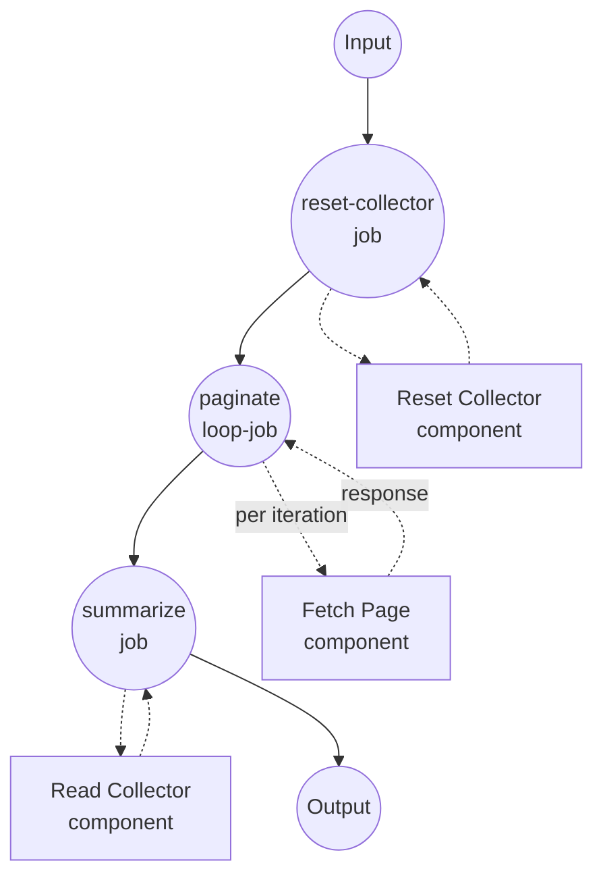

# Cursor Pagination with `loop` Example

This example demonstrates the `loop` job type with a `while` predicate and feed-forward via `${output}` — the previous page's response supplies the next request's cursor. It simulates walking a paginated API until it stops returning a `next_cursor`.

## Overview

This workflow operates through the following process:

1. **Reset State**: The `reset-collector` job removes the on-disk page counter and the items accumulator so each run starts empty
2. **Walk All Pages**: The `paginate` loop calls `fetch-page` repeatedly. Each iteration reads `${output.next_cursor}` from the previous response and passes it in as the next request's `cursor`. On the first iteration `${output}` is unset, so `cursor` resolves to `null` — the signal to fetch page 1.
3. **Continue Until Cursor Ends**: The `while` predicate keeps the loop running as long as the previous response's `next_cursor` is not null. When the endpoint returns `next_cursor: null`, the loop exits.
4. **Collect the Full Result Set**: The final `summarize` job reads the shared items file (populated by `fetch-page` during pagination) and returns it alongside the total page count from the loop's last response.

Iteration semantics:

- `${output}` on iteration 0 is unset. Any expression like `${output.next_cursor}` resolves to `null`.
- On subsequent iterations `${output}` is the previous iteration's response (the pinned "feed-forward" mechanism the loop provides).
- `max_iteration_count: 50` is a safety cap; if the endpoint keeps returning cursors forever, the loop will raise.

## Preparation

### Prerequisites

- model-compose installed and available in your PATH
- `python3` on the PATH (used by the fake `fetch-page` component)

### Environment Configuration

1. Navigate to this example directory:
   ```bash
   cd examples/job-flow/loop/pagination
   ```

2. No additional environment configuration is required — this example uses only local `shell` components.

## How to Run

1. **Start the service:**
   ```bash
   model-compose up
   ```

2. **Run the workflow:**

   **Using API:**
   ```bash
   curl -X POST http://localhost:8080/api/workflows/runs \
     -H "Content-Type: application/json" \
     -d '{"input": {}}'
   ```

   **Using Web UI:**
   - Open the Web UI: http://localhost:8081
   - Click the "Run Workflow" button

   **Using CLI:**
   ```bash
   model-compose run --input '{}'
   ```

## Component Details

### Reset Collector Component (reset-collector)
- **Type**: Shell component
- **Purpose**: Removes the on-disk items file and page-count file so successive runs behave independently
- **Command**: `rm -f /tmp/model-compose-loop-pagination.items.json /tmp/model-compose-loop-pagination.page.count && echo reset`
- **Output**: The literal string `reset`

### Fetch Page Component (fetch-page)
- **Type**: Shell component
- **Purpose**: Simulates a paginated API — returns 3 items per page across 3 pages, then `next_cursor: null`. Also appends the page's items to a shared JSON array so the downstream summarizer can read the full set.
- **Command**: Small Python script that advances a counter file, appends items to a shared JSON file, and prints the page response
- **Output**: An object with `page_number`, `items`, and `next_cursor`

### Read Collector Component (read-collector)
- **Type**: Shell component
- **Purpose**: Reads back the accumulated items array for the final summary
- **Command**: `cat /tmp/model-compose-loop-pagination.items.json`
- **Output**: The parsed JSON array of items

## Workflow Details

### "Cursor-Based Pagination with `loop`" Workflow (Default)

**Description**: Walks a fake paginated endpoint page-by-page until it stops returning a `next_cursor`. Demonstrates the `loop` job type with a `while` predicate and feed-forward via `${output}`.

#### Job Flow

1. **reset-collector**: Prepares clean state
2. **paginate**: The `loop` job that drives repeated calls to `fetch-page`
3. **summarize**: Reads the accumulated items back and returns the final result set



#### Input Parameters

This workflow takes no user input — the paginated source is entirely simulated.

#### Output Format

| Field | Type | Description |
|-------|------|-------------|
| `total_pages` | integer | Number of pages walked (taken from the loop's last iteration) |
| `items` | list | All items across every page, in order |

## Example Output

```json
{
  "total_pages": 3,
  "items": [1, 2, 3, 4, 5, 6, 7, 8, 9]
}
```

## Customization

- **Change the page size or page count** — adjust the `page_items = [start, start + 1, start + 2]` line and the `next_cursor` termination check inside the `fetch-page` Python snippet.
- **Switch stop directions** — swap `while` for `until` with an inverted predicate. `while: { input: ${output.next_cursor}, operator: neq, value: null }` is equivalent to `until: { input: ${output.next_cursor}, operator: eq, value: null }`.
- **Combine stop conditions** — replace the leaf predicate with `all` / `any` / `not` to express "keep going while (cursor exists AND page count < 100)".
- **Use a real HTTP endpoint** — swap the `shell` component for an `http-client` component whose response body contains `next_cursor`.

## Notes

- The counter and items files at `/tmp/model-compose-loop-pagination.*` persist across runs unless `reset-collector` wipes them first. That job exists solely to make repeated runs deterministic.
- Accumulating results across iterations is done through a shared file for demonstration purposes; a real client would collect items into an in-memory list (e.g. via a downstream `accumulate` job in a future workflow).
- The `paginate.output` referenced by `summarize` (`${jobs.paginate.output.page_number}`) is the *last iteration's* response — the loop's output is the last `do` output, matching pipeline/accumulate semantics.
