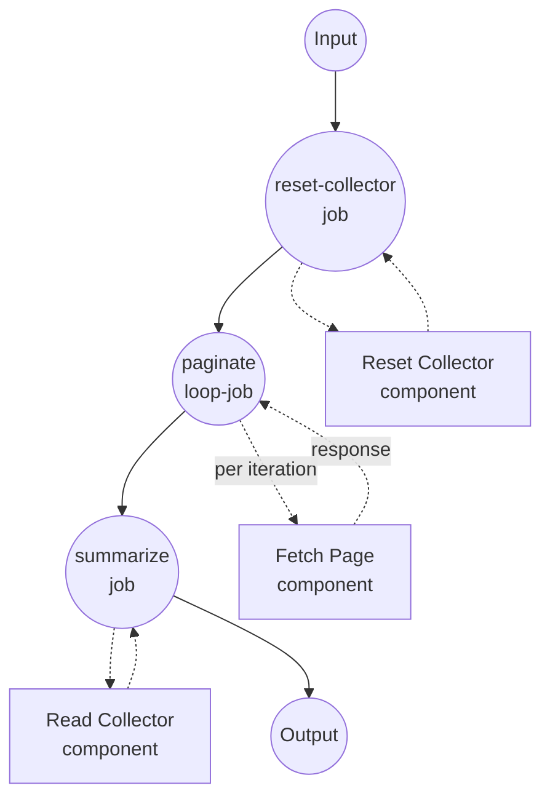

# 使用 `loop` 的游标分页示例

本示例演示带有 `while` 谓词和通过 `${output}` 进行前馈的 `loop` 作业类型 — 前一页的响应为下一次请求提供游标。示例模拟遍历分页 API 直到不再返回 `next_cursor`。

## 概述

此工作流通过以下流程运行:

1. **重置状态**: `reset-collector` 作业删除磁盘上的页面计数器和物品累加器，使每次运行以空状态开始
2. **遍历所有页面**: `paginate` 循环重复调用 `fetch-page`。每次迭代读取前一次响应的 `${output.next_cursor}` 并将其作为下一次请求的 `cursor` 传入。第一次迭代时 `${output}` 未设置，因此 `cursor` 解析为 `null` — 这是获取第 1 页的信号。
3. **在游标结束前继续**: `while` 谓词只要前一次响应的 `next_cursor` 不为 null 就保持循环。当端点返回 `next_cursor: null` 时循环退出。
4. **收集完整结果集**: 最终的 `summarize` 作业读取共享的物品文件(在分页过程中由 `fetch-page` 填充)并与循环最后响应中的总页数一起返回。

迭代语义:

- 第 0 次迭代的 `${output}` 未设置。任何像 `${output.next_cursor}` 的表达式都解析为 `null`。
- 后续迭代中 `${output}` 是前一次迭代的响应(循环提供的固定 "前馈" 机制)。
- `max_iteration_count: 50` 是安全上限；如果端点永远返回游标，循环会抛出异常。

## 准备工作

### 前置条件

- 已安装 model-compose 并可在 PATH 中使用
- PATH 中有 `python3`(伪造的 `fetch-page` 组件使用)

### 环境配置

1. 导航到此示例目录:
   ```bash
   cd examples/job-flow/loop/pagination
   ```

2. 不需要额外的环境配置 — 此示例仅使用本地 `shell` 组件。

## 如何运行

1. **启动服务:**
   ```bash
   model-compose up
   ```

2. **运行工作流:**

   **使用 API:**
   ```bash
   curl -X POST http://localhost:8080/api/workflows/runs \
     -H "Content-Type: application/json" \
     -d '{"input": {}}'
   ```

   **使用 Web UI:**
   - 打开 Web UI: http://localhost:8081
   - 点击 "Run Workflow" 按钮

   **使用 CLI:**
   ```bash
   model-compose run --input '{}'
   ```

## 组件详情

### Reset Collector 组件 (reset-collector)
- **类型**: Shell 组件
- **用途**: 删除磁盘上的物品文件和页面计数文件，使连续运行相互独立
- **命令**: `rm -f /tmp/model-compose-loop-pagination.items.json /tmp/model-compose-loop-pagination.page.count && echo reset`
- **输出**: 字面字符串 `reset`

### Fetch Page 组件 (fetch-page)
- **类型**: Shell 组件
- **用途**: 模拟分页 API — 3 页中每页返回 3 个物品，然后 `next_cursor: null`。同时将页面物品追加到共享 JSON 数组，以便下游 summarizer 可以读取完整集合。
- **命令**: 递进计数器文件、向共享 JSON 文件追加物品并打印页面响应的小型 Python 脚本
- **输出**: 包含 `page_number`、`items` 和 `next_cursor` 的对象

### Read Collector 组件 (read-collector)
- **类型**: Shell 组件
- **用途**: 为最终摘要读回累积的物品数组
- **命令**: `cat /tmp/model-compose-loop-pagination.items.json`
- **输出**: 解析后的 JSON 物品数组

## 工作流详情

### "Cursor-Based Pagination with `loop`" 工作流 (默认)

**描述**: 逐页遍历伪造的分页端点直到不再返回 `next_cursor`。演示带有 `while` 谓词和通过 `${output}` 进行前馈的 `loop` 作业类型。

#### 作业流程

1. **reset-collector**: 准备干净状态
2. **paginate**: 驱动对 `fetch-page` 重复调用的 `loop` 作业
3. **summarize**: 读回累积的物品并返回最终结果集



#### 输入参数

此工作流不接受用户输入 — 分页源完全被模拟。

#### 输出格式

| 字段 | 类型 | 描述 |
|------|------|------|
| `total_pages` | integer | 遍历的页数(取自循环的最后一次迭代) |
| `items` | list | 所有页面的所有物品，按顺序 |

## 示例输出

```json
{
  "total_pages": 3,
  "items": [1, 2, 3, 4, 5, 6, 7, 8, 9]
}
```

## 自定义

- **改变页面大小或页数** — 调整 `fetch-page` Python 片段内的 `page_items = [start, start + 1, start + 2]` 行和 `next_cursor` 终止检查。
- **切换停止方向** — 将 `while` 替换为反转谓词的 `until`。`while: { input: ${output.next_cursor}, operator: neq, value: null }` 等价于 `until: { input: ${output.next_cursor}, operator: eq, value: null }`。
- **组合停止条件** — 将叶子谓词替换为 `all` / `any` / `not` 来表达 "在(游标存在 AND 页数 < 100)时继续"。
- **使用真实 HTTP 端点** — 将 `shell` 组件替换为响应正文包含 `next_cursor` 的 `http-client` 组件。

## 备注

- 除非 `reset-collector` 先清除，否则 `/tmp/model-compose-loop-pagination.*` 处的计数器和物品文件会在运行之间持续存在。该作业的存在只是为了使重复运行确定性化。
- 跨迭代累积结果通过共享文件完成，仅用于演示目的；真实客户端会将物品收集到内存列表中(例如通过未来工作流中的下游 `accumulate` 作业)。
- `summarize` 引用的 `paginate.output`(`${jobs.paginate.output.page_number}`)是*最后一次迭代的*响应 — 循环的输出是最后一次 `do` 输出，与 pipeline/accumulate 语义一致。
