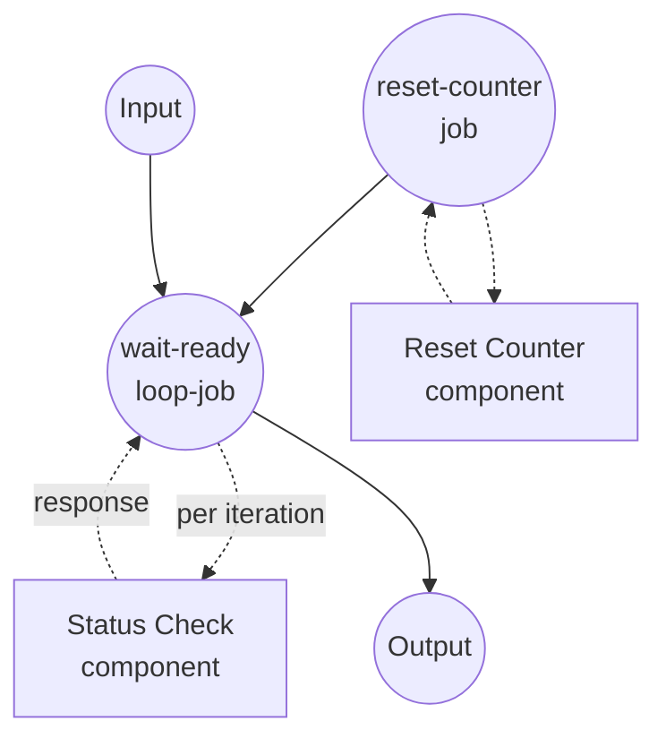

# `loop`을 사용한 폴링 예제

이 예제는 `loop` job 타입을 보여줍니다. 종료 조건이 만족될 때까지 인라인 job을 반복 실행합니다. 완료될 때까지 몇 번의 폴링이 필요한 장기 실행 원격 job을 시뮬레이션합니다.

## 개요

이 워크플로우는 다음 과정을 통해 동작합니다:

1. **상태 초기화**: `reset-counter` job이 이전 카운터 파일을 삭제하여 각 실행이 attempt 1부터 시작하도록 합니다
2. **준비 상태까지 폴링**: `wait-ready` 루프가 iteration마다 `status-check`를 호출하며, 매 호출마다 동일한 `job_id`(`${input}`에서)를 전달합니다. 각 iteration 후 루프는 반환된 `status` 필드에 대해 `until` 조건을 평가합니다.
3. **최종 응답 반환**: `status == "ready"`가 되면 루프가 종료되고, 최종 응답 객체가 워크플로우 출력으로 재구성됩니다.

Iteration 시맨틱:

- 루프 스코프 안의 `${input}`은 루프가 호출된 값으로 고정됩니다(do-while 방식). 따라서 모든 폴링이 동일한 논리적 job을 대상으로 합니다.
- `${output}`은 이전 iteration의 응답을 참조합니다. 첫 iteration에서는 설정되어 있지 않습니다.
- `max_iteration_count`는 안전장치로 루프를 20회로 제한합니다. 조건이 결코 매치되지 않으면 예외를 발생시켜 `retry` / `on_error`에서 처리할 수 있습니다.

## 준비사항

### 필수 요구사항

- model-compose가 설치되어 PATH에서 사용 가능
- `python3`가 PATH에서 사용 가능(가짜 `status-check` 컴포넌트가 사용)

### 환경 구성

1. 이 예제 디렉토리로 이동:
   ```bash
   cd examples/job-flow/loop/polling
   ```

2. 추가 환경 구성 불필요 - 로컬 `shell` 컴포넌트만 사용합니다.

## 실행 방법

1. **서비스 시작:**
   ```bash
   model-compose up
   ```

2. **워크플로우 실행:**

   **API 사용:**
   ```bash
   curl -X POST http://localhost:8080/api/workflows/runs \
     -H "Content-Type: application/json" \
     -d '{"input": {"job_id": "job-42"}}'
   ```

   **웹 UI 사용:**
   - 웹 UI 열기: http://localhost:8081
   - `job_id` 값을 입력
   - "Run Workflow" 버튼 클릭

   **CLI 사용:**
   ```bash
   model-compose run --input '{"job_id": "job-42"}'
   ```

## 컴포넌트 상세

### Reset Counter 컴포넌트 (reset-counter)
- **타입**: Shell 컴포넌트
- **목적**: 디스크상의 시도 카운터를 삭제하여 연속 실행이 독립적으로 동작하도록 함
- **명령**: `rm -f /tmp/model-compose-loop-polling.count && echo reset`
- **출력**: stdout으로 리터럴 문자열 `reset`

### Status Check 컴포넌트 (status-check)
- **타입**: Shell 컴포넌트
- **목적**: 원격 job 폴링을 시뮬레이션 - 처음 두 호출은 `pending`, 세 번째는 `ready` 반환
- **명령**: 카운터 파일을 증가시키고 JSON 상태를 출력하는 작은 Python 스크립트
- **출력**: `job_id`, `status`, `attempt`를 담은 객체

## 워크플로우 상세

### "Poll a Long-Running Job with `loop`" 워크플로우 (Default)

**설명**: 준비될 때까지 가짜 장기 실행 job 상태를 폴링합니다. `until` 조건과 고정된 `${input}` 참조로 매 폴링이 동일한 논리 job을 대상으로 하는 `loop` job 타입을 시연합니다.

#### Job 흐름

1. **reset-counter**: 초기 상태 준비
2. **wait-ready**: `status == "ready"`가 될 때까지 `status-check`를 반복 호출하는 `loop` job



#### 입력 파라미터

| 파라미터 | 타입 | 필수 | 기본값 | 설명 |
|---------|------|------|--------|------|
| `job_id` | text | No | `job-42` | 매 폴링마다 가짜 status 엔드포인트에 전달되는 식별자 |

#### 출력 형식

| 필드 | 타입 | 설명 |
|------|------|------|
| `job_id` | text | 에코된 job 식별자 |
| `status` | text | 폴링된 엔드포인트가 반환한 최종 상태(샘플에서는 항상 `ready`) |
| `attempts` | integer | `ready` 도달까지 소요된 폴링 횟수 |

## 예제 출력

```json
{
  "job_id": "job-42",
  "status": "ready",
  "attempts": 3
}
```

## 커스터마이징

- **필요 폴링 횟수 변경** — `status-check` Python 스니펫 내 `n >= 3` 임계값을 조정하세요.
- **다른 조건으로 폴링** — `until` 조건을 `eq`, `neq`, `gt`, `gte`, `lt`, `lte`, `in`, `not-in`, `starts-with`, `ends-with`, `match` 중 하나를 사용하는 leaf로 교체하고, `${output.status}`를 원하는 필드로 변경하세요.
- **여러 종료 조건 조합** — leaf `until`을 `all` / `any` / `not` 조합자로 바꿔서 "ready AND progress >= 100" 또는 "ready OR error가 설정됨" 같은 것을 표현할 수 있습니다. 형제 예제 `retry-with-combinators`를 참조하세요.
- **`while` 사용** — `until`을 `while`로 바꾸면 조건이 매치되는 *동안* 계속 반복합니다(예: `while: { input: ${output.next_cursor}, operator: neq, value: null }`).

## 참고사항

- `/tmp/model-compose-loop-polling.count` 파일은 `reset-counter` job이 삭제하지 않으면 워크플로우 실행 간 유지됩니다. 그 job의 존재 이유는 반복 실행을 결정론적으로 만들기 위함입니다.
- 루프는 `do` 본문을 최소 한 번 실행합니다(do-while 시맨틱). `until` 조건은 각 iteration 전이 아니라 *후에* 평가됩니다.
- 조건이 매치되지 않은 채 `max_iteration_count`에 도달하면 `RuntimeError`가 발생합니다. 루프 job에 `on_error: { output: ... }`를 감싸면 실패 전파 대신 폴백 값으로 변환할 수 있습니다.
