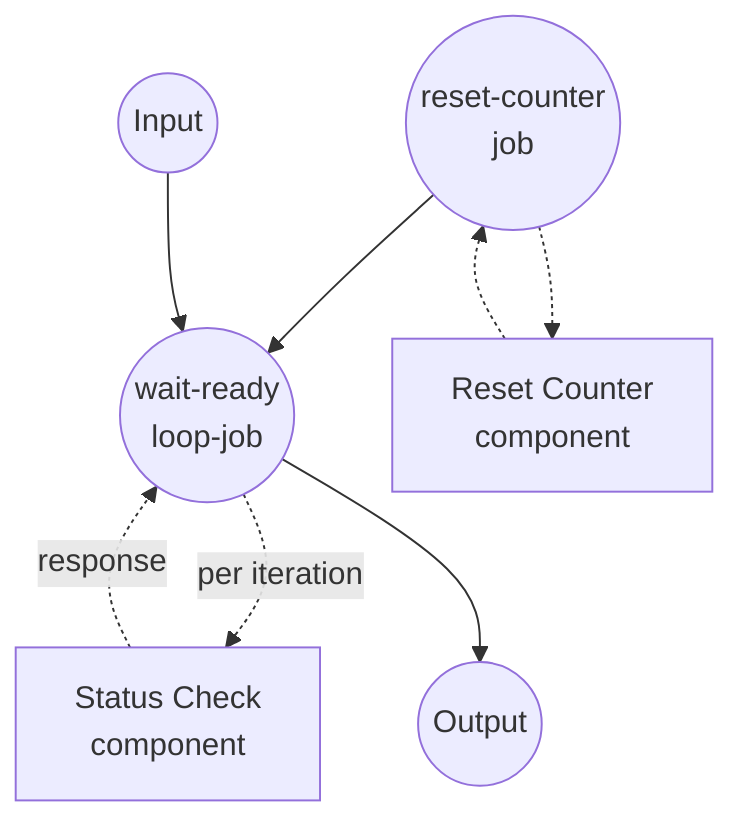

# Polling with `loop` Example

This example demonstrates the `loop` job type, which repeatedly executes an inline job until a stop condition is satisfied. It simulates polling a long-running remote job until it reports `ready`.

## Overview

This workflow operates through the following process:

1. **Reset State**: The `reset-counter` job wipes any leftover counter file so each run starts from attempt 1
2. **Poll Until Ready**: The `wait-ready` loop calls `status-check` once per iteration, feeding a fixed `job_id` (from `${input}`) to every call. After each iteration the loop evaluates its `until` predicate against the returned `status` field.
3. **Return the Final Response**: When `status == "ready"`, the loop breaks and the final response object is reshaped into the workflow output.

Iteration semantics:

- `${input}` inside the loop scope stays pinned to the value the loop was invoked with (do-while style), so every poll targets the same logical job.
- `${output}` refers to the previous iteration's response. It is unset on the very first iteration.
- `max_iteration_count` caps the loop at 20 iterations as a safety net; if the condition never matches, the loop raises so it can be handled by `retry` / `on_error`.

## Preparation

### Prerequisites

- model-compose installed and available in your PATH
- `python3` on the PATH (used by the fake `status-check` component)

### Environment Configuration

1. Navigate to this example directory:
   ```bash
   cd examples/job-flow/loop/polling
   ```

2. No additional environment configuration is required — this example uses only local `shell` components.

## How to Run

1. **Start the service:**
   ```bash
   model-compose up
   ```

2. **Run the workflow:**

   **Using API:**
   ```bash
   curl -X POST http://localhost:8080/api/workflows/runs \
     -H "Content-Type: application/json" \
     -d '{"input": {"job_id": "job-42"}}'
   ```

   **Using Web UI:**
   - Open the Web UI: http://localhost:8081
   - Enter a `job_id` value
   - Click the "Run Workflow" button

   **Using CLI:**
   ```bash
   model-compose run --input '{"job_id": "job-42"}'
   ```

## Component Details

### Reset Counter Component (reset-counter)
- **Type**: Shell component
- **Purpose**: Deletes the on-disk attempt counter so successive workflow runs behave independently
- **Command**: `rm -f /tmp/model-compose-loop-polling.count && echo reset`
- **Output**: The literal string `reset` from stdout

### Status Check Component (status-check)
- **Type**: Shell component
- **Purpose**: Simulates polling a remote job — returns `pending` for the first two calls and `ready` on the third
- **Command**: Small Python script that increments a counter file and emits a JSON status line
- **Output**: An object with `job_id`, `status`, and `attempt`

## Workflow Details

### "Poll a Long-Running Job with `loop`" Workflow (Default)

**Description**: Polls a fake long-running job status until it reports "ready". Demonstrates the `loop` job type with an `until` predicate and a fixed `${input}` reference so every poll hits the same logical job id.

#### Job Flow

1. **reset-counter**: Prepares clean state
2. **wait-ready**: The `loop` job that drives repeated calls to `status-check` until `status == "ready"`



#### Input Parameters

| Parameter | Type | Required | Default | Description |
|-----------|------|----------|---------|-------------|
| `job_id` | text | No | `job-42` | Identifier passed to the fake status endpoint on every poll |

#### Output Format

| Field | Type | Description |
|-------|------|-------------|
| `job_id` | text | Echoed job identifier |
| `status` | text | Final status reported by the polled endpoint (always `ready` for the sample) |
| `attempts` | integer | Number of polls it took to reach `ready` |

## Example Output

```json
{
  "job_id": "job-42",
  "status": "ready",
  "attempts": 3
}
```

## Customization

- **Change how many polls it takes** — edit the `n >= 3` threshold inside the `status-check` Python snippet.
- **Poll a different condition** — swap the `until` predicate for any leaf using `eq`, `neq`, `gt`, `gte`, `lt`, `lte`, `in`, `not-in`, `starts-with`, `ends-with`, or `match`, and change `${output.status}` to the field you care about.
- **Combine multiple stop conditions** — replace the leaf `until` with an `all` / `any` / `not` combinator to express things like "ready AND progress >= 100" or "ready OR error is set". See the sibling `retry-with-combinators` example.
- **Use `while` instead** — replace `until` with `while` to keep looping *while* a condition matches (e.g. `while: { input: ${output.next_cursor}, operator: neq, value: null }`).

## Notes

- The counter file at `/tmp/model-compose-loop-polling.count` persists across workflow runs unless the `reset-counter` job wipes it first. That job exists solely to make repeated runs deterministic.
- The loop runs the `do` body at least once (do-while semantics): the `until` predicate is evaluated *after* each iteration, not before.
- If the loop hits `max_iteration_count` without matching the condition, it raises `RuntimeError`. Wrap it with `on_error: { output: ... }` on the loop job to translate that into a fallback value instead of propagating the failure.
